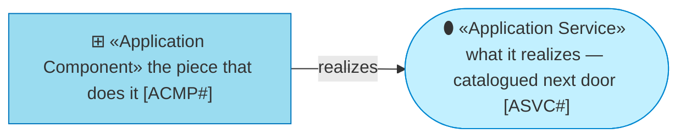
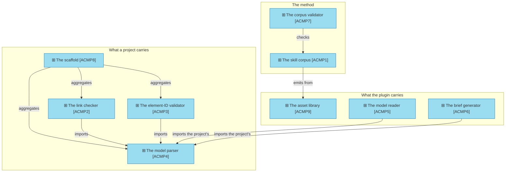

# Application components

_[← Application layer](./README.md) · [Front door](../README.md)_

**ArchiMate viewpoint:** Application — Application Component.

**Status:** ◐ Draft catalogue — not yet approved at a gate. **Understanding**
covers this document.

Every component below is shipping code — the catalogue holds nothing that
does not exist as a path in the archreator repository.

## How to read this document

## The components

**One box has five arrows into it and ships in every project.** The model
parser [`ACMP4`] is copied into each project by the scaffold and imported by
both validators there and by both reading tools in the plugin — which is the
whole architecture of "one parse of the document convention, and not two",
and the reason a change to it is the highest-blast-radius change in the
product.

| ID | Component | Realizes | Lives at |
| -- | --------- | -------- | -------- |
| `ACMP1` | **The skill corpus** — eighteen skills, their references, and the four rulebooks | `ASVC1`, `ASVC2` | `plugins/archreator/skills/` |
| `ACMP2` | **The link checker** | `ASVC3` | `plugins/archreator/scaffold/scripts/check_links.py`, copied into every project |
| `ACMP3` | **The element-ID validator** | `ASVC3` | `plugins/archreator/scaffold/scripts/check_model.py`, copied into every project |
| `ACMP4` | **The model parser** — one parse of the document convention, imported by every consumer, caching nothing | `ASVC3`, `ASVC7` | `plugins/archreator/scaffold/scripts/model_graph.py`, copied into every project |
| `ACMP5` | **The model reader** — trace, coverage, inventory, export, portal configuration | `ASVC7`, `ASVC8` | `plugins/archreator/scripts/model.py`, reading a project through `--project` |
| `ACMP6` | **The brief generator** — one focused question, answered verbatim from the model, disposable | `ASVC7` | `plugins/archreator/scripts/build_brief.py` |
| `ACMP7` | **The corpus validator** | `ASVC4` | `plugins/archreator/scripts/check_skills.py` |
| `ACMP8` | **The scaffold** — the eleven files a project starts with | `ASVC5` | `plugins/archreator/scaffold/` |
| `ACMP9` | **The asset library** — the templates a skill emits when the project first has content for them | `ASVC5` | `plugins/archreator/assets/` |
| `ACMP10` | **The plugin package** — the manifests, held byte-identical by the corpus validator | `ASVC6` | `plugins/archreator/plugin.json`, `.claude-plugin/` |
| `ACMP11` | **The skills installer** — for a host that installs no plugin | `ASVC6` | `plugins/archreator/scripts/install_skills.py` |
| `ACMP12` | **The guidance site** — two static pages and their stylesheet | `ASVC9` | `site/` |

## Relationships

What the diagram above draws: nine dependencies between components, which a
catalogue with one row per component has no column shape for.

| From | From element | To | To element | Relationship |
| ---- | ------------ | -- | ---------- | ------------ |
| `ACMP7` | ⊞ «Application Component» The corpus validator | `ACMP1` | ⊞ «Application Component» The skill corpus | checks |
| `ACMP8` | ⊞ «Application Component» The scaffold | `ACMP2` | ⊞ «Application Component» The link checker | aggregates |
| `ACMP8` | ⊞ «Application Component» The scaffold | `ACMP3` | ⊞ «Application Component» The element-ID validator | aggregates |
| `ACMP8` | ⊞ «Application Component» The scaffold | `ACMP4` | ⊞ «Application Component» The model parser | aggregates |
| `ACMP2` | ⊞ «Application Component» The link checker | `ACMP4` | ⊞ «Application Component» The model parser | imports |
| `ACMP3` | ⊞ «Application Component» The element-ID validator | `ACMP4` | ⊞ «Application Component» The model parser | imports |
| `ACMP5` | ⊞ «Application Component» The model reader | `ACMP4` | ⊞ «Application Component» The model parser | imports |
| `ACMP6` | ⊞ «Application Component» The brief generator | `ACMP4` | ⊞ «Application Component» The model parser | imports |
| `ACMP1` | ⊞ «Application Component» The skill corpus | `ACMP9` | ⊞ «Application Component» The asset library | emits from |
