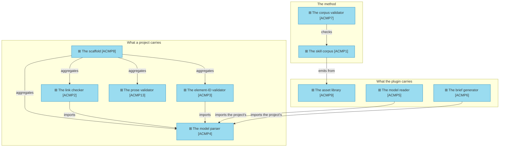

# Application components

_[← Application layer](./README.md) · [Front door](../README.md)_

The pieces of software that ship the method, each naming its path in the
archreator repository. Every component is shipping code.

**ArchiMate viewpoint:** Application: Application Component.

**Status:** ◐ Draft catalogue, not yet approved at Understanding.

## The components

One box has five arrows into it and ships in every project. The scaffold
copies `ACMP4` into each project, where two validators import it, and both
reading tools in the plugin import it too: one parse of the document
convention, and not two. A change to it is the change with the widest reach
in the product.

| ID | Component | Realizes | Lives at |
| -- | --------- | -------- | -------- |
| `ACMP1` | **The skill corpus**: eighteen skills, their references, and the four rulebooks; three listed for the agent, fifteen invoked by name | [`ASVC1`] Method execution, [`ASVC2`] Document generation | `plugins/archreator/skills/` |
| `ACMP2` | **The link checker** | [`ASVC3`] Self-checking | `plugins/archreator/scaffold/scripts/check_links.py`, copied into every project |
| `ACMP3` | **The element-ID validator** | [`ASVC3`] Self-checking | `plugins/archreator/scaffold/scripts/check_model.py`, copied into every project |
| `ACMP4` | **The model parser**: one parse of the document convention, imported by every consumer, caching nothing | [`ASVC3`] Self-checking, [`ASVC7`] Model interrogation | `plugins/archreator/scaffold/scripts/model_graph.py`, copied into every project |
| `ACMP5` | **The model reader**: trace, coverage, health, names, inventory, export, portal configuration | [`ASVC7`] Model interrogation, [`ASVC8`] Portal configuration | `plugins/archreator/scripts/model.py`, reading a project through `--project` |
| `ACMP6` | **The brief generator**: one focused question, answered verbatim from the model, disposable | [`ASVC7`] Model interrogation | `plugins/archreator/scripts/build_brief.py` |
| `ACMP7` | **The corpus validator** | [`ASVC4`] Corpus self-checking | `plugins/archreator/scripts/check_skills.py` |
| `ACMP8` | **The scaffold**: the thirteen files a project starts with | [`ASVC5`] Project emission | `plugins/archreator/scaffold/` |
| `ACMP9` | **The asset library**: the templates a skill emits when the project first has content for them | [`ASVC5`] Project emission | `plugins/archreator/assets/` |
| `ACMP10` | **The plugin package**: the manifests, held byte-identical by the corpus validator | [`ASVC6`] Plugin distribution | `plugins/archreator/plugin.json`, `.claude-plugin/` |
| `ACMP11` | **The skills installer**: for a host that installs no plugin | [`ASVC6`] Plugin distribution | `plugins/archreator/scripts/install_skills.py` |
| `ACMP12` | **The guidance site**: two static pages and their stylesheet | [`ASVC9`] Public guidance serving | `site/` |
| `ACMP13` | **The prose validator**: fails a model page that speaks about its governance, the method or itself, from a word list the project tunes | [`ASVC3`] Self-checking | `plugins/archreator/scaffold/scripts/check_prose.py` and `prose-denylist.json`, copied into every project |
