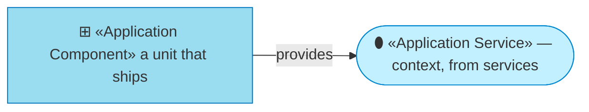
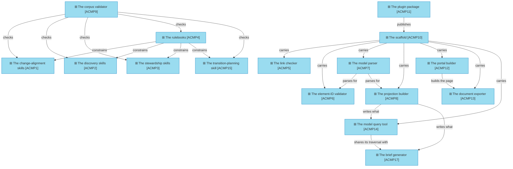

# Application components

_[← Application layer](./README.md) · [EA home](../README.md)_

**ArchiMate viewpoint:** Application. The units the method actually ships,
each mapped to the files that are it.

**Status:** ● Validated at **Gate 3** — every component on 2026-08-26; `ACMP7`
and `ACMP8` restated on 2026-08-27 with
[initiative 8](../scope/8_declare-the-relationships-and-let-the-graph-be-walked.md);
`ACMP14` restated and `ACMP16` added on 2026-08-27 with
[initiative 9](../scope/9_walk-the-model.md); `ACMP12` and `ACMP16` restated on
2026-08-27 with [initiative 10](../scope/10_federate-the-graph.md); `ACMP6`,
`ACMP7`, `ACMP8`, `ACMP14` and `ACMP16` on 2026-08-27 with
[initiative 11](../scope/11_cross-the-boundary.md); `ACMP7`, `ACMP8` and `ACMP16`
on 2026-08-27 with [initiative 12](../scope/12_make-it-readable.md).

Skills are grouped by the service they provide rather than listed one per
component. Fifteen rows naming fifteen files would restate the
[skill catalogue](https://github.com/roanboc/archreator/blob/main/plugins/archreator/skills/README.md)
without adding anything, and that catalogue is the single home for it.

## How to read this document

| Glyph | Shape | Element | ID prefix | Reads as |
| ----- | ----- | ------- | --------- | -------- |
| `⊞` | Rectangle | «Application Component» | `ACMP` | `ACMP1` = Application Component 1 |
| `⬮` | Stadium | «Application Service» — context, from [1_application-services.md](./1_application-services.md) | `ASVC` | `ASVC1` = Application Service 1 |

## The components

**`ACMP13` prints what `ACMP12` built**, rather than rendering anything of its
own. A second renderer would be a second set of rules about how a model looks,
and the two would drift; the document is the portal's own single-page view,
printed by a browser.

**`ACMP10` and `ACMP11` name what they refine one tree up.** The organization's
model says *that* a scaffold and a plugin package exist and who builds them;
this model says how. The reference runs this way and not the other, because
`org-archreator` is built on knowing nothing about the products under it — a
new product needs to know its parent, and the parent needs no edit to accept
one.

**`ACMP7` parses one more thing, and `ACMP6` resolves it two ways.** A
reference naming another model is read by the same parse as every other, and
resolved against that model's definitions where they are in this repository
or against `BOBJ9` where they are not. Nothing fetches: a validator that read
a sibling repository on every pull request would be slow, would fail when
somebody else's site was down, and would let another team's push break this
build. [initiative 11](../scope/11_cross-the-boundary.md) is what closed decision 1's recorded consequence.

**`ACMP17` is what `ACMP16` should have been.** The navigator drew the model
and left a reader to find their own question in it; the brief generator takes
the question and writes the answer. It runs the same traversal `ACMP14` runs,
against the same projection, and emits Markdown — the one form every reader of
this method can already use, agents included.

**`ACMP14` walks a qualified identifier**, so it does not stop at a model
boundary without saying so, which is the worst kind of wrong answer: a smaller
one that looks complete.

**`ACMP14` reads `ACMP8`'s output rather than `ACMP7` directly**, and the
indirection is the point. Importing the parser would have been one line
shorter and would have left the projection with no consumer at all — see
[`1_application-services.md`](./1_application-services.md) on `ASVC8`.

**`ACMP15` is its own component rather than a fifth skill in `ACMP1`.** The
change-alignment skills take a requirement and produce a merged change;
planning takes goals and a baseline and produces an intent. They share a
rulebook and nothing else.

**`ACMP7` reads two declaration surfaces and no diagrams.** A catalogue column
holding a resolving identifier is a relationship from that row's element,
labelled with the column header verbatim; a table whose first two columns hold
identifiers on every row is a relationship table, read by position. Both are
`BOBJ7`. Mermaid is parsed for nothing — a diagram is a rendering, and a fact
whose only home is a rendering is the one `P1` forbids.

**`ACMP7` is the only component two others depend on**, and it exists because
they were about to grow a second copy of the same parse. Initiative 8 widens
that: identifier **resolution** moves here too, so `ACMP6` and `ACMP8` agree on
what a bare identifier inside a domain means instead of each deciding. `ACMP4` is the only
one that constrains rather than calls — a rulebook is consulted by whoever is
running, not invoked.

| ID | Component | Provides | Realized by | Refines |
| -- | --------- | -------- | ----------- | ------- |
| `ACMP1` | **The change-alignment skills** | `ASVC1`, `ASVC3` | `skills/align-change-through-layers/`, `skills/write-scope-document/`, `skills/shard-stories/`, `skills/write-pr-description/` |  |
| `ACMP2` | **The discovery skills** | `ASVC2`, `ASVC6` | `skills/establish-project/`, `skills/discover-business-model/`, `skills/discover-strategy/`, `skills/model-domains/`, `skills/discover-current-landscape/` |  |
| `ACMP3` | **The stewardship skills** | `ASVC3` | `skills/restate-current-state/`, `skills/record-decision/`, `skills/run-retrospective/` |  |
| `ACMP4` | **The rulebooks** | — (constrains `ACMP1`–`ACMP3`) | `skills/document-style/`, `skills/architecture-document-style/`, `skills/process-and-capability-levels/`, `skills/stack-selection/` |  |
| `ACMP5` | **The link checker** | `ASVC4` | `scaffold/scripts/check_links.py` |  |
| `ACMP6` | **The element-ID validator** | `ASVC4` | `scaffold/scripts/check_model.py` |  |
| `ACMP7` | **The model parser** | `ASVC4`, `ASVC8` | `scaffold/scripts/model_graph.py` |  |
| `ACMP8` | **The projection builder** | `ASVC8` | `scaffold/scripts/build_model.py` |  |
| `ACMP9` | **The corpus validator** | `ASVC5` | `scripts/check_skills.py` |  |
| `ACMP10` | **The scaffold** | `ASVC6` | `scaffold/` — the layer folders, the notation, the validators, the portal configuration, the two workflows it ships in `.github/workflows-available/` where nothing reads them, and the placeholder entry points | `org-archreator::ACMP4` |
| `ACMP11` | **The plugin package** | `ASVC7` | `.claude-plugin/plugin.json`, `.claude-plugin/marketplace.json` | `org-archreator::ACMP1` |
| `ACMP12` | **The portal builder** | `ASVC9` | `scaffold/scripts/build_docs.py`, with `scaffold/mkdocs.yml` and `scaffold/overrides/`. It also publishes the model's own projection under `projection/`, which is the address `architecture/federation.md` names and the contract a second model reads. It also reports what it published a link to and not the file — the one thing `ACMP5` cannot see, because a link can resolve here and not on the site |  |
| `ACMP13` | **The document exporter** | `ASVC9` | `scaffold/scripts/export_pdf.py` |  |
| `ACMP14` | **The model query tool** | `ASVC10` | `scaffold/scripts/query_model.py`, with `scaffold/scripts/neighbourhood.sql` — the traversal it shares with `ACMP16` |  |
| `ACMP15` | **The transition-planning skill** | `ASVC11` | `skills/plan-the-transition/` |  |
| `ACMP17` | **The brief generator** | `ASVC10` | `scaffold/scripts/build_brief.py`, with `scaffold/scripts/neighbourhood.sql` — the traversal it shares with `ACMP14` |  |

All paths are relative to `plugins/archreator/` in the
[`archreator`](https://github.com/roanboc/archreator) repository, except
`ACMP11`'s marketplace manifest, which sits at that repository's root.

### Relationships

<!-- Transcribed from this document's diagrams. The identifier is
     authoritative; the description beside it is checked against the
     catalogue that defines the element. -->

| From | From element | To | To element | Relationship |
| ---- | ------------ | -- | ---------- | ------------ |
| `ACMP4` | «Application Component» The rulebooks | `ACMP1` | «Application Component» The change-alignment skills | constrains |
| `ACMP4` | «Application Component» The rulebooks | `ACMP2` | «Application Component» The discovery skills | constrains |
| `ACMP4` | «Application Component» The rulebooks | `ACMP3` | «Application Component» The stewardship skills | constrains |
| `ACMP4` | «Application Component» The rulebooks | `ACMP15` | «Application Component» The transition-planning skill | constrains |
| `ACMP7` | «Application Component» The model parser | `ACMP6` | «Application Component» The element-ID validator | parses for |
| `ACMP7` | «Application Component» The model parser | `ACMP8` | «Application Component» The projection builder | parses for |
| `ACMP8` | «Application Component» The projection builder | `ACMP14` | «Application Component» The model query tool | writes what |
| `ACMP10` | «Application Component» The scaffold | `ACMP5` | «Application Component» The link checker | carries |
| `ACMP10` | «Application Component» The scaffold | `ACMP6` | «Application Component» The element-ID validator | carries |
| `ACMP10` | «Application Component» The scaffold | `ACMP7` | «Application Component» The model parser | carries |
| `ACMP10` | «Application Component» The scaffold | `ACMP8` | «Application Component» The projection builder | carries |
| `ACMP10` | «Application Component» The scaffold | `ACMP12` | «Application Component» The portal builder | carries |
| `ACMP10` | «Application Component» The scaffold | `ACMP13` | «Application Component» The document exporter | carries |
| `ACMP10` | «Application Component» The scaffold | `ACMP14` | «Application Component» The model query tool | carries |
| `ACMP12` | «Application Component» The portal builder | `ACMP13` | «Application Component» The document exporter | builds the page |
| `ACMP11` | «Application Component» The plugin package | `ACMP10` | «Application Component» The scaffold | publishes |
| `ACMP9` | «Application Component» The corpus validator | `ACMP1` | «Application Component» The change-alignment skills | checks |
| `ACMP9` | «Application Component» The corpus validator | `ACMP2` | «Application Component» The discovery skills | checks |
| `ACMP9` | «Application Component» The corpus validator | `ACMP3` | «Application Component» The stewardship skills | checks |
| `ACMP9` | «Application Component» The corpus validator | `ACMP4` | «Application Component» The rulebooks | checks |
| `ACMP9` | «Application Component» The corpus validator | `ACMP15` | «Application Component» The transition-planning skill | checks |

## What is inside the scaffold, and what is not

`ACMP10` carries `ACMP5`–`ACMP8` and `ACMP12`–`ACMP13`, and does not carry
`ACMP9`. The line is whether a downstream project has anything for the
component to act on: an adopter's project has a model, so it needs the
validators, the projection and the two that publish it; it has no skills, so
the corpus validator would have nothing to check.

That is also why `ACMP9` lives at `scripts/` rather than `scaffold/scripts/` —
the directory a component sits in states who it is for.

## Portability

`ACMP11` is the only component `P5` calls disposable. Everything else is
Markdown and Python that would need **moving** if the host platform vanished,
not **editing**; the manifests would need rewriting for whatever replaced it.
A second platform would add a manifest beside this one rather than forking
anything above it.

## Retired

| ID | Component | Provides | Realized by | Refines |
| -- | --------- | -------- | ----------- | ------- |
| `ACMP16` | **The graph navigator** | — | Deleted. Was `scaffold/navigator/` |  |

**`ACMP16` was built, made legible, and written off inside a week.** It drew
the model as boxes, filtered and walked it, carried the documents' prose in a
panel and let a reader keep an arrangement — and it answered a question nobody
arrives with. [Decision 4](../decisions/4_the-graph-portal-is-retired.md)
records why, and `ACMP17` is what replaced it.

**The identifier stays retired.** It is not reused, and this row is what stops
a later reader concluding the number was never issued.
