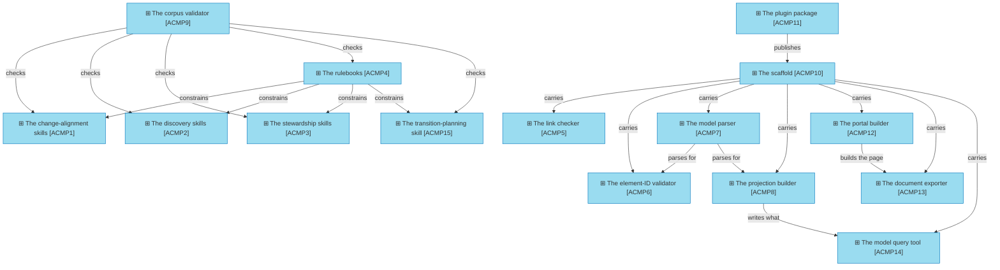

# Application components

_[← Application layer](./README.md) · [EA home](../README.md)_

**ArchiMate viewpoint:** Application. The units the method actually ships,
each mapped to the files that are it.

**Status:** ● Validated — **Gate 3** declined at Gate 2 ([scope document 1](../scope/1_rebuild-the-models-on-the-current-method.md), 2026-08-22), which routed the layers below the business layer to pull-request review.

Skills are grouped by the service they provide rather than listed one per
component. Fifteen rows naming fifteen files would restate the
[skill catalogue](https://github.com/roanboc/archreator/blob/main/plugins/archreator/skills/README.md)
without adding anything, and that catalogue is the single home for it.

## How to read this document

| Glyph | Shape | Element | ID prefix | Reads as |
| ----- | ----- | ------- | --------- | -------- |
| `⊞` | Rectangle | «Application Component» | `ACMP` | `ACMP1` = Application Component 1 |
| `⬮` | Stadium | «Application Service» — context, from [1_application-services.md](./1_application-services.md) | `ASVC` | `ASVC1` = Application Service 1 |

## The components

**`ACMP13` prints what `ACMP12` built**, rather than rendering anything of its
own. A second renderer would be a second set of rules about how a model looks,
and the two would drift; the document is the portal's own single-page view,
printed by a browser.

**`ACMP14` reads `ACMP8`'s output rather than `ACMP7` directly**, and the
indirection is the point. Importing the parser would have been one line
shorter and would have left the projection with no consumer at all — see
[`1_application-services.md`](./1_application-services.md) on `ASVC8`.

**`ACMP15` is its own component rather than a fifth skill in `ACMP1`.** The
change-alignment skills take a requirement and produce a merged change;
planning takes goals and a baseline and produces an intent. They share a
rulebook and nothing else.

**`ACMP7` is the only component two others depend on**, and it exists because
they were about to grow a second copy of the same parse. `ACMP4` is the only
one that constrains rather than calls — a rulebook is consulted by whoever is
running, not invoked.

| ID | Component | Provides | Realized by |
| -- | --------- | -------- | ----------- |
| `ACMP1` | **The change-alignment skills** | `ASVC1`, `ASVC3` | `skills/align-change-through-layers/`, `skills/write-scope-document/`, `skills/shard-stories/`, `skills/write-pr-description/` |
| `ACMP2` | **The discovery skills** | `ASVC2`, `ASVC6` | `skills/establish-project/`, `skills/discover-business-model/`, `skills/discover-strategy/`, `skills/model-domains/`, `skills/discover-current-landscape/` |
| `ACMP3` | **The stewardship skills** | `ASVC3` | `skills/restate-current-state/`, `skills/record-decision/`, `skills/run-retrospective/` |
| `ACMP4` | **The rulebooks** | — (constrains `ACMP1`–`ACMP3`) | `skills/document-style/`, `skills/architecture-document-style/`, `skills/process-and-capability-levels/`, `skills/stack-selection/` |
| `ACMP5` | **The link checker** | `ASVC4` | `scaffold/scripts/check_links.py` |
| `ACMP6` | **The element-ID validator** | `ASVC4` | `scaffold/scripts/check_model.py` |
| `ACMP7` | **The model parser** | `ASVC4`, `ASVC8` | `scaffold/scripts/model_graph.py` |
| `ACMP8` | **The projection builder** | `ASVC8` | `scaffold/scripts/build_model.py` |
| `ACMP9` | **The corpus validator** | `ASVC5` | `scripts/check_skills.py` |
| `ACMP10` | **The scaffold** | `ASVC6` | `scaffold/` — the layer folders, the notation, the validators, the portal configuration, and the placeholder entry points |
| `ACMP11` | **The plugin package** | `ASVC7` | `.claude-plugin/plugin.json`, `.claude-plugin/marketplace.json` |
| `ACMP12` | **The portal builder** | `ASVC9` | `scaffold/scripts/build_docs.py`, with `scaffold/mkdocs.yml` and `scaffold/overrides/`. It also reports what it published a link to and not the file — the one thing `ACMP5` cannot see, because a link can resolve here and not on the site |
| `ACMP13` | **The document exporter** | `ASVC9` | `scaffold/scripts/export_pdf.py` |
| `ACMP14` | **The model query tool** | `ASVC10` | `scaffold/scripts/query_model.py` |
| `ACMP15` | **The transition-planning skill** | `ASVC11` | `skills/plan-the-transition/` |

All paths are relative to `plugins/archreator/` in the
[`archreator`](https://github.com/roanboc/archreator) repository, except
`ACMP11`'s marketplace manifest, which sits at that repository's root.

## What is inside the scaffold, and what is not

`ACMP10` carries `ACMP5`–`ACMP8` and `ACMP12`–`ACMP13`, and does not carry
`ACMP9`. The line is whether a downstream project has anything for the
component to act on: an adopter's project has a model, so it needs the
validators, the projection and the two that publish it; it has no skills, so
the corpus validator would have nothing to check.

That is also why `ACMP9` lives at `scripts/` rather than `scaffold/scripts/` —
the directory a component sits in states who it is for.

## Portability

`ACMP11` is the only component `P5` calls disposable. Everything else is
Markdown and Python that would need **moving** if the host platform vanished,
not **editing**; the manifests would need rewriting for whatever replaced it.
A second platform would add a manifest beside this one rather than forking
anything above it.
