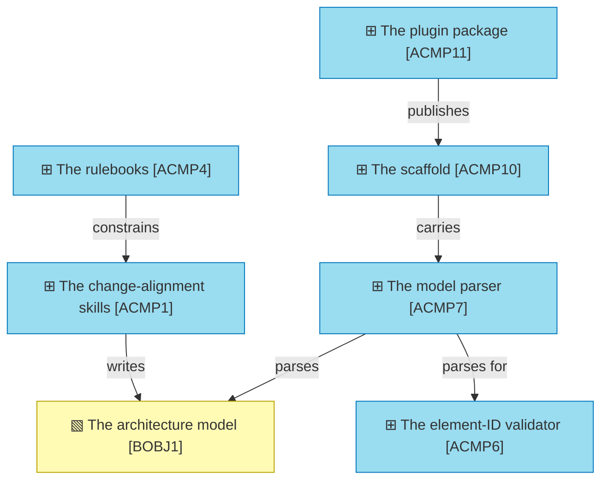

# Application Layer

_[← EA home](../README.md)_

The software that realizes the
`business services`: application
services, the components providing them, how the components collaborate,
and — at the finest grain — the solution design and the contracts of every
interface/port.

## Analysis order

Files are numbered in the order they are analyzed, from the coarsest view
(services offered to the business) down to the finest (per-method interface
contracts). Not every project needs all five from day one — a small
project may only ever populate 1 and 2; add 3–5 when the component count or
the number of interchangeable adapters justifies the extra grain.

| #   | Document                                                             | Elements                                                     | Question it answers                              |
| --- | -----------------------------------------------------------------------| --------------------------------------------------------------- | --------------------------------------------------- |
| 1   | [1_application-services.md](./1_application-services.md)             | Application Services and the business services they realize | What does the software offer the business layer? |
| 2   | [2_application-components.md](./2_application-components.md)         | Application Components, mapped to source files               | Which components provide those services?          |
| 3   | `3_application-collaborations.md` | Collaborations and interaction sequences                     | How do the components interact?                   |
| 4   | `4_solution-design.md`                       | Overall design, diagrams, patterns, tooling                  | How is the code structured, and why?               |
| 5   | `5_interface-contracts.md`               | Per-interface pre/postconditions, invariants, error behavior | What exactly does each interface promise?          |

[2_application-components.md](./2_application-components.md) is where the **grounding rule** bites
hardest: every component row must point at the module/file that implements
it. `4_solution-design.md` is the natural place to document "how to add a
new X" recipes (a new port, a new adapter, a new platform) once the shape
repeats often enough to be worth writing down once.

## Layer view

The two halves of the layer, and they barely touch. The skills are read by an
agent; the scripts are run by CI. Neither calls the other, and the only shared
thing is the model they both act on.

A selection, not the whole layer — thirteen components do not fit one honest
view. The full set is in
[2_application-components.md](./2_application-components.md).

### Relationships

<!-- Transcribed from this document's diagrams. The identifier is
     authoritative; the description beside it is checked against the
     catalogue that defines the element. -->

| From | From element | To | To element | Relationship |
| ---- | ------------ | -- | ---------- | ------------ |
| `ACMP11` | «Application Component» The plugin package | `ACMP10` | «Application Component» The scaffold | publishes |
| `ACMP10` | «Application Component» The scaffold | `ACMP7` | «Application Component» The model parser | carries |
| `ACMP4` | «Application Component» The rulebooks | `ACMP1` | «Application Component» The change-alignment skills | constrains |
| `ACMP1` | «Application Component» The change-alignment skills | `BOBJ1` | «Business Object» The architecture model | writes |
| `ACMP7` | «Application Component» The model parser | `BOBJ1` | «Business Object» The architecture model | parses |
| `ACMP7` | «Application Component» The model parser | `ACMP6` | «Application Component» The element-ID validator | parses for |
