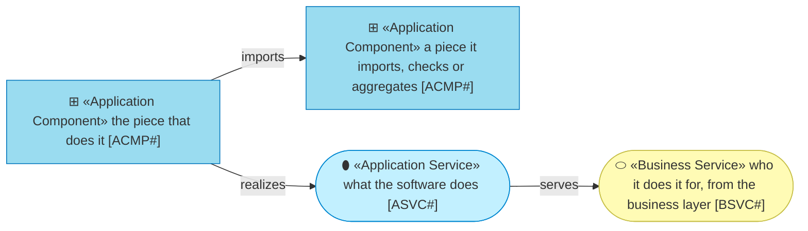
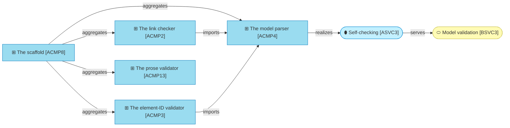

# Application

_[← Front door](../README.md)_

Which software realizes each service. Everything here is a path in the
[archreator repository](https://github.com/roanboc/archreator).

**ArchiMate viewpoint:** Application: Application Service, Application
Component.

## Documents

| # | Document | Elements | Question it answers |
| - | -------- | -------- | ------------------- |
| 1 | [Application services](./1_application-services.md) | The nine services the software offers, and the business service each one serves | What does the software do for the business layer? |
| 2 | [Application components](./2_application-components.md) | The thirteen pieces that do it, each naming its path | Which components provide those services? |

## Metamodel

The cyan ramps from service to component; the business service is a visitor
and keeps its yellow.

## Layer view

The scaffold ships three validators and the parser two of them import; the
self-checking service they realize is what the business layer sells as model
validation.
