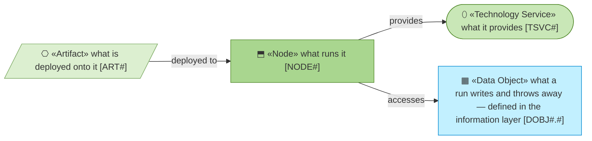
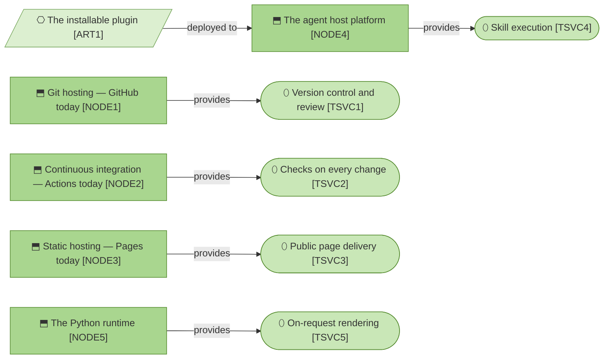
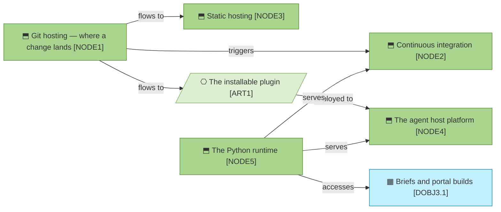

# Technology and deployment

_[← Technology layer](./README.md) · [Front door](../README.md)_

**ArchiMate viewpoint:** Technology.

**Status:** ◐ Draft catalogue — not yet approved at a gate. **Understanding**
covers this document.

**Nothing to operate** is the layer's headline: no database, no server, no
cache to rebuild. Every node below is either a free hosted service or the
adopter's own machine.

## How to read this document

## Nodes

**Five nodes, five services, one artifact, and no line between any two
nodes.** That flatness is the layer's headline drawn: nothing here calls
anything else here, so there is no cluster to keep running and nothing whose
failure takes a neighbour with it. The one node that receives a deployment
is the one this organization does not choose.

| ID | Node | Is | Replaceable? |
| -- | ---- | -- | ------------ |
| `NODE1` | **Git hosting** — GitHub today | Where the method and every model live and are reviewed | Yes, with edits — gate-presentation guidance names pull-request URLs |
| `NODE2` | **Continuous integration** — GitHub Actions today | What runs the validators on every change | Yes — a few workflow files invoking Python scripts |
| `NODE3` | **Static hosting** — GitHub Pages today | Where the guidance site is served from | Yes, trivially — the site is two static pages |
| `NODE4` | **The agent host platform** — Claude Code, Copilot, Codex or Gemini | Where the skills execute; the one node the method does not choose, because it is wherever the adopter already works | By design — a second platform adds a manifest and forks nothing |
| `NODE5` | **The Python runtime** — 3.11+, standard library | What the validators and readers run on, everywhere, offline; `uv` supplies the two extras the corpus checks need | The one true dependency, and deliberately the boring one |

## Technology services

| ID | Service | Provided by | Note |
| -- | ------- | ----------- | ---- |
| `TSVC1` | **Version control and review** | `NODE1` | The thing that versions the code versions the architecture; a change and its documents are one review |
| `TSVC2` | **Checks on every change** | `NODE2` | The validators are worthless as somebody's discipline; free at this scale, and already where the code is |
| `TSVC3` | **Public page delivery** | `NODE3` | Zero servers to secure or pay for |
| `TSVC4` | **Skill execution** | `NODE4` | The method rides the adopter's agent; it operates nothing of its own |
| `TSVC5` | **On-request rendering** | `NODE5` | A portal build is `uvx` fetching MkDocs Material for the duration of one command — a dependency only while somebody asks |

## Artifacts

| ID | Artifact | Is | Deployed to |
| -- | -------- | -- | ----------- |
| `ART1` | **The installable plugin** | The skill corpus, scaffold and assets, resolved from the marketplace manifest at install time | `NODE4` |

## Deployment

**Everything leaves the repository and nothing comes back.** A merge fans out
to three destinations — the checks, the site, the plugin an adopter installs
— and the only thing written anywhere else is disposable by design, which is
why the arrow into `DOBJ3.1` is the one edge with nothing downstream of it.

| | |
| --- | --- |
| **Repositories** | [`archreator`](https://github.com/roanboc/archreator) — the method; this repository — the models |
| **Checks on every change** | Both repositories run their validators in CI; here that is the two scripts in [`scripts/`](../../../scripts/README.md) |
| **The site** | Deployed from the archreator repository's `site/` by its own workflow, to `NODE3` |
| **Where generated things go** | `.archreator/` in whichever project asked — gitignored, disposable, never deployed |

## Relationships

What the deployment diagram draws and no catalogue row can carry: the path a
merged change takes across nodes, and the runtime that serves two of them.

| From | From element | To | To element | Relationship | Note |
| ---- | ------------ | -- | ---------- | ------------ | ---- |
| `NODE1` | ⬒ «Node» Git hosting | `NODE2` | ⬒ «Node» Continuous integration | triggers | Every push and pull request runs both validators |
| `NODE1` | ⬒ «Node» Git hosting | `NODE3` | ⬒ «Node» Static hosting | flows to | The guidance site is deployed by the method repository's own workflow |
| `NODE1` | ⬒ «Node» Git hosting | `ART1` | ⎔ «Artifact» The installable plugin | flows to | Resolved from the marketplace manifest at install time |
| `NODE5` | ⬒ «Node» The Python runtime | `NODE2` | ⬒ «Node» Continuous integration | serves | The validators are Python and nothing else |
| `NODE5` | ⬒ «Node» The Python runtime | `NODE4` | ⬒ «Node» The agent host platform | serves | The reading tools run wherever the adopter already works |
| `NODE5` | ⬒ «Node» The Python runtime | `DOBJ3.1` | ▦ «Data Object» Briefs and portal builds | accesses | Written into the project's gitignored work area, and thrown away |
