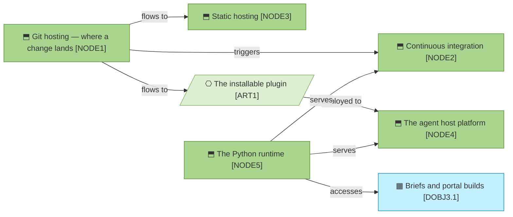

# Technology and deployment

_[← Technology layer](./README.md) · [Front door](../README.md)_

What runs the method, and where each part lives and deploys. There is
nothing to operate: no database, no server, no cache to rebuild. Every node
is a free hosted service or the adopter's own machine.

**ArchiMate viewpoint:** Technology: Node, Technology Service, Artifact.

**Status:** ◐ Draft catalogue, not yet approved at Understanding.

## Nodes

Five nodes, five services, one artifact, and no line between any two nodes.
Nothing calls anything else, so there is no cluster to keep running and
nothing whose failure takes a neighbour with it. The one node that receives
a deployment is the one the organization does not choose.

| ID | Node | Is | Replaceable? |
| -- | ---- | -- | ------------ |
| `NODE1` | **Git hosting**, GitHub today | Where the method and every model live and are reviewed | Yes, with edits; the gate-presentation guidance names pull-request URLs |
| `NODE2` | **Continuous integration**, GitHub Actions today | What runs the validators on every change | Yes; a few workflow files invoking Python scripts |
| `NODE3` | **Static hosting**, GitHub Pages today | Where the guidance site is served from | Yes, trivially; the site is two static pages |
| `NODE4` | **The agent host platform**, Claude Code, Copilot, Codex or Gemini | Where the skills execute; the one node the method does not choose, because it is wherever the adopter already works. A host that reads the by-name key loads three skills; one that ignores it loads all eighteen | By design; a second platform adds a manifest and forks nothing |
| `NODE5` | **The Python runtime**, 3.11 or later, standard library | What the validators and readers run on, everywhere, offline; `uv` supplies the two extras the corpus checks need | The one true dependency, and deliberately the boring one |

## Technology services

| ID | Service | Note |
| -- | ------- | ---- |
| `TSVC1` | **Version control and review** | The thing that versions the code versions the architecture; a change and its documents are one review |
| `TSVC2` | **Checks on every change** | The validators are worthless as somebody's discipline; free at this scale, and already where the code is |
| `TSVC3` | **Public page delivery** | Zero servers to secure or pay for |
| `TSVC4` | **Skill execution** | The method rides the adopter's agent; it operates nothing of its own |
| `TSVC5` | **On-request rendering** | A portal build is `uvx` fetching MkDocs Material for the duration of one command, a dependency only while somebody asks |

## Artifacts

| ID | Artifact | Is |
| -- | -------- | -- |
| `ART1` | **The installable plugin** | The skill corpus, scaffold and assets, resolved from the marketplace manifest at install time |

## Deployment

Everything leaves the repository and nothing comes back. A merge fans out to
three destinations, the checks, the site and the plugin an adopter installs,
and the only thing written anywhere else is disposable by design. The arrow
into the data object [`DOBJ3.1`] [Briefs and portal builds](../3_information/1_data-domains-and-objects.md)
is the one edge with nothing downstream of it.

| | |
| --- | --- |
| **Repositories** | [`archreator`](https://github.com/roanboc/archreator), the method; this repository, the models |
| **Checks on every change** | Both repositories run their validators in CI; here, the three scripts in [`scripts/`](../../../scripts/README.md) |
| **The site** | Deployed from the archreator repository's `site/` by its own workflow, to `NODE3` |
| **Where generated things go** | `.archreator/` in whichever project asked: gitignored, disposable, never deployed |
