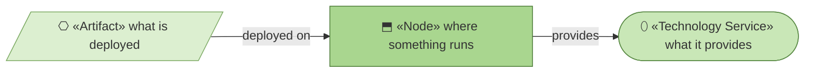
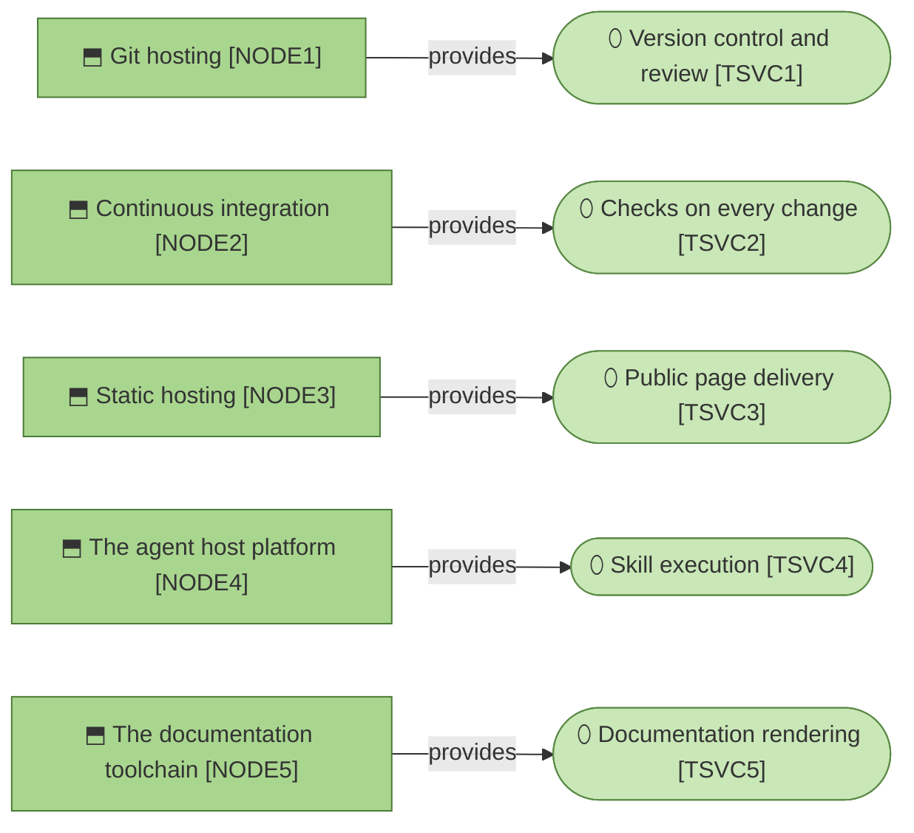

# Technology services

_[← Technology layer](./README.md) · [EA home](../README.md)_

**ArchiMate viewpoint:** Technology. What the method runs on.

**Status:** ● Validated at **Gate 3**, 2026-08-26.

**Nothing here is operated by the organization**, and that is the whole shape
of this layer. archreator has no server, no database, no account system and no
state — it is text in a repository plus scripts that run and exit. Every node
below is somebody else's, on a free tier, and the layer is short because there
is nothing to keep running.

This is `stack-selection`'s "no backend" case taken literally: the method
stores no shared state, so none of its guidance about databases, auth or
hosting applies.

## How to read this document

| Glyph | Shape | Element | ID prefix | Reads as |
| ----- | ----- | ------- | --------- | -------- |
| `⬒` | Rectangle | «Node» | `NODE` | `NODE1` = Node 1 |
| `⬯` | Stadium | «Technology Service» | `TSVC` | `TSVC1` = Technology Service 1 |
| `⎔` | Parallelogram | «Artifact» | `ART` | `ART1` = Artifact 1 |

## The stack

**Five nodes, five services, and no edge between any of them.** Nothing calls
anything else at request time, which is what makes the whole layer this short
and why there is no deployment topology to draw.

| ID | Technology service | Provided by | Why this one |
| -- | ------------------ | ----------- | ------------ |
| `TSVC1` | **Version control and review** | `NODE1` | The model is Markdown in git, so the thing that versions the code versions the architecture. Review of a change and review of its documents are the same act |
| `TSVC2` | **Checks on every change** | `NODE2` | The validators are worthless if running them is somebody's discipline. Free at this scale, and already where the code is. The scaffold now carries the same service to the projects the method emits, as a workflow it ships switched off |
| `TSVC3` | **Public page delivery** | `NODE3` | Zero servers to secure or pay for, and the site is fully static. An adopting project on a public repository can reach the same service for its own portal, with the workflow the scaffold ships |
| `TSVC4` | **Skill execution** | `NODE4` | The only node the method does not choose — it is wherever the adopting agent runs |
| `TSVC5` | **Documentation rendering** | `NODE5` | Turning the model into a website and a document is the one thing the method cannot do with Python's standard library, so it is the one dependency it takes |

| ID | Node | Operated by | Substitutable? |
| -- | ---- | ----------- | -------------- |
| `NODE1` | **Git hosting** — GitHub today | GitHub | Yes, with edits. Pull-request URLs appear in `ACMP1`'s gate-presentation guidance, so a move would need those repaired |
| `NODE2` | **Continuous integration** — GitHub Actions today | GitHub | Yes. Two workflow files invoking three scripts |
| `NODE3` | **Static hosting** — GitHub Pages today | GitHub | Yes, trivially. See [`site/`](../../site/architecture/5_technology/README.md) |
| `NODE4` | **The agent host platform** — Claude Code today | The adopter | Yes, and this is what `P5` is about: a second platform adds a manifest, and forks nothing |
| `NODE5` | **The documentation toolchain** — MkDocs with Material, and a Chromium-family browser | Whoever runs the build, on their own machine | The browser, trivially — any of three, and the export says so when it finds none. MkDocs, not cheaply: `mkdocs.yml` and the theme override are written for it |

**`NODE4` is the one that matters for portability.** The skills are Markdown
with YAML frontmatter; what makes them *runnable* is a host that reads a
description and routes to a procedure. `ACMP11` is the adapter, and it is the
only component that would need rewriting rather than moving.

**`NODE5` runs on somebody's laptop, and no server.** It is a build
dependency rather than infrastructure: `ACMP12` fetches it, uses it and
leaves nothing running. The dependency that outlives the build is smaller and
easier to miss — the theme fetches its diagram library from a CDN while a
page is being *read*, so a reader behind a strict proxy sees diagram source
instead of diagrams. `ACMP13` checks for exactly that before handing over a
document; a hosted portal has nothing running to check it.

**`NODE3` carries the guidance site, and no model.** These models are not
published anywhere, which is a decision rather than a limit — the method can
now publish one, and this organization has not asked it to.

What the method does for an adopter is narrower than running anything. It
ships the workflow that would publish a model and leaves it inert, and
bootstrap activates it only for a public GitHub repository. Where a model goes,
and whether it goes anywhere, is still the adopting organization's call on its
own infrastructure; what changed is that the commonest answer no longer has to
be assembled by hand.

**`NODE1`'s substitutability is qualified on purpose.** The method is not tied
to GitHub for storage, but it does assume a pull request exists as a surface
where a Requester can approve and a Reviewer can read a whole branch. A host
without that concept would need more than a path change.

## Artifacts

| ID | Artifact | What it is | Deployed on |
| -- | -------- | ---------- | ----------- |
| `ART1` | **The installable plugin** | The skill corpus and scaffold, resolved from the marketplace manifest at install time | `NODE4` |

There is no build. `ART1` is the repository contents at a ref, which is why
there is no packaging step, no version to publish and nothing to sign.

## What this layer deliberately does not have

| Absent | Because |
| ------ | ------- |
| A database | Nothing mutates shared state. The projection is a file, regenerated and thrown away |
| Authentication | There are no accounts. Repository permissions carry `ROLE1` and `ROLE3` |
| An application server | Nothing runs between requests, because there are no requests |
| A monitoring stack | Nothing is running to monitor. A failure is a red check on a pull request |
