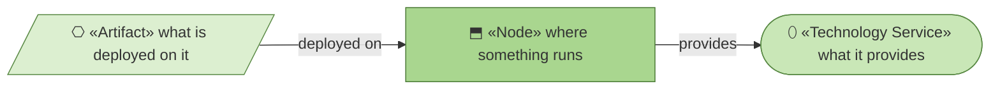
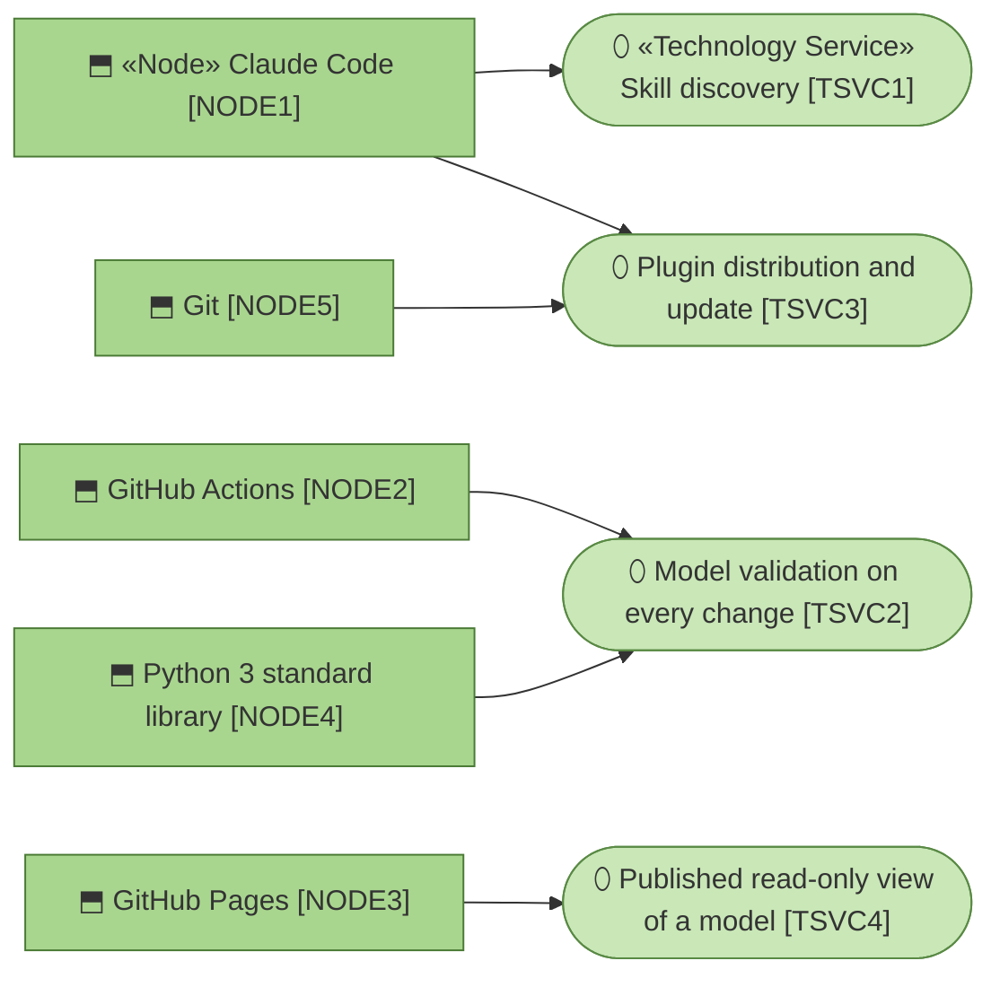
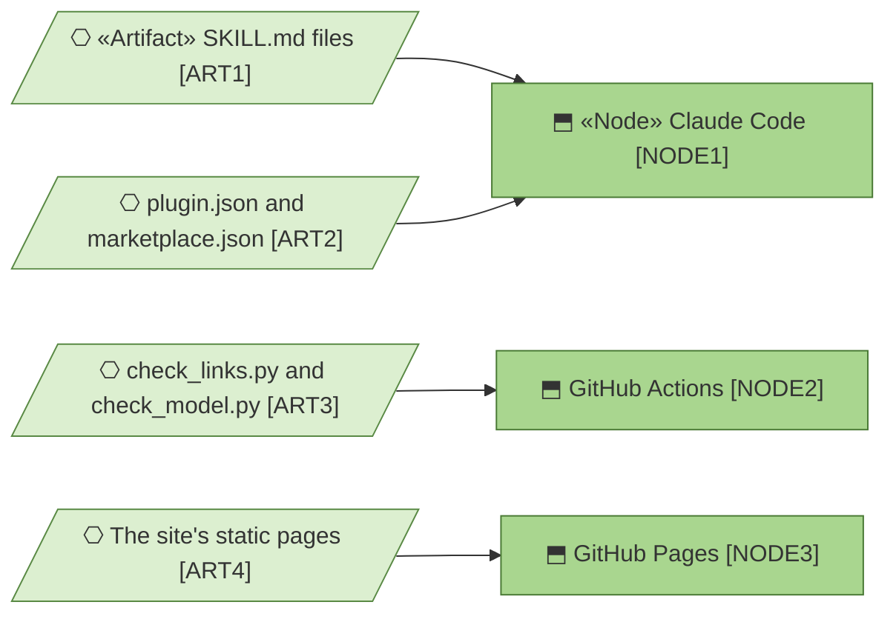

# Technology Services — archreator

_[← Technology layer](./README.md) · [EA home](../README.md)_

**ArchiMate elements:** Node, Technology Service, Artifact.

## How to read this document

| Glyph | Shape | Element | ID prefix | Reads as |
| ----- | ----- | ------- | --------- | -------- |
| `⬒` | Rectangle | «Node» | `NODE` | `NODE1` = Node 1 |
| `⬯` | Stadium | «Technology Service» | `TSVC` | `TSVC1` = Technology Service 1 |
| `⎔` | Parallelogram | «Artifact» | `ART` | `ART1` = Artifact 1 |

**The glyph rides on every node; the «stereotype» word appears once.**

## Nodes

Every edge reads **provides**. **Nothing here was installed.** Every node is
either the developer's own tooling or a GitHub feature — no runtime, no
database, no dependencies, no build, and `NODE4` is whatever Python the
runner already had.

| ID | Node | Runs | State |
| -- | ---- | ---- | ----- |
| `NODE1` | Claude Code | `ACMP1`–`ACMP12` — the skills are loaded and executed by it, from `.claude/skills/` or from the installed plugin | In use |
| `NODE2` | GitHub Actions | `ACMP13` and `ACMP15` on every PR and every push to `main` touching markdown, HTML, or the scripts | In use — [`.github/workflows/docs-check.yml`](../../../.github/workflows/docs-check.yml) |
| `NODE3` | GitHub Pages | The guidance site built by the `site/` project | In use — [`.github/workflows/deploy-site.yml`](../../../.github/workflows/deploy-site.yml) |
| `NODE4` | Python 3 standard library | `ACMP13` and `ACMP15`. No packages, no lockfile, no `setup-python` step — the runner's Python is enough | In use |
| `NODE5` | Git | The model's storage and its history. `RULE6`'s immutability is enforced by convention, not by git — nothing prevents editing a merged scope document except the rule | In use |

## Technology services

| ID | Service | Realizes | Realized by |
| -- | ------- | -------- | ----------- |
| `TSVC1` | Skill discovery — a component is selected by matching its description against the situation | `ACMP1`–`ACMP12`'s interface | `NODE1` |
| `TSVC2` | Model validation on every change — links, and element-ID references | `RULE5` fully; `RULE2` partially | `NODE2` + `NODE4` |
| `TSVC3` | Plugin distribution and update | `BSVC7` | `NODE1`'s marketplace mechanism, over `NODE5` |
| `TSVC4` | Published read-only view of a model | `BSVC4`'s third gate surface | `NODE3` |

## Artifacts

Every edge reads **deployed on**. Three of the four artifacts are the source
files themselves — nothing is compiled or bundled, which is why there is no
deployment pipeline to draw.

| ID | Artifact | Deployed on |
| -- | -------- | ----------- |
| `ART1` | `SKILL.md` files under `.claude/skills/` | `NODE1` |
| `ART2` | [`plugin.json`](../../../.claude/.claude-plugin/plugin.json) and [`marketplace.json`](../../../.claude-plugin/marketplace.json) | `NODE1` via `TSVC3` |
| `ART3` | [`check_links.py`](../../../.claude/skills/project-bootstrap/templates/scripts/check_links.py) and [`check_model.py`](../../../.claude/skills/project-bootstrap/templates/scripts/check_model.py) | `NODE2` |
| `ART4` | The `site/public/` static pages | `NODE3` |

## Why there is no more than this

`stack-selection`'s first principle is that a project's traffic and data
volume essentially never justify operating infrastructure. archreator has
neither, so it operates none. Two consequences worth stating rather than
discovering later:

- **CI enforces two rules out of nine.** `TSVC2` checks that links resolve
  and that element references do. Nothing checks whether an element's named
  realizing artifact exists — the grounding rule is still carried by review,
  because distinguishing a repository path from a team name is fuzzy and a
  wrong CI failure teaches people to ignore CI.
- **`RULE6` has no technical enforcement.** Nothing stops someone editing a
  merged scope document; git records that they did, but only if someone
  looks. A pre-merge check comparing merged scope documents against their
  merge-commit versions would close it. Not built, and probably not worth it
  until a project has enough contributors for the convention to fail.
