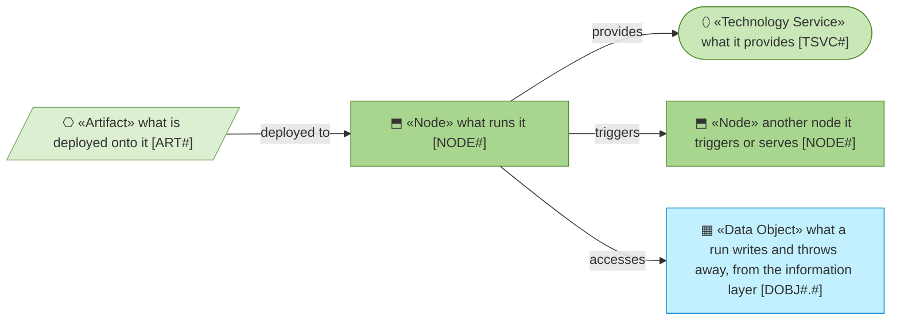
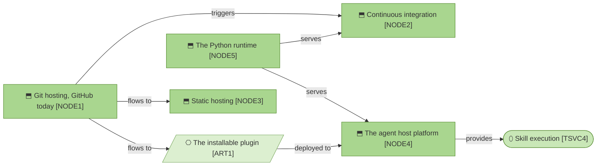

# Technology

_[← Front door](../README.md)_

What runs it all, and where each part lives and deploys.

**ArchiMate viewpoint:** Technology: Node, Technology Service, Artifact.

## Documents

| # | Document | Elements | Question it answers |
| - | -------- | -------- | ------------------- |
| 1 | [Technology and deployment](./1_technology-and-deployment.md) | Five nodes, none of them operated by the organization, five services, one artifact and the path a merged change takes | What runs it all, and how does a change reach where it runs? |

## Metamodel

Green is technology; the data object is a visitor from the information layer
and keeps its cyan.

## Layer view

A merge fans out to the checks, the site and the plugin an adopter installs;
the Python runtime serves the checks and the agent host, and nothing calls
anything else.
