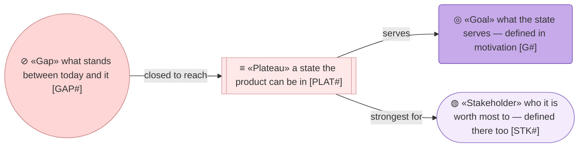
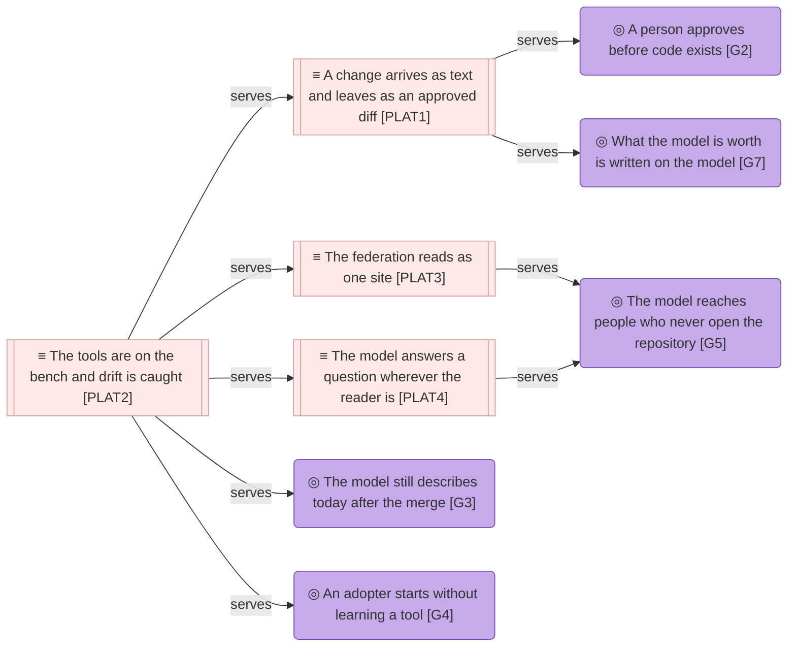
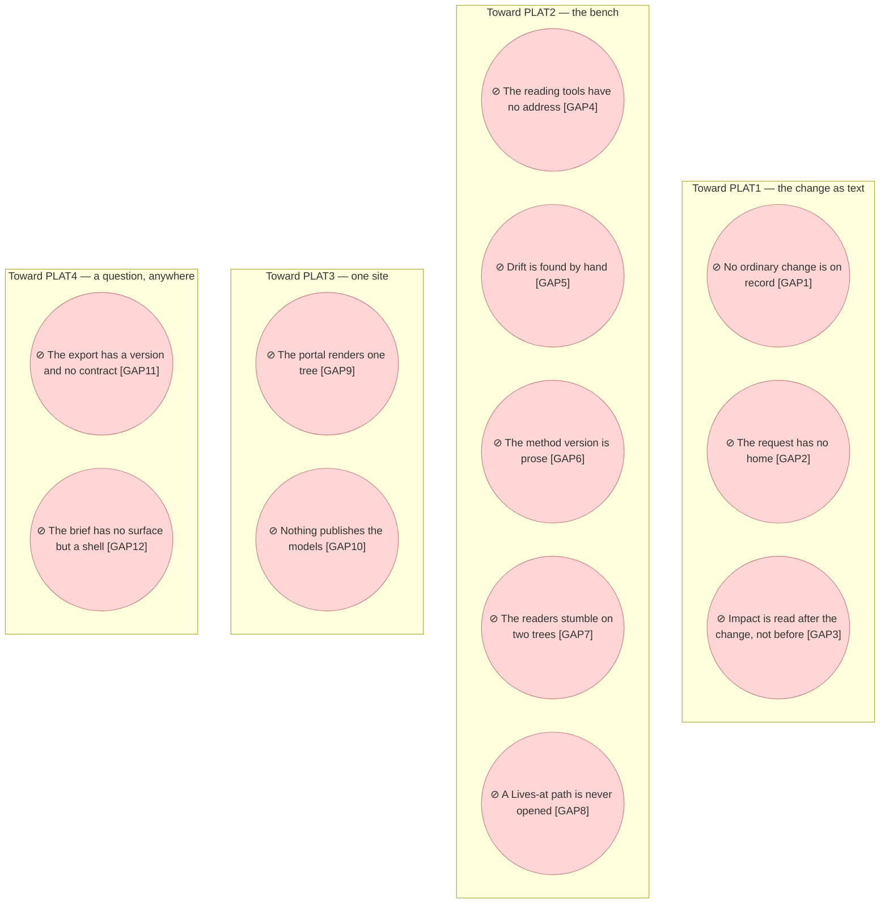

# Target state

_[← Roadmap](./README.md) · [Front door](../README.md)_

**ArchiMate viewpoint:** Implementation & Migration — Plateau, Gap.

**Status:** ◐ Draft catalogue — the destination is drafted, not yet approved.
**Direction** covers this document, and approving it approves the states and
their order, never the work.

Where the product should be, measured against the model as it stands, and
what stands between here and there. Every plateau is a state the product can
be in, named for what is true on arrival; every gap names the element it is
measured from and the plateau that closes it. The source of every row is
[the Requester's request](../reference/2026-09-06-poc-features-request.md).

## How to read this document

## The plateaus

**Three of the four hang off the bench, and the bench is the one in flight.**
The walk on record is checked on it, the site is built on it, and the export
a host would read is proven on it — which is why the least visible plateau is
the first one closed.

| ID | Plateau | Serves | Strongest for | Status |
| -- | ------- | ------ | ------------- | ------ |
| `PLAT1` | **A change arrives as text and leaves as an approved diff** — the request is filed as it was received, walked through the layers with a verdict on every one, scoped before its gate, approved by a reply on the pull request and transcribed into the Approvals table, and the model's diff is the whole of the change; an adopter reads one such walk here end to end, and it is an ordinary change rather than a rebuild | `G2`, `G7` | `STK1`, `STK3` | **Planned** |
| `PLAT2` | **The tools are on the bench and drift is caught** — one command runs the validators and every reading tool over both trees with nothing installed; every change proves that the validators here are the scaffold's and that the method still reads these models; the method version the models are written against is declared where a tool can read it | `G3`, `G4` | `STK2`, `STK4` | **In flight** — initiative 2 |
| `PLAT3` | **The federation reads as one site** — a reader who will not open a repository opens one site carrying both trees, every link between them resolves, and what is published is a rendering, never a second copy | `G5` | `STK5` | **Planned** |
| `PLAT4` | **The model answers a question wherever the reader is** — a reader outside a terminal asks one question and receives a brief generated from the current revision and stamped with it; whatever hosts the answer reads the Markdown fresh, or the export, and edits neither | `G5` | `STK5`, `STK1` | **Planned** |

**The first plateau is the product's whole argument.** Proposing a change to
an architecture with a sentence and a document, the agent doing the modeling
and a person deciding at the gate, is what the method offers in place of a
modeling tool; the model describes that service as
[Gated change alignment [BSVC1]](../2_business/1_business-services.md), and
the one initiative on record is a rebuild rather than a change, so nobody
evaluating the method can read the service being delivered here. That is the
first gap below, and the reason the ordinary change is the second thing on
the sequence rather than the last.

**Read down the Strongest-for column and the product's readers appear in the
order they meet it.** The Requester and the Reviewer of an adopting project
[STK1, STK3] want the walk; the agent and the maintainer [STK2, STK4] want
the bench; the reader outside the repository [STK5] wants the site, and then
wants the same answer without the site. No plateau is for the method alone.

**None of the four serves the goal that the model says where the subject is
going [G6], and none needs to.** This folder is what that goal asks for, and
the product had none until now — the one goal the product's own model failed,
closed by writing the page rather than by planning to.

### Relationships

What the diagram draws between the plateaus and no row can carry: the bench
serves the other three states, because each of them is checked, built or
proven on it.

| From | From element | To | To element | Relationship |
| ---- | ------------ | -- | ---------- | ------------ |
| `PLAT2` | ≡ «Plateau» The tools are on the bench and drift is caught | `PLAT1` | ≡ «Plateau» A change arrives as text and leaves as an approved diff | serves |
| `PLAT2` | ≡ «Plateau» The tools are on the bench and drift is caught | `PLAT3` | ≡ «Plateau» The federation reads as one site | serves |
| `PLAT2` | ≡ «Plateau» The tools are on the bench and drift is caught | `PLAT4` | ≡ «Plateau» The model answers a question wherever the reader is | serves |

## The gaps

Derived by subtracting today from the plateaus above, measured against the
two trees of this repository at the revision this document was drafted on.

**Five of the twelve are the bench's, and three of those are the method's to
close.** A gap measured from a component of the plugin is closed in the
archreator repository with its scope document here; the roadmap names it so
the Requester can carry it across, and so the initiative that closes it has a
row to mark.

| ID | Gap | Measured from | Closes toward | Status |
| -- | --- | ------------- | ------------- | ------ |
| `GAP1` | **No ordinary change is on record** — the one initiative recorded is a rebuild with its three gates still open; nothing here shows one requirement becoming a scoped, gated, merged diff, which is the service the product exists to deliver | `BSVC1` | `PLAT1` | **Planned** — initiative 3 |
| `GAP2` | **The request has no home** — what the Requester provides lives in the conversation it was said in; no `reference/` folder exists, so no Source cell can cite it | `DOBJ2.2` | `PLAT1` | **In flight** — initiative 2 |
| `GAP3` | **Impact is read after the change, not before** — `trace` and the impact brief answer what a change would touch, and the alignment walk never asks; a gate is presented with documents and no blast radius | `ASVC7` | `PLAT1` | **Planned** — initiative 5, in the method |
| `GAP4` | **The reading tools have no address** — the repository rules name `model.py` and `build_brief.py` and nothing says where they are; they live in the plugin, installed per host or not at all | `ACMP5`, `ACMP6` | `PLAT2` | **In flight** — initiative 2 |
| `GAP5` | **Drift between the method and the models is found by hand** — the validators here are copies of the scaffold's and nothing compares them; the checks on every change run the validators and never the readers, so a method change that broke `trace`, `coverage`, a brief or the portal on these trees would wait for somebody to notice | `ACMP3`, `TSVC2` | `PLAT2` | **In flight** — initiative 2 |
| `GAP6` | **The method version is prose** — "0.2" is a sentence on the front door and `0.2.0` a field in the plugin manifest; nothing reads either, so no tool can say that these models were written against a method the plugin has moved past | `ACMP10` | `PLAT2` | **Planned** — initiative 3 |
| `GAP7` | **The readers stumble on a two-tree repository** — `coverage` reports two rows as not true yet because it matches the marker anywhere in a row, where the parse anchors it to the start of a cell; a brief named with `--project` still stops on an identifier both trees own until `--scope` repeats the tree | `ACMP5`, `ACMP6` | `PLAT2` | **Planned** — initiative 4, in the method |
| `GAP8` | **A path in a `Lives at` cell is never opened** — twelve components name a path in the method's repository and no check opens one; a moved directory passes both validators silently, as the scripts' own README says | `ACMP2`, `ACMP3` | `PLAT2` | **Planned** — initiative 5 |
| `GAP9` | **The portal renders one tree** — the configuration the method writes covers one model; built for the product, seven links into the organization's tree, the repository rules and the scripts resolve to nothing | `ASVC8` | `PLAT3` | **Planned** — initiative 6 |
| `GAP10` | **Nothing publishes the models** — the static host serves the guidance site and nothing else; no workflow deploys a portal of these trees, and publishing a model is the Requester's decision, never a default | `NODE3`, `TSVC3` | `PLAT3` | **Planned** — initiative 6, on the Requester's authorization |
| `GAP11` | **The export has a version and no contract** — `model.json` carries a schema number and every field is documented in the code that writes it; nothing consumes it, so a host that did would have to guess | `DOBJ3.1` | `PLAT4` | **Planned** — initiative 7 |
| `GAP12` | **The brief has no surface but a shell** — one question is answered from a checkout by a command; the reader outside the repository has neither | `ACMP6`, `STK5` | `PLAT4` | **Planned** — initiative 7 |

## What is deliberately not a gap

- **A graph to explore.** A reader arrives with a question, not at a graph;
  the product answers with a brief, and a navigator would answer a question
  nobody asked.
- **A second model on the host.** Whatever serves the last plateau reads the
  Markdown fresh or the export, and writes nothing back. A host that edits is
  a second model, which is the thing the product exists to prevent.
- **A converter on the bench.** One brief or one scope document per PDF,
  converted by the agent with whatever the environment offers, is the
  method's rule; a converter here would be a dependency for a job any agent
  already does.
- **The organization's roadmap.** Its front door keeps the stated gap: where
  the organization is going is decided there, by the Requester, and never
  derived from where the product is going.
