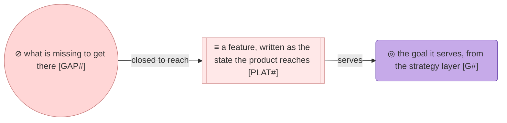
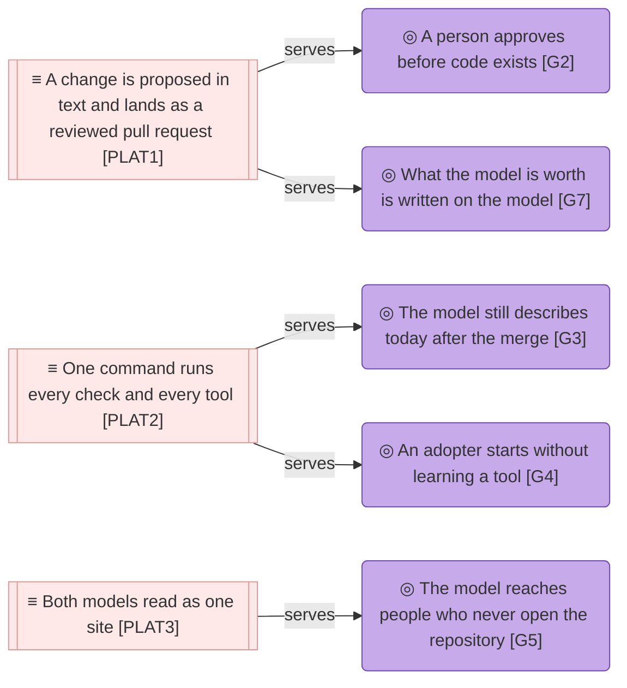

# Features

_[← Where the product is going](./README.md) · [Front door](../README.md)_

**Status:** ◐ Draft — not yet marked as reviewed by the owner.

Three features, each written as the state the product is in once it is done,
and under each what is missing today. Every row comes from
[the owner's request](../reference/2026-09-06-poc-features-request.md).

## How to read this document

## The features

| ID | Feature | Serves | For | Status |
| -- | ------- | ------ | --- | ------ |
| `PLAT1` | **A change is proposed in text and lands as a reviewed pull request** — the request is filed as it was received, the agent walks the layers and gives each a verdict, writes the note and opens the pull request, and the owner's merge is the approval; one such change is on record here, an ordinary one rather than a rebuild, so an adopter can read it end to end | `G2`, `G7` | `STK1`, `STK3` | **Planned** |
| `PLAT2` | **One command runs every check and every tool** — the validators and every reading tool run over both trees with nothing installed, and the command fails when the validators here differ from the method's or the method no longer reads these models; the method version the models are written against is declared where a tool can read it | `G3`, `G4` | `STK2`, `STK4` | **In progress** — scope note 2 |
| `PLAT3` | **Both models read as one site** — a reader who will not open a repository opens one site carrying both trees, and every link between them resolves; the site is a rendering, never a second copy | `G5` | `STK5` | **Planned** |

**The first feature is the product's whole argument.** Proposing a change to
an architecture with a sentence and a document, the agent doing the modeling
and the owner deciding on the pull request, is what the method offers in
place of a modeling tool. The one change on record is a rebuild, so nobody
evaluating the method can read that happening here yet.

## What is missing

| ID | Missing | Measured from | Closes toward | Status |
| -- | ------- | ------------- | ------------- | ------ |
| `GAP1` | **No ordinary change is on record** — the one change recorded is a rebuild; nothing shows one request becoming a reviewed, merged diff, which is the service the product exists to deliver | `BSVC1` | `PLAT1` | **Planned** |
| `GAP2` | **The request has no home** — what the owner asks for lives in the conversation it was said in; no `reference/` folder exists, so nothing can cite it | `DOBJ2.2` | `PLAT1` | **In progress** — scope note 2 |
| `GAP3` | **Impact is read after the change, not before** — `trace` and the impact brief answer what a change would touch, and the walk never asks; a pull request shows documents and no blast radius | `ASVC7` | `PLAT1` | **Planned** — in the method |
| `GAP4` | **The reading tools have no address** — the repository rules name `model.py` and `build_brief.py` and nothing says where they are; they live in the plugin, installed per host or not at all | `ACMP5`, `ACMP6` | `PLAT2` | **In progress** — scope note 2 |
| `GAP5` | **Drift between the method and the models is found by hand** — the validators here are copies of the method's and nothing compares them; nothing runs the readers over these trees unless somebody remembers to | `ACMP3`, `TSVC2` | `PLAT2` | **In progress** — scope note 2 |
| `GAP6` | **The method version is prose** — "0.2" is a sentence on the front door and `0.2.0` a field in the plugin manifest; nothing reads either, so no tool can say the models were written against a method the plugin has moved past | `ACMP10` | `PLAT2` | **Planned** |
| `GAP7` | **The readers stumble on a two-tree repository** — `coverage` reports two rows as not true yet because it matches the marker anywhere in a row, where the parse anchors it to the start of a cell; a brief named with `--project` still stops on an identifier both trees own until `--scope` repeats the tree | `ACMP5`, `ACMP6` | `PLAT2` | **Planned** — in the method |
| `GAP8` | **A path in a `Lives at` cell is never opened** — twelve components name a path in the method's repository and no check opens one; a moved directory passes both validators silently | `ACMP2`, `ACMP3` | `PLAT2` | **Planned** |
| `GAP9` | **The portal renders one tree** — the configuration the method writes covers one model; built for the product, seven links into the organization's tree, the repository rules and the scripts resolve to nothing | `ASVC8` | `PLAT3` | **Planned** |

## Deliberately not here

- **A graph to explore.** A reader arrives with a question, and the brief
  answers it.
- **Anything hosted on another platform.** Running the method elsewhere is a
  separate solution, synced back into this repository when it exists. Nothing
  here plans for it.
- **A PDF converter.** One brief or one note per PDF, converted by the agent
  with whatever the environment offers.
- **The organization's roadmap.** Its front door keeps the stated gap.
