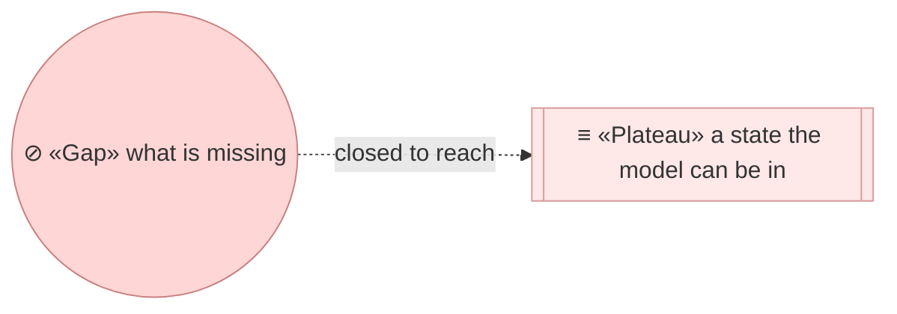
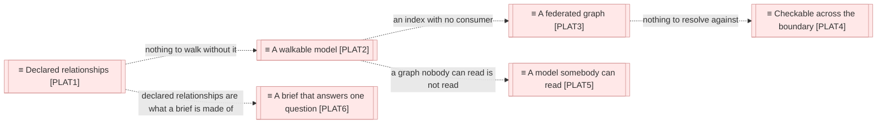
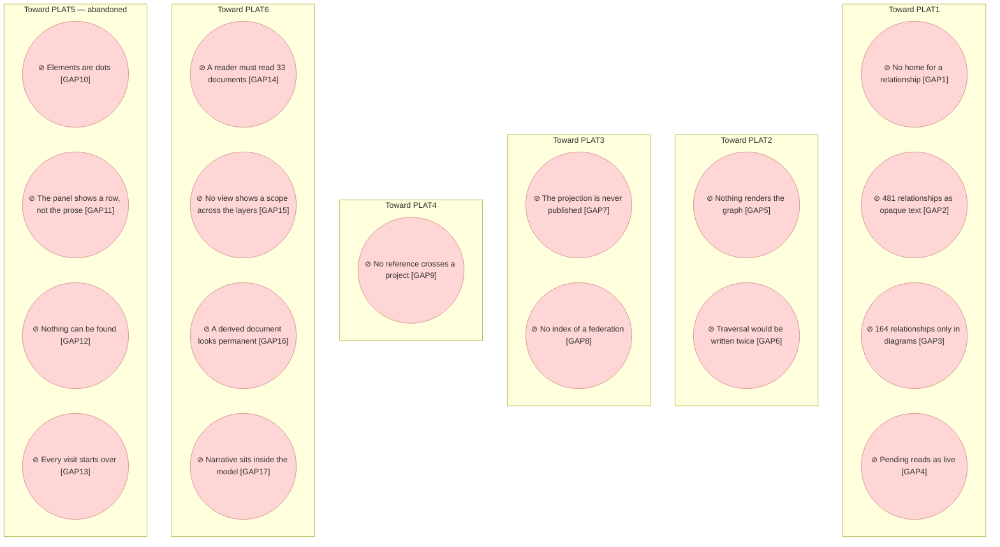

# Target state

_[← Roadmap](./README.md) · [EA home](../README.md)_

**ArchiMate viewpoint:** Implementation & Migration. Where the model's
relationships are going, and what is missing between here and there.

**Status:** ● Validated at **Gate 1**, 2026-08-27 — the destination and the order,
approved as direction. It approves no work: every initiative below still stops at
its own Gate 2.

The method models the element and not the relationship. `BOBJ2` has an
identifier, a type, a level and a rule that it names what realizes it; the
relationship between two elements has none of that, and so it settled wherever
an author happened to write it. Today that is mostly inside a Mermaid diagram,
which is a **rendering** — and a fact whose only home is a rendering is a fact
`P1` says the method does not have.

Everything below is a consequence of that single omission. Nothing here
proposes a new capability: `CAP4` already exists to prove the model internally
consistent, and `G5` already commits the method to reaching readers who never
open a repository. What is missing is the relationship itself.

## How to read this document

| Glyph | Shape | Element | ID prefix | Reads as |
| ----- | ----- | ------- | --------- | -------- |
| `≡` | Subroutine | «Plateau» | `PLAT` | `PLAT1` = Plateau 1 |
| `⊘` | Circle | «Gap» | `GAP` | `GAP1` = Gap 1 |

Dashed edges throughout: none of these states is reached.

## The plateaus

| ID | Plateau | The state it names | Status |
| -- | ------- | ------------------ | ------ |
| `PLAT1` | **Declared relationships** | Every relationship an element has is **stated** — in a catalogue column or a relationship table a Requester can read and a validator already checks — and the projection carries it as an edge that knows where it came from and whether it is live. Diagrams render; they no longer declare | **In flight** — [initiative 8](../scope/8_declare-the-relationships-and-let-the-graph-be-walked.md) |
| `PLAT2` | **A walkable model** | The projection has a visual reader: one static page, filters by layer and element type, and expansion outward from any node. No server, no deployed database | **Abandoned** — [decision 4](../decisions/4_the-graph-portal-is-retired.md). A reader does not arrive at a graph, they arrive at a question, and a graph makes them reconstruct it by clicking. Superseded by `PLAT6` |
| `PLAT3` | **A federated graph** | Each project publishes its own projection at a stable URL. The topmost tree of a federation — the organization, or the parent business function where there is no organization — owns an **index** naming those URLs. The graph is the union, computed at read time and owned by nobody | **In flight** — [initiative 10](../scope/10_federate-the-graph.md) |
| `PLAT4` | **Checkable across the boundary** | A reference can name an element in another project, and something checks it. Decision 1's recorded consequence — "no validator crosses the repository boundary" — stops being true | **In flight** — [initiative 11](../scope/11_cross-the-boundary.md) |
| `PLAT5` | **A model somebody can read** | Elements are named boxes, not dots. Selecting one shows what the documents say about it, not just its catalogue row. Somebody who does not know an identifier can find it. A view arranged by hand can be kept and shared | **Abandoned** — [decision 4](../decisions/4_the-graph-portal-is-retired.md). Reached, then written off with the plateau it was making legible. What it built — the prose excerpts, the faceted vocabulary — is what `PLAT6` is assembled from |
| `PLAT6` | **A brief that answers one question** | A reader names a scope — an element, a domain, a function — and gets a Markdown document generated on the spot: the elements that matter, the ArchiMate views that show how they depend on each other across the layers, and the paragraphs the documents already write about them. Disposable, never committed, stamped with the revision it came from | **In flight** — [initiative 13](../scope/13_answer-one-question.md) |

**`PLAT6` is the Requester's direction, in their words**, and it retires two
plateaus rather than adding to them — see [decision 4](../decisions/4_the-graph-portal-is-retired.md):

> I see myself wanting to explore the architecture for specific use cases or
> domains, and the best thing I could get is a temporary document created
> in-time with the architectural elements relevant to me, no need to navigate
> graphs and explore blindly.

**The view that matters most is the multi-layer one.** A reader asking about a
domain, a function or a scope is asking how business and information reach
application and technology — that chain is where understanding is thin, and it
is what a brief leads with. Other views follow it; none replaces it.

**`PLAT2` and `PLAT5` keep their rows.** Nothing here is deleted when it stops
being the plan: a reached plateau removed leaves no evidence the direction was
ever taken, and an abandoned one removed invites somebody to propose it again
in two years.

**`PLAT5` was the Requester's direction too, in their words**, recorded here
because the roadmap is the only place the method permits a future to be
described and [decision 3](../decisions/3_the-navigator-earns-its-own-initiative.md)
is why it was added outside the approved sequence:

> Improve the visualization, a user should be able to read the names of the
> elements and in boxes at least, and being able to see definitions and related
> documentation in the markdown as a properties panel. Think of a user trying
> to understand the architecture and needs to find elements (search) and query
> certain elements. We need an intelligent search that can guide the user on
> existing types, elements, etc. I would also like to be able to create and
> safe certain views by adjusting the elements as if I was creating
> visualisations in archi, but nothing is created from there, just displays and
> allows visual personalization.

**It depends on `PLAT2` and on nothing else.** A reader is worth improving once
there is a reader; it needs neither federation nor a crossed boundary, and it
would have been worth building if neither existed.

**`PLAT1` is the only one that is not optional.** The other three are worth
having; without `PLAT1` they are worth having *and impossible*, because each of
them is a consumer of a relationship set that does not currently exist.

**`PLAT3` deliberately has no central model.** A tree that held the union would
restate what another tree owns, which the tier rule in
`architecture-document-style` forbids in as many words, and would need approval
rights over elements it does not own. What is centralized is a list of URLs.
The graph is a view.

### Relationships

<!-- Transcribed from this document's diagrams. The identifier is
     authoritative; the description beside it is checked against the
     catalogue that defines the element. -->

| From | From element | To | To element | Relationship |
| ---- | ------------ | -- | ---------- | ------------ |
| `PLAT1` | «Plateau» Declared relationships | `PLAT2` | «Plateau» A walkable model | nothing to walk without it |
| `PLAT2` | «Plateau» A walkable model | `PLAT3` | «Plateau» A federated graph | an index with no consumer |
| `PLAT3` | «Plateau» A federated graph | `PLAT4` | «Plateau» Checkable across the boundary | nothing to resolve against |

## The gaps

Derived by subtracting today from the plateaus above, and measured against the
three trees in this repository on 2026-08-27.

| ID | Gap | What is true today | Closes toward |
| -- | --- | ------------------ | ------------- |
| `GAP1` | **The relationship has no home in the model** | `BOBJ2` names the element. Nothing names the relationship, so no rule says where one is written, and no document owes one | `PLAT1` |
| `GAP2` | **Cross-layer relationships are opaque text** | 481 backticked identifiers sit in catalogue columns — `Realizes`, `Serves`, `Source`, `Provided by`, `Accessed by` — where `ACMP7` carries them into `attrs` as strings and `ACMP8` never makes an edge of them. 47% of `org-archreator`'s 184 elements have no edge at all | `PLAT1` |
| `GAP3` | **Peer relationships exist only inside diagrams** | 164 relationships are drawn in Mermaid and stated nowhere else. They are overwhelmingly **within one layer** — `CAP5 precedes CAP1`, `ACMP10 carries ACMP5`, `DRV1 evidenced by ASM1` — because a catalogue has one row per element and no column shape for a peer. The diagram was the only surface available | `PLAT1` |
| `GAP4` | **A pending relationship reads as a live one** | The notation says a dashed edge means Pending. `ACMP7`'s edge pattern matches the dashed arrow form and discards which form matched, so 24 pending relationships are indistinguishable from live ones in `DOBJ4`. Anything reading the projection as current state is wrong about them | `PLAT1` |
| `GAP5` | **Nothing renders the graph** | `ACMP14` prints text. A reader who is not in a terminal has the portal, which renders documents and draws no graph | `PLAT2` |
| `GAP6` | **Traversal would be written twice** | `ACMP14` walks `model.json` in Python. A web reader would walk `model.db` in the browser. Two implementations of one traversal is the drift `ACMP7` was created to prevent, one level up | `PLAT2` |
| `GAP7` | **The projection is never published** | `DOBJ4` is gitignored and local. Federation needs an interchange format, and `stack-selection` § A persisted projection needs one of four triggers names exactly this case — "an agent cannot `grep` a repository it has not cloned" | `PLAT3` |
| `GAP8` | **No index names the projects in a federation** | The fact exists in prose: `org-archreator`'s component catalogue carries a **Modeled in** column pointing at the tree that holds each component's detail. Nothing machine-readable carries it | `PLAT3` |
| `GAP9` | **No reference crosses a project** | `ACMP6` scopes every identifier to its project and rejects a foreign one as dangling. `ACMP14` stops at the same boundary, so "what would this change touch" silently excludes everything in another tree. Decision 1 records this consequence and accepts it as the price of the split | `PLAT4` |
| `GAP10` | **Elements are dots** | A node is a six-pixel circle with an identifier beside it, and the identifier is hidden entirely once a hundred are on screen. A reader sees a shape and learns nothing from it: `CAP5` is not a name, and a graph whose nodes cannot be read is a picture of a graph | `PLAT5` |
| `GAP11` | **The panel shows a row, not the prose** | Selecting an element gives its catalogue columns and a link to the document that defines it. What the document *says* — the paragraph that defines a goal, the note explaining why a component exists — is one click and one scroll away, which is where a reader trying to understand something stops | `PLAT5` |
| `GAP12` | **Nothing can be found** | There is no search. A reader who does not already know that `BSVC7` is the identifier they want has one route to it: switch every layer on and read 363 labels. Somebody meeting the model for the first time is exactly the reader who cannot do that | `PLAT5` |
| `GAP13` | **Every visit starts over** | The layout is recomputed on load and the filters reset. A reader who arranged the six elements that explain something to a colleague cannot keep the arrangement, and cannot send it to them | `PLAT5` |
| `GAP14` | **A reader must read 33 documents** | Understanding one domain, function or use case means opening every layer document and holding the relevant rows in your head. The model has 368 elements across 33 documents; nothing assembles the subset that answers one question | `PLAT6` |
| `GAP15` | **No view shows a scope across the layers** | Each layer document diagrams itself. The chain a reader actually needs — a business service, the information it uses, the application component that realizes it, the technology it runs on — is spread across four documents and drawn in none of them. That chain is where understanding is thinnest and it is the view a brief must lead with | `PLAT6` |
| `GAP16` | **A derived document looks permanent** | The PDF and the portal say they are rendered from the repository; neither says it is disposable. A generated document that does not announce what it is gets committed, emailed, and quoted eight months later — which is the second source of truth this method exists to prevent | `PLAT6` |
| `GAP17` | **Narrative folders sit inside the model** | `scope/`, `decisions/`, `reference/`, `reviews/` and `engagements/` are nested in `architecture/`, which says they are the architecture. `model_graph.py` already disagrees — it lists them as `NARRATIVE` and skips them. They are how the model got here, not what it says, and they belong in a sibling of it. Moving them touches five folders across every tree, every skill that writes into one, and the parse constant that names them — see [decision 5](../decisions/5_folders-that-are-not-the-architecture.md) | — |

## What is deliberately not here

**No relationship vocabulary.** `ACMP8` carries a Mermaid edge label verbatim
on the stated grounds that mapping it onto ArchiMate's vocabulary would be a
guess, and a wrong guess in a projection is worse than an honest string. That
reasoning does not change because the label moves into a table. The corpus
currently uses 111 distinct labels across 306 edges, 67 of them exactly once —
which is worth **reporting** so a project can converge on its own, and is not
worth a controlled list the method would then have to translate.

**No graph database.** At 345 elements and 306 edges across three trees, the
projection is 369 KB. `stack-selection` already settled this: at the scale a
model reaches, SQLite is the graph database. The point at which a model stops
being comprehensible to a person arrives long before the point at which it
stops fitting in a browser tab.

**No private-repository federation.** `PLAT3` works by fetching a published
URL, so it reaches public projects. That is enough to prove the shape.
