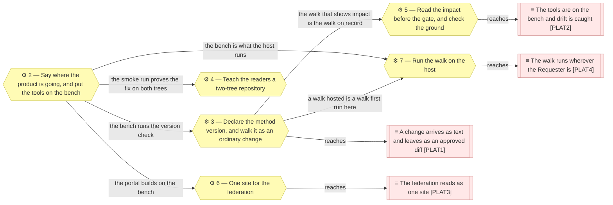

# Sequence

_[← Roadmap](./README.md) · [Target state](./1_target-state.md) · [Front door](../README.md)_

**ArchiMate viewpoint:** Implementation & Migration. The order the gaps in
[the target state](./1_target-state.md) are closed in, and what has to be true
before each initiative can start.

**Status:** ◐ Draft catalogue — the order is drafted, not yet approved.
**Direction** covers this document.

This document defines no elements. It orders the ones the target state names,
and it carries no dates: what must precede what is the method's business, and
how long each step takes is the initiative's.

## The order

**Everything starts from the initiative in flight, and the two that leave the
repository come last.** Four arrows leave initiative 2 because the bench is
where every later step is checked; the site and the hosted answer sit at the
end because each is the first step whose output lives somewhere other than
this repository, and that is the Requester's word to give.

| # | Initiative | Closes | Reaches | Needs first | State |
| - | ---------- | ------ | ------- | ----------- | ----- |
| 2 | **Say where the product is going, and put the tools on the bench** — [scope document 2](../scope/2_say-where-the-product-is-going.md) | `GAP2`, `GAP4`, `GAP5` | `PLAT2`, in part | — | **In flight** |
| 3 | **Declare the method version, and walk it as an ordinary change** — the front door says which method version the models are written against, a bench check compares it with the plugin's, and the change is walked from a filed request to a gate granted on the pull request, so the walk itself is the record the first plateau asks for | `GAP1`, `GAP6` | `PLAT1` | 2 — the bench runs the check | **Planned** |
| 4 | **Teach the readers a two-tree repository** — the marker is read at the start of a cell in the coverage report as the parse already reads it, and `--project` narrows a brief to its own tree | `GAP7` | — | 2 — the smoke run proves the fix on both trees | **Planned** — a change to the method, recorded here |
| 5 | **Read the impact before the gate, and check the ground** — the alignment walk shows what a change would touch before Understanding, and a check opens every path a `Lives at` cell names against the method on the bench | `GAP3`, `GAP8` | `PLAT2` | 2 — the method checkout is where a path is opened; 3 — the walk on record is the walk this changes | **Planned** — half of it a change to the method |
| 6 | **One site for the federation** — one portal configuration over both trees, so every link between them resolves; then, on the Requester's authorization, a workflow that publishes it | `GAP9`, then `GAP10` | `PLAT3` | 2 — the portal builds on the bench; the Requester's word before anything is published | **Planned** |
| 7 | **Run the walk on the host** — the skills run on the hosted platform against a working copy, a gate granted there lands in the scope document, and a change leaves as a pull request | `GAP11`, `GAP12` | `PLAT4` | 2 — the bench is what the host runs; 3 — a walk hosted is a walk first run here; the Requester's word before a copy is held off the repository | **Planned** |

## Why this order and not another

**The bench first, because everything checks against it.** Every later
initiative ends in a verdict the smoke run gives — a check passes, a brief
writes, a portal builds — and a roadmap whose steps cannot be checked is a
list of wishes.

**The ordinary change second, because it is the product's argument and the
cheapest thing to show.** Declaring a method version is one line on the front
door and one comparison on the bench; walking that line from a filed request
to a gate granted on the pull request costs nothing extra and leaves the
record the first plateau asks for. A larger change would show the same thing
more slowly.

**The method's fixes before the site, because a site renders what the readers
read.** A portal over two trees that still misreports two rows as not true
yet publishes the mistake; the readers are corrected first, and the smoke run
is what proves the correction on these models rather than on a probe.

**The host last, because it is the one step that leaves the repository.** A
site can be built locally and never published; a host holds a working copy by
definition, and a walk hosted there is a walk that has to have been run here
first. Both wait on the same authorization, and the host waits on the site
only where the Requester wants the site first.

## What the Requester decides

Two orderings are equally sound to an architect and are the Requester's to
settle at Direction:

- **Whether 7 precedes 6.** Nothing in running the walk on the host needs the
  site. If the hosted platform is the priority, initiative 7 moves ahead and
  the site follows, or never comes.
- **Whether 4 and 5 are one initiative in the method's repository.** Both are
  small, both touch the reading tools, and one scope document here could
  record them together.

## What would change this plan

- **The host is wanted before the walk on record exists.** Then initiative 7
  moves ahead of 3 and the first ordinary change is walked on the host; the
  record is the same, and only the surface differs.
- **The walk in 3 needs more than the skills give.** If aligning one ordinary
  change here exposes a step the method is silent on, the retrospective after
  it says so, and the impact step of 5 moves earlier.
- **A second product appears.** The site of the federation and the host both
  assume two trees; a third is a small change if known in advance and an
  awkward one if not.
