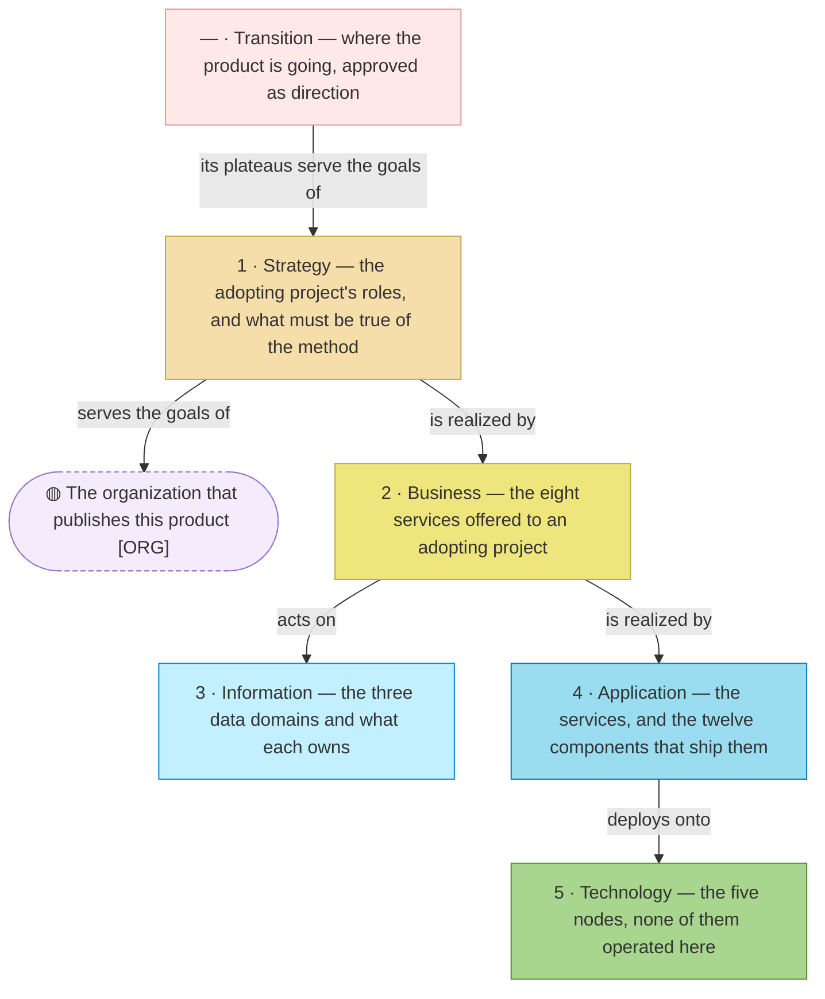

# Architecture — archreator, the product

_The front door of this model. Repository-wide rules: [`AGENTS.md`](../AGENTS.md)._

**This folder is what the product knows about itself** — who it is for, which
services it offers, and which piece of the [archreator
repository](https://github.com/roanboc/archreator) realizes each part. Plain
Markdown, one source, no copies.

**Federation ID:** `PRD_MTD` — a reference to this model from another model
in the federation reads `PRD_MTD.BSVC#`. The product carries a short name
from birth because a second product must never rename the first.

## What is modeled, and what is not

**The chain runs one way and stops once.** Layer 0 is somebody else's — the
canvases belong to the organization. Everything below it is here, one folder
per box, and the last box is the one folder permitted to describe a future:
where the product is going, approved as direction and never as work. The
table below says what each one holds.

| # | Layer | The question it answers | Status |
| - | ----- | ----------------------- | ------ |
| 0 | Business design | Who are the customers, and how does each offering pay? | `Out of scope` — the subject is an application; the canvases belong to [the organization](../../org-archreator/architecture/README.md) |
| 1 | [Strategy](./1_strategy/README.md) | Why does this exist, and what must it be able to do? | `Local` — motivation: light, and enough to judge a change against |
| 2 | [Business](./2_business/README.md) | Who does what, and which services are offered? | `Local` — the services, one document |
| 3 | [Information](./3_information/README.md) | What information exists, and where does it live? | `Local` — the data domains and what each owns, one document |
| 4 | [Application](./4_application/README.md) | Which software realizes each service? | `Local` — services and components |
| 5 | [Technology](./5_technology/README.md) | What runs it all? | `Local` — hosts, runtimes and the deployment |
| — | [Transition](./6_transition/README.md) | Where is this going, and in what order? | `Local` — four plateaus, the gaps under each, and the order they close in; direction, never permission |

Domains stay unused at Depth 1.

**What is modeled where.** The method's motivation is here, in
[`1_strategy/`](./1_strategy/README.md). Its **process model** is not: it
lives in `docs/process/` of the archreator repository, beside the skills
that realize it, because that adjacency is what lets CI prove every process
has a skill and every skill a process.

## How far each document has been validated

Every document that defines elements opens with `○` not started, `◐` draft
catalogue, or `●` validated at a named gate. **Everything in this model is
`◐` today** — the gates are pending in
[initiative 1](./scope/1_rebuild-the-models-on-method-02.md), and the
roadmap's Direction in [initiative 2](./scope/2_say-where-the-product-is-going.md).

## Federation

This model cites the organization's — the contract is
[`federation.md`](./federation.md).
