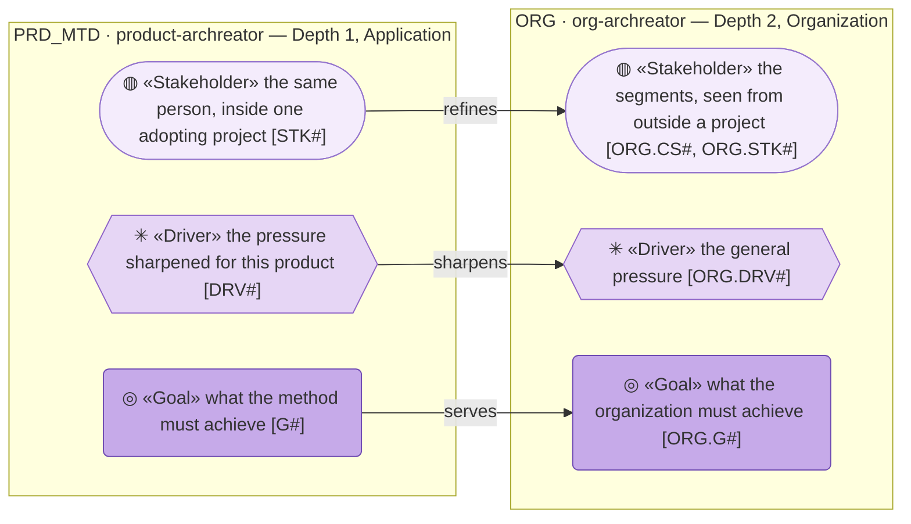

# Federation

_[← Front door](./README.md)_

**Every arrow points the same way, and that is the contract.** The models
this one cites, each by its **federation ID** — the short uppercase code the
model declares on its own front door. The ID leads a qualified reference —
`ORG.G#` — and resolves against that model's own definitions, because both
live in this repository. Three kinds of element cross the boundary and no
others: a stakeholder refines a segment, a driver sharpens a driver, a goal
serves a goal.

| ID | Model | Level | Where | Relationship |
| -- | ----- | ----- | ----- | ------------ |
| `ORG` | `org-archreator` | Organization | [`../../org-archreator/architecture/`](../../org-archreator/architecture/README.md) | The organization that publishes this product; the product's goals serve its goals |

Read by position: cell 1 the federation ID, cell 2 the model's key — its
tree name, backticked.

References run one way: this model cites the organization's elements, never
the reverse — a new product needs to know its parent, and the parent needs
to know nothing about it.
