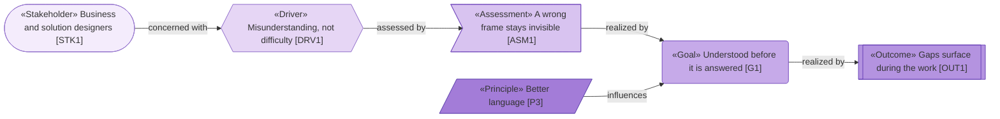
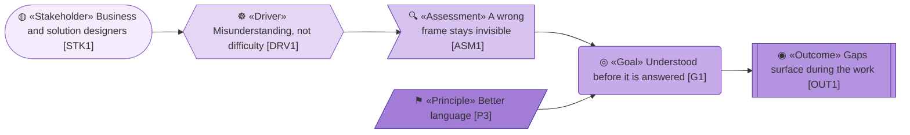
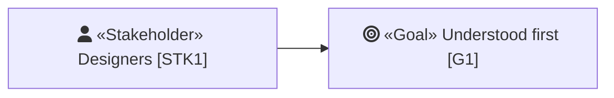

# Notation review — can ArchiMate icons be drawn in Mermaid?

_[← meta home](../../README.md)_

**Question.** The [strategy layer](../../../org-archreator/architecture/1_strategy/1_motivation.md)
distinguishes element types by shape and by a tone ramp, because Mermaid has
no ArchiMate profile and therefore no element icons. Icons would be better:
they are what an ArchiMate practitioner actually reads, and they carry the
type without spending a line of the label on it.

**This page is the test.** Four approaches are drawn below with the same six
motivation elements. Read it **on GitHub**, because GitHub's Mermaid renderer
is the one that matters — a diagram that only works in a local tool is a
diagram archreator cannot use.

> Every approach here was rendered locally first with `mermaid-cli`, so a
> blank diagram below means GitHub's renderer refused it, not that the syntax
> is wrong.

## Option 1 — shape and tone only (what the model uses today)

Works everywhere, costs nothing, and the source stays readable. The
limitation is that shape and tone have to be *learned* from the legend —
nothing about a hexagon says "driver" to someone who has not read it.

## Option 2 — Unicode glyphs in the label

Free and portable, and two of them are genuinely right — `◎` is the ArchiMate
Goal and `◉` is close to the Outcome. The rest are approximations, the
magnifier arrives as a colour emoji among monochrome glyphs, and every glyph
renders differently depending on the reader's installed fonts.

## Option 3 — Font Awesome, via `fa:` in the label

Renders correctly in `mermaid-cli`, which loads Font Awesome into its own
page. **It depends entirely on the host page shipping that font**, so what
appears above is the real answer for GitHub. Font Awesome also has no
ArchiMate icons — `fa-bullseye` is a lucky near-match for Goal and there is
nothing resembling an Assessment or a Course of Action.

## Option 4 — the icon shape, `@{ img: … }`

```mermaid
flowchart LR
  stk@{ img: "data:image/svg+xml;base64,PHN2ZyB4bWxucz0iaHR0cDovL3d3dy53My5vcmcvMjAwMC9zdmciIHZpZXdCb3g9IjAgMCAzMiAzMiIgd2lkdGg9IjMyIiBoZWlnaHQ9IjMyIj48Y2lyY2xlIGN4PSIxNiIgY3k9IjE2IiByPSIxMCIgZmlsbD0ibm9uZSIgc3Ryb2tlPSIjNDUyN2EwIiBzdHJva2Utd2lkdGg9IjIuNSIvPjxsaW5lIHgxPSIxNiIgeTE9IjYiIHgyPSIxNiIgeTI9IjI2IiBzdHJva2U9IiM0NTI3YTAiIHN0cm9rZS13aWR0aD0iMi41Ii8+PC9zdmc+", label: "«Stakeholder» STK1 Designers", pos: "t", w: 150, h: 40, constraint: "on" }
  drv@{ img: "data:image/svg+xml;base64,PHN2ZyB4bWxucz0iaHR0cDovL3d3dy53My5vcmcvMjAwMC9zdmciIHZpZXdCb3g9IjAgMCAzMiAzMiIgd2lkdGg9IjMyIiBoZWlnaHQ9IjMyIj48Y2lyY2xlIGN4PSIxNiIgY3k9IjE2IiByPSIxMSIgZmlsbD0ibm9uZSIgc3Ryb2tlPSIjNDUyN2EwIiBzdHJva2Utd2lkdGg9IjIuNSIvPjxjaXJjbGUgY3g9IjE2IiBjeT0iMTYiIHI9IjMuNSIgZmlsbD0iIzQ1MjdhMCIvPjxsaW5lIHgxPSIxNiIgeTE9IjUiIHgyPSIxNiIgeTI9IjEyLjUiIHN0cm9rZT0iIzQ1MjdhMCIgc3Ryb2tlLXdpZHRoPSIyLjUiLz48bGluZSB4MT0iMTYiIHkxPSIxOS41IiB4Mj0iMTYiIHkyPSIyNyIgc3Ryb2tlPSIjNDUyN2EwIiBzdHJva2Utd2lkdGg9IjIuNSIvPjxsaW5lIHgxPSI1IiB5MT0iMTYiIHgyPSIxMi41IiB5Mj0iMTYiIHN0cm9rZT0iIzQ1MjdhMCIgc3Ryb2tlLXdpZHRoPSIyLjUiLz48bGluZSB4MT0iMTkuNSIgeTE9IjE2IiB4Mj0iMjciIHkyPSIxNiIgc3Ryb2tlPSIjNDUyN2EwIiBzdHJva2Utd2lkdGg9IjIuNSIvPjwvc3ZnPg==", label: "«Driver» DRV1 Misunderstanding", pos: "t", w: 150, h: 40, constraint: "on" }
  g@{ img: "data:image/svg+xml;base64,PHN2ZyB4bWxucz0iaHR0cDovL3d3dy53My5vcmcvMjAwMC9zdmciIHZpZXdCb3g9IjAgMCAzMiAzMiIgd2lkdGg9IjMyIiBoZWlnaHQ9IjMyIj48Y2lyY2xlIGN4PSIxNiIgY3k9IjE2IiByPSIxMiIgZmlsbD0ibm9uZSIgc3Ryb2tlPSIjNDUyN2EwIiBzdHJva2Utd2lkdGg9IjIuNSIvPjxjaXJjbGUgY3g9IjE2IiBjeT0iMTYiIHI9IjciIGZpbGw9Im5vbmUiIHN0cm9rZT0iIzQ1MjdhMCIgc3Ryb2tlLXdpZHRoPSIyLjUiLz48Y2lyY2xlIGN4PSIxNiIgY3k9IjE2IiByPSIyLjUiIGZpbGw9IiM0NTI3YTAiLz48L3N2Zz4=", label: "«Goal» G1 Understood first", pos: "t", w: 150, h: 40, constraint: "on" }
  stk --> drv --> g
```

True ArchiMate icons, embedded as `data:` URIs so nothing is fetched from
outside the page. But the icon shape **replaces** the node: the fill, the
outline shape and the tone all go, leaving an image with a caption. That
trades three signals for one.

## Option 5 — icons inside a normal node

```mermaid
flowchart LR
  stk(["<img src='data:image/svg+xml;base64,PHN2ZyB4bWxucz0iaHR0cDovL3d3dy53My5vcmcvMjAwMC9zdmciIHZpZXdCb3g9IjAgMCAzMiAzMiIgd2lkdGg9IjMyIiBoZWlnaHQ9IjMyIj48Y2lyY2xlIGN4PSIxNiIgY3k9IjE2IiByPSIxMCIgZmlsbD0ibm9uZSIgc3Ryb2tlPSIjNDUyN2EwIiBzdHJva2Utd2lkdGg9IjIuNSIvPjxsaW5lIHgxPSIxNiIgeTE9IjYiIHgyPSIxNiIgeTI9IjI2IiBzdHJva2U9IiM0NTI3YTAiIHN0cm9rZS13aWR0aD0iMi41Ii8+PC9zdmc+' width='18' height='18' /> «Stakeholder» Business and solution designers [STK1]"]):::stakeholder
  drv{{"<img src='data:image/svg+xml;base64,PHN2ZyB4bWxucz0iaHR0cDovL3d3dy53My5vcmcvMjAwMC9zdmciIHZpZXdCb3g9IjAgMCAzMiAzMiIgd2lkdGg9IjMyIiBoZWlnaHQ9IjMyIj48Y2lyY2xlIGN4PSIxNiIgY3k9IjE2IiByPSIxMSIgZmlsbD0ibm9uZSIgc3Ryb2tlPSIjNDUyN2EwIiBzdHJva2Utd2lkdGg9IjIuNSIvPjxjaXJjbGUgY3g9IjE2IiBjeT0iMTYiIHI9IjMuNSIgZmlsbD0iIzQ1MjdhMCIvPjxsaW5lIHgxPSIxNiIgeTE9IjUiIHgyPSIxNiIgeTI9IjEyLjUiIHN0cm9rZT0iIzQ1MjdhMCIgc3Ryb2tlLXdpZHRoPSIyLjUiLz48bGluZSB4MT0iMTYiIHkxPSIxOS41IiB4Mj0iMTYiIHkyPSIyNyIgc3Ryb2tlPSIjNDUyN2EwIiBzdHJva2Utd2lkdGg9IjIuNSIvPjxsaW5lIHgxPSI1IiB5MT0iMTYiIHgyPSIxMi41IiB5Mj0iMTYiIHN0cm9rZT0iIzQ1MjdhMCIgc3Ryb2tlLXdpZHRoPSIyLjUiLz48bGluZSB4MT0iMTkuNSIgeTE9IjE2IiB4Mj0iMjciIHkyPSIxNiIgc3Ryb2tlPSIjNDUyN2EwIiBzdHJva2Utd2lkdGg9IjIuNSIvPjwvc3ZnPg==' width='18' height='18' /> «Driver» Misunderstanding, not difficulty [DRV1]"}}:::driver
  asm>"<img src='data:image/svg+xml;base64,PHN2ZyB4bWxucz0iaHR0cDovL3d3dy53My5vcmcvMjAwMC9zdmciIHZpZXdCb3g9IjAgMCAzMiAzMiIgd2lkdGg9IjMyIiBoZWlnaHQ9IjMyIj48Y2lyY2xlIGN4PSIxMyIgY3k9IjEzIiByPSI4IiBmaWxsPSJub25lIiBzdHJva2U9IiM0NTI3YTAiIHN0cm9rZS13aWR0aD0iMi41Ii8+PGxpbmUgeDE9IjE5IiB5MT0iMTkiIHgyPSIyNyIgeTI9IjI3IiBzdHJva2U9IiM0NTI3YTAiIHN0cm9rZS13aWR0aD0iMyIvPjwvc3ZnPg==' width='18' height='18' /> «Assessment» A wrong frame stays invisible [ASM1]"]:::assessment
  g("<img src='data:image/svg+xml;base64,PHN2ZyB4bWxucz0iaHR0cDovL3d3dy53My5vcmcvMjAwMC9zdmciIHZpZXdCb3g9IjAgMCAzMiAzMiIgd2lkdGg9IjMyIiBoZWlnaHQ9IjMyIj48Y2lyY2xlIGN4PSIxNiIgY3k9IjE2IiByPSIxMiIgZmlsbD0ibm9uZSIgc3Ryb2tlPSIjNDUyN2EwIiBzdHJva2Utd2lkdGg9IjIuNSIvPjxjaXJjbGUgY3g9IjE2IiBjeT0iMTYiIHI9IjciIGZpbGw9Im5vbmUiIHN0cm9rZT0iIzQ1MjdhMCIgc3Ryb2tlLXdpZHRoPSIyLjUiLz48Y2lyY2xlIGN4PSIxNiIgY3k9IjE2IiByPSIyLjUiIGZpbGw9IiM0NTI3YTAiLz48L3N2Zz4=' width='18' height='18' /> «Goal» Understood before it is answered [G1]"):::goal
  out[["<img src='data:image/svg+xml;base64,PHN2ZyB4bWxucz0iaHR0cDovL3d3dy53My5vcmcvMjAwMC9zdmciIHZpZXdCb3g9IjAgMCAzMiAzMiIgd2lkdGg9IjMyIiBoZWlnaHQ9IjMyIj48Y2lyY2xlIGN4PSIxNCIgY3k9IjE4IiByPSIxMSIgZmlsbD0ibm9uZSIgc3Ryb2tlPSIjNDUyN2EwIiBzdHJva2Utd2lkdGg9IjIuNSIvPjxjaXJjbGUgY3g9IjE0IiBjeT0iMTgiIHI9IjUuNSIgZmlsbD0ibm9uZSIgc3Ryb2tlPSIjNDUyN2EwIiBzdHJva2Utd2lkdGg9IjIuNSIvPjxsaW5lIHgxPSIxNCIgeTE9IjE4IiB4Mj0iMjgiIHkyPSI0IiBzdHJva2U9IiM0NTI3YTAiIHN0cm9rZS13aWR0aD0iMi41Ii8+PHBvbHlsaW5lIHBvaW50cz0iMjEsNCAyOCw0IDI4LDExIiBmaWxsPSJub25lIiBzdHJva2U9IiM0NTI3YTAiIHN0cm9rZS13aWR0aD0iMi41Ii8+PC9zdmc+' width='18' height='18' /> «Outcome» Gaps surface during the work [OUT1]"]]:::outcome
  p[/"<img src='data:image/svg+xml;base64,PHN2ZyB4bWxucz0iaHR0cDovL3d3dy53My5vcmcvMjAwMC9zdmciIHZpZXdCb3g9IjAgMCAzMiAzMiIgd2lkdGg9IjMyIiBoZWlnaHQ9IjMyIj48cmVjdCB4PSI0IiB5PSI1IiB3aWR0aD0iMjQiIGhlaWdodD0iMjIiIHJ4PSIyIiBmaWxsPSJub25lIiBzdHJva2U9IiM0NTI3YTAiIHN0cm9rZS13aWR0aD0iMi41Ii8+PGxpbmUgeDE9IjE2IiB5MT0iMTAiIHgyPSIxNiIgeTI9IjE5IiBzdHJva2U9IiM0NTI3YTAiIHN0cm9rZS13aWR0aD0iMyIvPjxjaXJjbGUgY3g9IjE2IiBjeT0iMjMiIHI9IjEuOCIgZmlsbD0iIzQ1MjdhMCIvPjwvc3ZnPg==' width='18' height='18' /> «Principle» Better language [P3]"/]:::principle

  stk -->|concerned with| drv
  drv -->|assessed by| asm
  asm -->|realized by| g
  g -->|realized by| out
  p -->|influences| g

  classDef stakeholder fill:#f4ecfc,stroke:#9575cd,color:#333
  classDef driver fill:#e6d6f5,stroke:#7e57c2,color:#333
  classDef assessment fill:#d8c3f0,stroke:#7e57c2,color:#333
  classDef goal fill:#c6aae9,stroke:#673ab7,color:#333
  classDef outcome fill:#b493e0,stroke:#5e35b1,color:#333
  classDef principle fill:#a37cd8,stroke:#4527a0,color:#333
```

**This is the one worth having.** The node keeps its shape, its tone and its
stereotype, and gains the real ArchiMate icon above them — the signals
compose instead of replacing each other. The icons are inline SVG, encoded
as `data:` URIs, so there is no external dependency and nothing to break
when GitHub is not the reader.

The cost is the source. Each icon is a 350–750 character `data:` URI sitting
in the middle of a diagram, which makes the Mermaid block unpleasant to edit
and noisy to diff.

**The mitigation is the rule the documents already follow:** the stereotype
label appears on the first node of each type and is dropped on the rest, so
the icon can do the same. A six-type diagram then carries six `data:` URIs
rather than thirty, and every later node of that type is identified by shape
and tone alone — which is exactly what Option 1 already does well.

## Where this lands

| Option | Icons | Keeps shape and tone | Survives GitHub | Source cost |
| ------ | ----- | -------------------- | --------------- | ----------- |
| 1 Shape and tone | None | ✅ | ✅ | None |
| 2 Unicode glyphs | Approximate | ✅ | ✅, font-dependent | Trivial |
| 3 Font Awesome | Approximate | ✅ | See above | Trivial |
| 4 `@{ img }` shape | **Exact** | ❌ | See above | High |
| 5 Icon inside the node | **Exact** | ✅ | See above | High |

**Decided: option 2, Unicode glyphs, combined with option 1.** The Requester
chose portability over fidelity, and the reasoning holds — a glyph costs one
character, renders everywhere Markdown does, and survives being copied into a
pull request comment, a terminal, or a page that is not GitHub. Options 4 and
5 produce better pictures and stake them on one renderer's treatment of
`data:` URIs.

The inconsistency this page warned about was answered by naming it rather
than hiding it: **some glyphs depict and others only distinguish**, and every
document's legend says which. `⌕`, `◎`, `◉` and `⊸` are ArchiMate's own
icons; `◍` and `⚑` resemble nothing and are simply consistent — which is
exactly what the shapes and the tones already were.

The standard that came out of this is in
[`docs/ea/README.md` § Notation conventions](../../../.claude/skills/project-bootstrap/templates/architecture/README.md#notation-conventions),
delivered by [scope document 5](../scope/5_diagram-notation-standard.md).
This page stays as the record of what was tried, which is worth keeping: the
next person to ask "why not real icons?" deserves the tested answer rather
than the remembered one.
