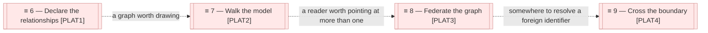

# Sequence

_[← Roadmap](./README.md) · [Target state](./1_target-state.md) · [EA home](../README.md)_

**ArchiMate viewpoint:** Implementation & Migration. The order the gaps in
[1_target-state.md](./1_target-state.md) are closed in, and what has to be true
before each one can start.

**Status:** ● Validated at **Gate 1**, 2026-08-27 — the destination and the order,
approved as direction. It approves no work: every initiative below still stops at
its own Gate 2.

This document defines no elements. It orders the ones the target state
already named.

## The order

| # | Initiative | Closes | Reaches | Gate | State |
| - | ---------- | ------ | ------- | ---- | ----- |
| 6 | [Declare the relationships, and let the graph be walked](../scope/6_declare-the-relationships-and-let-the-graph-be-walked.md) | `GAP1`, `GAP2`, `GAP3`, `GAP4` | `PLAT1` | 2 | In flight |
| 7 | [Walk the model](../scope/7_walk-the-model.md) | `GAP5`, `GAP6` | `PLAT2` | 2 and 3, both delegated ([decision 2](../decisions/2_the-requester-delegates-the-remaining-gates.md)) | In flight |
| 8 | [Federate the graph](../scope/8_federate-the-graph.md) | `GAP7`, `GAP8` | `PLAT3` | 2 and 3, both delegated ([decision 2](../decisions/2_the-requester-delegates-the-remaining-gates.md)) | In flight |
| 9 | Cross the boundary | `GAP9` | `PLAT4` | 2 | Not started |

### Relationships

<!-- Transcribed from this document's diagrams. The identifier is
     authoritative; the description beside it is checked against the
     catalogue that defines the element. -->

| From | From element | To | To element | Relationship |
| ---- | ------------ | -- | ---------- | ------------ |
| `PLAT1` | «Plateau» Declared relationships | `PLAT2` | «Plateau» A walkable model | a graph worth drawing |
| `PLAT2` | «Plateau» A walkable model | `PLAT3` | «Plateau» A federated graph | a reader worth pointing at more than one |
| `PLAT3` | «Plateau» A federated graph | `PLAT4` | «Plateau» Checkable across the boundary | somewhere to resolve a foreign identifier |

## Why this order and not another

**The dependencies are real, not preferences.** Each arrow above is a thing
that cannot be built before the one behind it, and the reason differs each
time:

| Edge | Why it cannot be reversed |
| ---- | -------------------------- |
| 6 → 7 | A navigator over today's projection would show `org-archreator` as 88 disconnected dots out of 184. It would be judged a bad navigator, and the diagnosis would be wrong |
| 7 → 8 | An index of published projections with nothing reading it is `DOBJ4` before `ACMP14` existed — built, correct, and consumed by nothing. The method has made that mistake once and recorded it |
| 8 → 9 | A cross-project reference has to resolve against something. Until each project publishes its projection there is nothing on the other side of the boundary to check against, and a validator that clones sibling repositories to check a link is not lightweight |

**Initiative 9 is last, and that is a change from the first instinct.** The
cross-repository hole is the most *visible* problem — decision 1 names it, and
it is the one that will eventually bite. It is still last, because closing it
means teaching `ACMP6` to resolve a foreign identifier, and the only
non-cloning way to do that is against a published projection, which is
initiative 8. Attempting it earlier means either a validator that clones every
sibling repository on every pull request, or a hand-maintained copy of another
project's identifiers — a second source of truth, which is the thing `P1`
exists to prevent.

**Nothing here is sized in time.** A plateau is a state, not a sprint. The
sequence says what must precede what; how long each takes is a question for the
initiative, not the roadmap.

## What would change this plan

Two findings would reorder it, and both are worth watching for:

- **The relationship tables turn out to be unwritable by hand.** Initiative 6
  transcribes 164 diagram-only relationships mechanically, but every one
  afterwards is written by a person. If maintaining them proves worse than
  drawing a diagram, the answer is not to give up on `PLAT1` — it is to
  generate the diagram *from* the tables, which is one more consumer of the
  projection and belongs in initiative 7.
- **A second organization appears before initiative 8.** The index in `PLAT3`
  is owned by the topmost tree of one federation. Two federations means two
  indexes and a navigator that takes more than one, which is a small change if
  it is known in advance and an awkward one if it is not.
