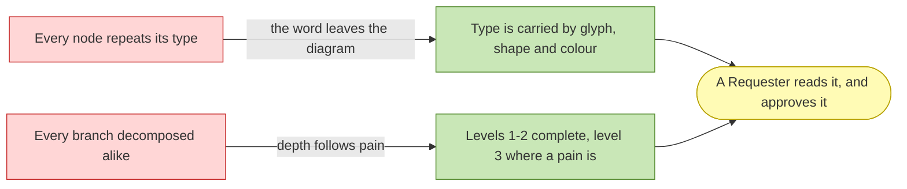

# Project Scope — A model a human can read

_[← Scope index](./README.md) · [EA home](../README.md)_

**ArchiMate viewpoint:** Implementation & Migration.
**Delivered as:** the branch and pull request opened for this initiative.

The method can now produce more model than anyone will read. Running it on a
real organization surfaced two ways that happens: diagrams carry a word that
teaches nothing after its first appearance, and nothing in the method says how
far down to decompose a process or a capability — so the honest answer becomes
"all of it", and the result is a catalogue the Requester skims instead of
approves. This initiative fixes both, and they are one initiative because they
are one failure: **a model that is correct and unreadable has not been
delivered.**

## Where this came from

A client engagement, not a review of this repository. The organization already
had its macro processes identified and its pain concentrated in one of them,
and the method had nothing to say about either fact — it would have modeled all
of them to the same depth. The pattern is recorded as
[engagement note 3](../../../org-archreator/architecture/engagements/3_breadth-first-depth-on-pain.md),
with no client facts, per the `engagement-retrospective` skill's
confidentiality boundary.

**That skill says to wait for a second note before acting on a pattern**, and
this acts on the first. The reason it is not a violation is that the heuristic
protects against an agent generalizing from one case; here the Requester —
who did the engagement — is the one asking. Recorded so the exception is
visible rather than silent.

## What the two threads have in common



Both threads spend model detail where it is read and refuse it where it is
not. **This diagram is drawn in the notation this initiative proposes** — no
stereotypes, because the legend above each element document already says what
a shape means.

## Thread 1 — the stereotype leaves the diagram

Today `architecture/README.md` § Notation conventions puts `«Stereotype»` on
the first node of each type in every diagram and drops it on the rest. Four
devices already encode the type — glyph, shape, colour, and the legend every
element document is required to carry by `RULE10` — so the word is the fifth,
and the only one that costs a node's whole label width.

The change: **`«Stereotype»` survives only in a diagram whose subject is the
notation itself** — the legend under "How to read this document", and the
notation section of `architecture/README.md`. Everywhere else a node reads
`<glyph> <description> [<ID>]`.

Nothing is lost, because the legend is one screen above and is mandatory. What
is gained is roughly a quarter of the label width back on every node, on the
diagrams that already run widest.

## Thread 2 — breadth first, depth on pain

The method models processes and capabilities as flat catalogues with no stated
levels, no standard for how a process is described, and no rule about how far
to decompose. Four changes, which are one idea:

| # | Change | Why |
| - | ------ | --- |
| 1 | **Level 1 of an organization's process model is the macro process map, classified into strategic, operational, support and evaluation** | The quality-management process map is what an organization's own people already recognize, and the four bands make "what did we not write down" answerable |
| 2 | **Processes and capabilities carry a level, and each level has a standard description** | A process named without a trigger and an output is a heading, not a process |
| 3 | **A capability map is seeded from a reference model for the organization's industry, then confirmed by the Requester** | "What are your capabilities?" is a question businesses answer badly. "Here is what a business like yours must usually be able to do — which of these are real, and what is missing?" is answerable |
| 4 | **Levels 1 and 2 are complete; level 3 and below exist only where a named pain justifies them** | This is the whole point. Full horizontal scope, detail only where it earns itself, and every undetailed branch says so rather than looking forgotten |

Change 3 is the one with a safeguard attached. Both discovery skills forbid
assuming, and a reference model is exactly the kind of plausible filler that
rule exists to stop — so the skill states that **a reference proposes and never
fills**, that the reference used is named in the document, and that an
unconfirmed capability is marked Pending like any other.

### Where the levels live

Below roughly fifteen elements a level is a **column**, as
[the organization's capability map](../../../org-archreator/architecture/1_strategy/2_capabilities-and-resources.md)
already does with three areas over seven capabilities. Above it, the catalogue
becomes **a folder named for the file it replaces, one document per level**:

```
2_business/3_business-processes/README.md                    the level map, and which branches are detailed
2_business/3_business-processes/1_level-1-macro-processes.md
2_business/3_business-processes/2_level-2-processes.md
2_business/3_business-processes/3_level-3-<macro-process>.md one per focused branch
```

**This deviates from the request, which asked for a document per level
outright.** The threshold is proposed because a six-process organization
splitting into three files is the same over-modeling this initiative exists to
stop, and because the number is not a new one — it is the fifteen-element
threshold `architecture-doc-style` already uses for when one diagram stops
being honest. Overruling it costs one sentence.

The folder keeps the layer's own numbering intact: `3_` stays the process slot,
`4_business-objects.md` and `5_domain-context-and-rules.md` do not move, and a
second level-3 branch renumbers nothing outside the folder.

## EA alignment (assessed top-down before implementing)

| Layer | Impact |
| ----- | ------ |
| 0_business-design | **Not used** — `product-archreator` is Depth 1; the canvases belong to the organization one tree up |
| 1_strategy | **No change.** No Stakeholder, Driver, Goal or Principle is added or modified. One observation is recorded below rather than absorbed |
| 2_business | **No element change.** `BSVC2` and `BSVC3` gain a realizing artifact; no service, rule or actor is added, altered or removed |
| 3_information | **Not started** in this tree — [initiative 13](./13_completing-the-business-and-information-layers.md) proposes creating it and is still awaiting its own Gate 2 |
| 4_application | **`ACMP17` added** — the new skill, realizing `BSVC2` and `BSVC3` |
| 5_technology | **No change.** Neither validator is affected: element IDs keep the form `<prefix><integer>`, so a level is a column and never a dotted identifier |

**The observation, not absorbed.** "Well-done less is more" is called the
standing principle by `architecture-first-change` and is not a «Principle» in
`1_motivation.md`. This initiative applies it and does not add it, because
adding a `P` triggers Gate 1 and splits the work in two for one table row. It
is the strongest candidate for a `P6` if the Requester ever wants one.

**No thirteenth rule is proposed.** Breadth-first-depth-on-pain is method text
in a skill, the same shape as § Consolidate before you enumerate — which is
also a governing rule of this method and also not a `RULE` row.
[Initiative 11](./11_referencing-across-models.md) was declined for proposing a
rule that did not earn its place, and that is taken as guidance here.

## Approvals

| Gate | Approved by | Date | What was approved |
| ---- | ----------- | ---- | ----------------- |
| Gate 0 — Business model | — | — | **N/A** — Depth 1; no canvases exist in this tree |
| Gate 1 — Strategy | — | — | **N/A** — no Stakeholder, Driver, Goal or Principle added or modified |
| Gate 2 — Business | Requester | 2026-08-14 | This document and [engagement note 3](../../../org-archreator/architecture/engagements/3_breadth-first-depth-on-pain.md), presented with branch links, including the four calls listed as overturnable and open question 12 |
| Gate 3 — Solution design | — | — | **N/A — declined at Gate 2.** The new skill's structure and its hooks are covered by ordinary pull-request review instead |

## Plateaus

| Plateau | State |
| ------- | ----- |
| **Baseline** (before) | A stereotype on the first node of every type; processes and capabilities as flat catalogues with no levels, no standard description, and no stated stopping point |
| **Target** (delivered) | The stereotype lives only in the legend; an organization's processes and capabilities are leveled, level 1 is classified into four macro categories, and level 3 exists only where a pain does |

## Work packages and deliverables

### WP1 — The stereotype leaves the diagram

- **Deliverables:**
  `.claude/skills/project-bootstrap/templates/architecture/README.md`
  § Notation conventions § 1 — the label format becomes
  `<glyph> <description> [<ID>]`, with the one exception stated;
  `.claude/skills/architecture-doc-style/SKILL.md` § ArchiMate on Mermaid,
  § Canvas notation and § Actors — the same decision, and the two places where
  a stereotype was carrying information rather than repeating it. Plus the
  scaffold's own six placeholder views, redrawn to the new form, so a project
  generated tomorrow does not start on the superseded one.
- **The carve-out found while writing it:** an actor's kind — `(Human)`,
  `(AI)`, `(Hybrid)` — stays on the node. Colour distinguishes an AI actor and
  nothing distinguishes a hybrid one, so dropping it would lose information
  rather than repetition, and § Actors exists precisely to stop a reader
  defaulting to "person".
- **One repair, taken because the section was open:** `▧`, the Business Object
  glyph, was introduced by the organization's model and never reached the
  notation table that is supposed to be its single source. The two are now
  reconciled; it was the only such gap of twenty-seven glyphs in use.
- **Outcome:** every future diagram is a quarter narrower per node, and the
  legend becomes the one place the vocabulary is taught.

### WP2 — The `process-and-capability-levels` skill

- **Deliverables:**
  `.claude/skills/process-and-capability-levels/SKILL.md`, covering: the four
  macro process categories and what belongs in each; the level definitions and
  the standard description each level carries; verb-object naming; capability
  levels and the industry-reference seeding rule with its safeguard; the
  breadth-first-depth-on-pain rule and the focus table that records which
  branches are detailed and why; and where the documents live.
- **Outcome:** an agent modeling an organization has an answer to "how far
  down", and the answer is the same one twice.

### WP3 — The hooks, so the skill is reachable

- **Deliverables:** `strategy-discovery` theme 4 and theme 6;
  `operating-model-discovery` at the hand-off; `architecture-first-change`
  Step 2; the template's `1_strategy/README.md` and `2_business/README.md`;
  and the skill listings in the root `CLAUDE.md`, the template `CLAUDE.md`,
  `.claude/skills/README.md`, and the root `README.md`.
- **Outcome:** the skill is reached from where the work actually starts. This
  is `ACMP10`'s lesson applied — a skill nothing points at is dead code, and
  that has already happened once here.

### WP4 — The method's own model

- **Deliverables:** `ACMP17` in
  `product-archreator/architecture/4_application/1_application-components.md`,
  and the realizing artifact added to `BSVC2` and `BSVC3` in
  `2_business/2_business-services.md`.
- **Outcome:** the model still describes the method after the method changes.

### WP5 — What this falsified elsewhere (`RULE12`)

- **Deliverables:** the skill count corrected from thirteen to fourteen in
  `README.md` (twice) and in the organization's `ACMP1` row and the paragraph
  below it; the site's `architecture/README.md` § Notation conventions, which
  described the label format as "stereotype in the node label" and now
  describes the new one, with an explicit note that its own diagrams have not
  been redrawn yet.
- **Left alone deliberately:** the organization's
  [initiative 3](../../../org-archreator/architecture/scope/3_take-coa1-stage-one.md)
  says the skill count "moves from twelve to thirteen". That was true when it
  was written and it is a merged scope document, so `RULE6` forbids touching
  the words.

### WP6 — The engagement note

- **Deliverables:**
  `org-archreator/architecture/engagements/3_breadth-first-depth-on-pain.md`
  and its row in that folder's index.
- **Outcome:** the provenance of this initiative is in the log the method says
  it should be in, generalized past recognition of the client.

## In scope / out of scope

| In scope | Out of scope (gaps, candidate future work) |
| -------- | ------------------------------------------- |
| The notation standard changes | **Redrawing this repository's own ninety diagrams** to it — the next initiative, exactly as [initiative 5](./5_diagram-notation-standard.md) was followed by [initiative 6](./6_bring-meta-up-to-the-notation.md) |
| The leveling method, in a skill | **Restructuring the organization's own process and capability catalogues** — six processes and ten capabilities sit under the threshold, and the categories would raise a question about the organization rather than about the method |
| The four macro categories as a classification | Making them elements. They get no IDs: nothing realizes a band, and `P1` would have nothing to point at |
| Levels as a table column | Dotted identifiers (`BPROC1.1`). `ACMP15` accepts `<prefix><integer>` and changing that would renumber every model that exists |
| Naming a reference model as the source of a proposed capability map | Reproducing any reference model's content. The skill cites; it does not copy |
| `BSVC2` and `BSVC3` gaining a realizing artifact | Any new business service or rule |
| Six of the scaffold's eight placeholder views, and the `▧` glyph reaching its single source | The two views drawing an element type that has no identifier prefix — see the gap notes |

## Gap notes

- **This repository will publish a notation it does not yet follow.** Between
  this initiative and the sweep, every element document here keeps stereotypes
  on its nodes and a legend sentence describing the superseded standard. That
  is precedented — initiatives 5 and 6 did exactly this — and the sentence
  stays true of the document it sits in until the document is redrawn. The
  sweep is mechanical, large, and would bury this initiative's diff.
- **The organization's model will not demonstrate the categories.** Its six
  processes are all operational: it documents no strategic, support or
  evaluation process at all. The four bands make that visible, which is a
  finding about the organization and belongs in its own scope index, not here.
- **Nothing checks that a level-3 document names its pain.** Like `RULE11` and
  `RULE12` before it, the rule is carried by review. A check would need to
  distinguish a justification from a sentence, which is the same fuzziness that
  kept `RULE2` out of tooling.
- **Two placeholder views could not be redrawn, and the reason is a finding.**
  The new label form ends in an identifier, and two element types the scaffold
  draws have none: «Representation» in `3_information/README.md` has neither a
  glyph nor a prefix, and «Application Interface» in `4_application/README.md`
  has a glyph but no prefix. Both were left in the old form rather than
  inventing vocabulary mid-sweep — that is
  [initiative 13](./13_completing-the-business-and-information-layers.md)'s
  work, and it now has two concrete holes to fill instead of an abstract
  claim that the vocabulary is undocumented. The remaining six views were
  redrawn.
- **One file is shared with an unapproved initiative.** Initiative 13 proposes
  moving the rules out of `2_business/2_business-services.md` and is still
  awaiting Gate 2. This initiative touches only two "Realized by" cells in that
  file, which survive either order.

## Open questions

- **Does the fifteen-element threshold belong here at all, or should a level
  always get its own document?** Adopted: the threshold, reusing the number
  `architecture-doc-style` already uses for diagrams. The request asked for a
  document per level outright, and the deviation is recorded here so it can be
  overruled in one sentence rather than discovered later. Applied in
  `.claude/skills/process-and-capability-levels/SKILL.md`.
