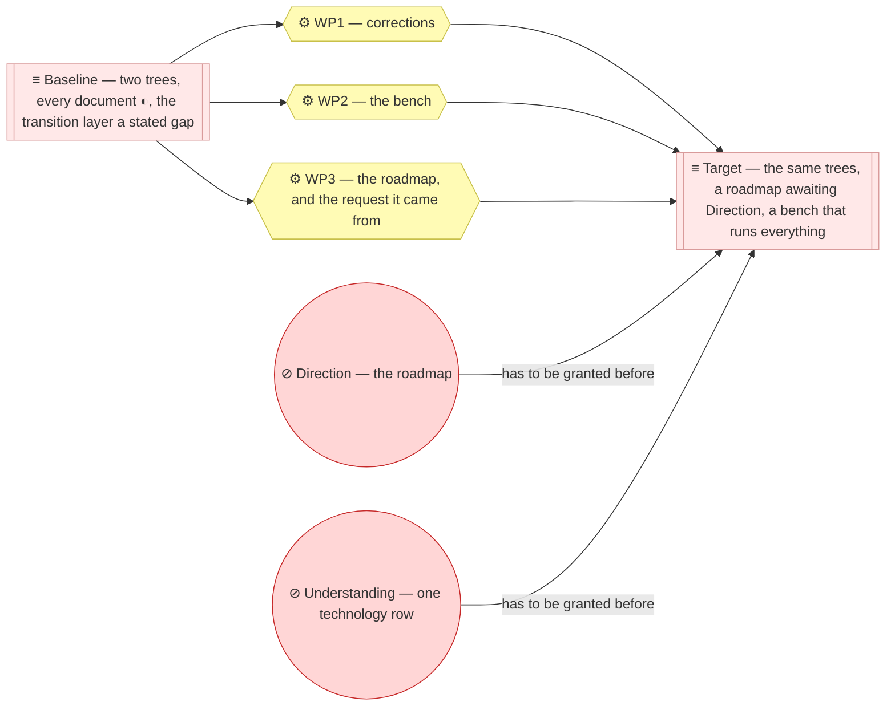

# Project Scope — Say where the product is going, and put the tools on the bench

_[← Scope index](./README.md) · [Front door](../README.md)_

**ArchiMate viewpoint:** Implementation & Migration.
**Delivered as:** the pull request for this initiative, and everything it
contains.

## The problem

The Requester asked three things of the models in one message, filed as
[the request](../reference/2026-09-06-poc-features-request.md): validate the
solution as it stands; say what can change now so that it keeps being
exercised locally; and, wearing the product manager's hat, say which features
the different readers of the method will need — showing what is possible
before any of it moves to a hosted platform, and keeping each feature as
simple as the one the Requester already values most: proposing a change to an
architecture with text, documents and an agent, instead of a modeling tool.

The model answers the first question well and the other two not at all. Both
validators are green, the method's own tests pass, and every reading tool
reads both trees. But the front door said the transition layer was a gap, so
the product that promises
[a model that says where the subject is going [G6]](../1_strategy/1_motivation.md#goals-and-outcomes)
had never said where it was going itself; the reading tools are named in the
repository rules with no address, because they live in a plugin this
repository does not carry; the validators here had fallen one check behind the
scaffold's, and nothing would have said so; and the one initiative on record
is a rebuild, so nobody evaluating the method can read an ordinary change go
through it here.

## The design

- **The roadmap is the deliverable, and it is direction rather than
  permission.** Four plateaus, twelve gaps and a sequence in `6_transition/`,
  each plateau named for a state and each gap for the element it is measured
  from — drafted `◐`, approved at Direction, and approving it approves no work.
- **One plateau per reader.** The four states are, in the order the product's
  readers meet it: the change that arrives as text, for the Requester and the
  Reviewer of an adopting project; the bench that catches drift, for the agent
  and the maintainer; the federation as one site, for the reader outside the
  repository; and a question answered wherever that reader is — on the hosted
  platform the Requester names, Databricks, which consumes the export and
  never becomes a second model.
- **The bench lands now, because everything else checks against it.** A
  `Makefile` at the repository root fetches the method under gitignored
  `.archreator/`, wraps every reading tool, fails when a validator here
  differs from the scaffold's, and runs all of it over both trees; CI runs the
  same target beside the validators.
- **The request is filed where a source belongs.** `architecture/reference/`
  opens with the Requester's message as written, and every roadmap row cites
  it — the first time a source in this model can be followed back to what
  somebody said.
- **Corrections ride along, gate-free.** The validator is brought level with
  the scaffold, and a documented command that stopped on an identifier both
  trees own now carries `--scope`.
- **Not a graph to explore, and not a second model.** The Requester's
  direction on readers, given on the previous roadmap and preserved at
  [decision 4 of the pre-0.2 corpus](https://github.com/roanboc/architecture-archreator/blob/pre-02-2026-08/product-archreator/architecture/decisions/4_the-graph-portal-is-retired.md),
  holds: a reader arrives with a question and leaves with a document. The
  last plateau serves that reader on a host, and the host reads.

## EA alignment (assessed top-down before recording)

| Tree | Layer | Impact |
| ---- | ----- | ------ |
| org | all | **No change** — the organization's roadmap stays a stated gap on its front door; where the organization is going is the Requester's business, never derived from the product's |
| product | 1_strategy | **No change** — every plateau serves a goal the layer already holds (`G2`, `G3`, `G4`, `G5`, `G7`), and the roadmap itself is what `G6` asks for; the local-first order is recorded in the sequence rather than as a course of action, because a Depth 1 strategy layer carries no catalogue for one |
| product | 2_business | **No change** — the walk the first plateau puts on record is the service [Gated change alignment [BSVC1]](../2_business/1_business-services.md) already describes |
| product | 3_information | **No change** — a reference document is a record the layer already names under [Records [DOBJ2.2]](../3_information/1_data-domains-and-objects.md); the folder now exists |
| product | 4_application | **No change** — the bench is this repository's, not a component of the product; every tool it wraps is catalogued already |
| product | 5_technology | **Changed** — one row of the deployment table: the checks on every change now include the smoke run of the reading tools |
| product | 6_transition | **New** — the roadmap: four plateaus, twelve gaps, the sequence |
| product | reference | **New** — the request, filed and indexed |

## Approvals

| Gate | Approved by | Date | What was approved |
| ---- | ----------- | ---- | ----------------- |
| Direction | — | — | **Pending** — [the target state](../6_transition/1_target-state.md) and [the sequence](../6_transition/2_sequence.md): the destination and the order, never the work |
| Understanding | — | — | **Pending** — the one changed row of [the technology layer](../5_technology/1_technology-and-deployment.md#deployment); the strategy, business and information layers carry explicit no-change verdicts above |
| Design | — | — | **N/A** — a bench and a roadmap, no solution design |

**Where these gates happen:** the pull request for this initiative — each may
be granted as a review reply naming what it covers, and the reply is
transcribed here.

## Plateaus

**The work is done and the direction is not.** Three packages reach the
target; the two circles are the Requester's, which is why the roadmap's
documents open with `◐` and the sequence's first row says in flight rather
than reached.

| Plateau | State |
| ------- | ----- |
| **Baseline** (before) | Two trees on method 0.2, every document `◐`, the transition layer a stated gap; the reading tools reachable only through an installed plugin; the element-ID validator one check behind the scaffold's; one initiative on record, a rebuild |
| **Target** (this initiative) | The same two trees with a drafted roadmap awaiting Direction, the request it came from filed as its source, the validator level with the scaffold, and a bench that runs every check and reading tool over both trees locally and in CI |

## Work packages and deliverables

- **WP1 — Corrections**: `scripts/check_model.py` level with the scaffold, and
  the seventh check named in `scripts/README.md`; the brief command in
  `CLAUDE.md` and `scripts/README.md` carrying `--scope`.
- **WP2 — The bench**: `Makefile`; `README.md` § Working locally; the
  `read-the-models` job in `.github/workflows/docs-check.yml`; the changed row
  in `5_technology/1_technology-and-deployment.md`.
- **WP3 — The roadmap, and the request it came from**:
  `architecture/6_transition/README.md`, `1_target-state.md` and
  `2_sequence.md`; `architecture/reference/README.md` and the filed request;
  the front door's transition row, diagram and validation note; this document
  and its row in the index.

## In scope / out of scope

| In | Out |
| -- | --- |
| The roadmap, drafted and awaiting Direction | **Closing any gap beyond the three this initiative closes** — each is its own initiative through the spine, in the sequence's order |
| The bench, local and in CI, over both trees | **Any change to the method** — five findings below belong in the archreator repository; they are gap notes here so the Requester can carry them across |
| The request filed as the roadmap's source | **Publishing anything** — a site or a host is an authorization the Requester grants, and the roadmap says where it waits |
| The validator brought level with the scaffold | **The organization's roadmap** |

## Gap notes

- **The three gaps this initiative closes** — `GAP2`, `GAP4` and `GAP5` — are
  marked in flight on the roadmap, and the merge that delivers this document
  is what turns them to reached, with the sequence's first row following.
- **Five findings belong to the method, not to these models.** Each is a gap
  on the roadmap and a change in the archreator repository whose scope
  document would land here:
  1. `coverage` reports a row as not true yet when the marker appears
     mid-sentence, where the parse anchors it to the start of a cell; two
     rows in these trees are misreported — `GAP7`.
  2. `build_brief.py --project <tree>` still stops on an identifier both trees
     own until `--scope <tree>` is repeated — `GAP7`.
  3. The alignment walk never asks `trace` or the impact brief what a change
     would touch before the gate — `GAP3`.
  4. No check opens the paths a `Lives at` cell names — `GAP8`; with the
     method on the bench, it is one existence test per path.
  5. A model declares the method version it was written against nowhere a
     tool can read — `GAP6`; a `Method` line on the front door compared with
     the plugin manifest would answer the standing request that an agent
     prompt before realigning a model to a newer plugin.
- **`coverage` cannot see `Lives at` as grounding.** The component catalogue
  grounds every row in a path under a header the reader's short list of
  realization headers does not carry, so the report counts the document
  among those that ground nothing. Harmless today, misleading the day a row
  goes blank; the fix is the method's, or a column rename here, and it is the
  Requester's call at Understanding.
- **The smoke job tracks the method's `main`.** A method change that breaks
  these models turns CI red here, which is the point; when a red is understood
  and not yet fixed, `METHOD_REF` pins a branch or a tag until the fix lands.

## Open questions

- **What the hosted platform is expected to do.** The request names
  Databricks as where the features move next. The roadmap's last plateau
  assumes the host is a reader — it consumes `model.json` or a synced
  checkout, generates a brief on request, and edits nothing — because a host
  that edits is a second model. Is that the intended role, or should the host
  also carry the walk itself, the agent and the gates? The answer changes
  `PLAT4` and what `GAP11` must state; the adopted interpretation is applied
  in [the target state](../6_transition/1_target-state.md#the-gaps).
- **When publishing is authorized.** `GAP10` and initiative 7 wait on the
  Requester's word that a rendering of these models may leave the
  repository. Nothing here assumes it.
