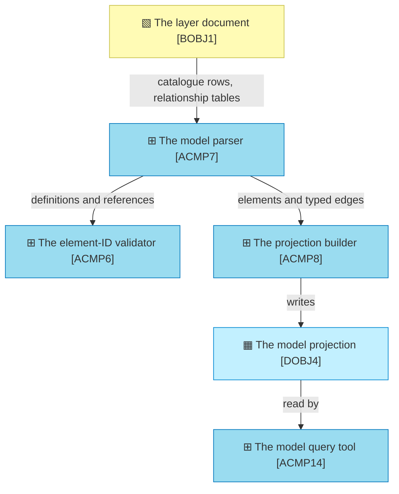

# Project Scope — Declare the relationships, and let the graph be walked

_[← Scope index](./README.md) · [Model home](../README.md)_

**ArchiMate viewpoint:** Implementation & Migration.
**Delivered as:** the `claude/graph-navigator-architecture-m2fr9j` branch in
[`archreator`](https://github.com/roanboc/archreator), and the model changes
this document holds the gate for.
**Closes:** `GAP1`, `GAP2`, `GAP3`, `GAP4` — reaching `PLAT1` on the
[roadmap](../roadmap/1_target-state.md).

The method models the element and not the relationship. `BOBJ2` — the element —
has an identifier, a type, a level, and a rule that it names what realizes it.
The relationship between two elements has none of that, so it went wherever the
author happened to put it: some into catalogue columns, where the projection
carries it as opaque text; the rest into Mermaid diagrams, where it is drawn and
stated nowhere else.

This initiative gives the relationship a home. It does not build a graph
navigator — that is initiative 7, and it is unbuildable until this lands.

## The measurement that started it

Run against the three trees in this repository on 2026-08-27, from `DOBJ4`:

| | `org-archreator` | `product-archreator` | `product-archreator/site` |
| --- | --- | --- | --- |
| Elements | 184 | 128 | 33 |
| Edges in the projection | 116 | 148 | 42 |
| **Elements with no edge at all** | **88 (47%)** | 17 (13%) | 4 (12%) |
| Identifiers sitting in catalogue columns, unread as edges | 327 | 129 | 25 |
| Relationships drawn in a diagram and stated nowhere else | 46 | 98 | 20 |

The 481 unread identifiers are in columns like `Realizes`, `Serves`,
`Provided by`, `Accessed by` — and, in `org-archreator`, 46 of them are in a
`Source` column that traces each strategy and business element back to the
canvas element it was derived from. That derivation trace is the answer to "why
does this capability exist", and it is currently invisible to everything except
a person reading the table.

## The design

**One rule: a relationship is declared where the fact lives, and a diagram
renders what was declared.** That is `P1` — each fact has exactly one home —
applied to a fact that currently has two homes, or none.

### 1. The catalogue column, for relationships a row can carry

A backticked identifier in any column of a catalogue row **is** a relationship
from that row's element, labelled with the column header **verbatim**.

Nothing about the documents changes. This is already written, already validated
by `ACMP6` (a backticked identifier is a reference like any other, and has
always had to resolve), and currently discarded by `ACMP8`.

Carrying the header verbatim rather than mapping it is the same call `ACMP8`
already made for Mermaid edge labels, for the same reason: mapping onto
ArchiMate's vocabulary would be a guess, and a wrong guess in a projection is
worse than an honest string. It also keeps the parse language-independent,
which is the constraint every other reading in `ACMP7` is built to satisfy.

**A known imperfection, accepted rather than engineered around.** A `Provided
by` column produces an edge whose arrow points the opposite way from the way
the label reads. The alternative is a list of passive-voice headers to flip on,
which re-introduces exactly the language dependence that `realized_by` is
already the method's one apology for. The edge carries its label; a reader sees
which way it reads.

### 2. The relationship table, for everything a row cannot carry

A catalogue has **one row per element**, so it can state what an element points
at across the layers, and has no shape at all for a relationship between two
peers. That is not a stylistic gap — it is why 164 relationships ended up in
diagrams, and they are overwhelmingly peer-to-peer: `CAP5 precedes CAP1`,
`ACMP10 carries ACMP5`, `BSVC5 precedes BSVC2`, `DRV1 evidenced by ASM1`.

So a second surface, with a shape the parser recognises by **position**, never
by a header word:

> **A table that is not a catalogue and whose first and third columns hold a
> backticked identifier on every data row is a relationship table.** Cell 1 is
> the source and cell 2 describes it; cell 3 is the target and cell 4 describes
> it; cell 5 is the relationship, and any further columns are notes.

| From | From element | To | To element | Relationship | Note |
| ---- | ------------ | -- | ---------- | ------------ | ---- |
| `CAP5` | ✦ «Capability» Learn from an engagement | `CAP1` | ✦ «Capability» Discover a subject from nothing | precedes | A retrospective feeds the next discovery |
| `ACMP10` | ⊞ «Application Component» The scaffold | `ACMP5` | ⊞ «Application Component» The link checker | carries | The scaffold ships the validators |

Position fixing meaning is how the catalogue already works — "the name is the
second cell, which the notation fixes" — so this adds a shape, not a principle.
No header word is read, which is what keeps the parse working on a model
written in any language.

**Each end carries its archetype and its name, and the reason is that a table
has no shapes and no colours.** The notation says a node drops its stereotype
because glyph, shape and colour already carry the type three times over with a
legend one screen above. None of those three exist in a table cell. `CAP5`
alone tells a reader nothing; `✦ «Capability» Learn from an engagement` tells
them what it is and what it is called, which is the whole point of writing the
relationship down where a person can approve it.

**Two of those three facts are copies, so they are checked.** The archetype is
determined by the identifier's prefix and the name is owned by the catalogue
row that defines the element — writing them again is a duplicate, and a
duplicate that drifts is exactly what `P1` exists to prevent. The method has
already decided how to handle a copy it cannot avoid: `DOBJ2` is "a copy, held
in step by a check… `P1`'s escape clause used deliberately". Same clause, same
remedy — see § Solution design for what is checked and what is deliberately
not.

**Where it lives: in the layer document that owns the relationship**, under its
own heading, beside the diagram that renders it. A relationship between two
capabilities is a strategy-layer fact and belongs in the strategy layer.

**One escape hatch:** a per-project `architecture/relationships.md` for
relationships no single layer owns. It is one file rather than a folder because
it is also where cross-project imports will go at `PLAT4`, and two surfaces for
"relationships that no catalogue row owns" would be one too many.

**Why a triple table and not a grid.** A matrix with identifiers on both axes
is more compact and worse in every other way: it stops fitting the page at
about eight columns, its diff is unreadable when a row moves, and it has
nowhere to put the relationship's name except a legend. Three columns diff line
by line and scale to any size.

### 3. Mermaid stops being a source

Once (1) and (2) are read, `ACMP7`'s Mermaid parse is deleted. Diagrams keep
doing the thing they are good at and stop being load-bearing.

**The migration is mechanical, not manual.** A one-shot
`scripts/extract_relationships.py` reads today's diagrams and emits the
relationship tables for review, so the 164 diagram-only relationships are
transcribed and checked rather than retyped from scratch. It is deleted with
the same pull request that uses it.

**The acceptance test is a superset check.** After the diagram parse is
removed, the projection's edge set must contain every pair it contained before.
That is mechanical, and it is what makes "diagrams stop being a source" a safe
edit rather than a hopeful one.

### 4. What the projection carries

`DOBJ4`'s `edges` table gains two columns:

| Column | Values | Why |
| ------ | ------ | --- |
| `origin` | `catalogue`, `table`, `identifier` | A consumer can weight or filter by how firmly a relationship was stated. `identifier` is the decomposition edge inferred from a levelled ID, which is structure rather than assertion |
| `pending` | `0`, `1` | A relationship that is not true yet. The notation draws this as a dashed edge, and 24 relationships in this repository use it — but a dashed edge is a **diagram** device, and diagrams stop being read. So pending is declared in words, with the marker the method already has: `Pending — future initiative`, recognised by the same `PENDING_MARKERS` list `ACMP14` already uses for grounding. See § Solution design |

Both are additive. Nothing that reads `DOBJ4` today breaks.

## EA alignment (assessed top-down before implementing)

| Layer | Impact |
| ----- | ------ |
| 0_business-design | **Not used** — this tree is Depth 1, one application |
| 1_strategy | **No change.** No stakeholder, driver, goal or principle is added or modified. The initiative serves `G5` (the model reaches people who never open the repository) through the plateaus it unblocks, and is bounded by `P1`, which is the argument for it. `CAP4` already covers proving the model internally consistent; a relationship becoming checkable widens what that capability acts on, not what it is |
| 2_business | **`BOBJ7` — the relationship** added to [4_business-objects.md](../2_business/4_business-objects.md), validated at Gate 2 on 2026-08-27. **`BSVC3` restated** in [2_business-services.md](../2_business/2_business-services.md): the Requester's Gate 3 request for archetype, identifier and name on each end introduces a copy, and a copy needs a check — which the Gate 2 verdict of "unchanged" no longer describes. Re-presented at Gate 2. `BSVC8` **unchanged**: interrogation gains better data, not a new promise |
| 3_information | **`DOBJ4` restated** in [1_data-objects.md](../3_information/1_data-objects.md) — the projection's edges gain `origin` and `pending`, and its edge set stops depending on whether anyone drew a diagram |
| 4_application | **`ASVC8` restated** and **`ACMP7`, `ACMP8` restated** — the parse reads two declaration surfaces and no diagrams, and identifier resolution moves into `ACMP7` so `ACMP6` and `ACMP8` stop deciding it separately. `ACMP14`'s interface is unchanged and its data is better. No new component: the migration tool is one-shot and deleted with the pull request that runs it. See § Solution design |
| 5_technology | **No change.** No runtime, dependency, host or workflow is added. The parse stays standard-library Python |

## Approvals

| Gate | Approved by | Date | What was approved |
| ---- | ----------- | ---- | ----------------- |
| Gate 0 — Business model | — | — | **N/A** — the subject is one application, not an organization. `0_business-design/` is not used at Depth 1 |
| Gate 1 — Strategy | — | — | **N/A for this initiative** — no strategy element is added or modified. The [roadmap](../roadmap/README.md) this initiative sits on carries its own Gate 1, separately |
| Gate 2 — Business | Requester | 2026-08-27 | `BOBJ7`, the unchanged verdicts on `BSVC3` and `BSVC8`, and the restated `DOBJ4`, presented in the session with links to each document on this branch |
| Gate 2 — Business (amended) | Requester | 2026-08-27 | **`BSVC3` restated.** The Gate 3 change request put a copied name into every relationship table, which needs a check; the original "`BSVC3` unchanged" verdict is falsified and is re-presented rather than quietly revised |
| Gate 3 — Solution design | Requester | 2026-08-27 | **Requested at Gate 2.** Presented 2026-08-27; the Requester asked for the archetype, identifier and name of each end in a relationship table. Reworked, re-presented and approved with the amended Gate 2 |

## Plateaus

| Plateau | State |
| ------- | ----- |
| **Baseline** (before) | Relationships are declared in two places and read from one. 481 sit in catalogue columns as text the projection never turns into edges; 164 exist only inside diagrams; 24 are pending and indistinguishable from live. 47% of `org-archreator`'s elements have no edge at all |
| **Target** (delivered) | `PLAT1`. Every relationship is stated in a catalogue column or a relationship table. The projection's edges carry where they came from and whether they are live. The Mermaid parse is gone, and the superset check passed — 304, 219 and 40 connections before and after, none lost. **Elements with no edge at all fall from 47% / 13% / 12% to 9% / 11% / 9%**, and the three trees carry 619 stated relationships where they carried 306 |

## Work packages and deliverables

### WP1 — The relationship gets a home in the model

- **Deliverables:** `BOBJ7` in `2_business/4_business-objects.md`; `DOBJ4`
  restated in `3_information/1_data-objects.md`; the relationship-table shape
  documented in `architecture-document-style`, beside the element-ID grammar it
  belongs with.
- **Outcome:** a rule that says where a relationship is written, so a document
  can owe one.

### WP2 — The catalogue columns become edges

- **Deliverables:** `ACMP7` emits an edge for every resolving backticked
  identifier in a catalogue row's non-name columns, labelled with the column
  header verbatim and tagged `origin=catalogue`; `ACMP8` carries `origin` and
  `pending` into `model.json` and `model.db`.
- **Outcome:** 481 relationships that were already written become traversable.
  `ACMP14 trace` starts answering with the relationships stated in tables,
  which it has never seen.

### WP3 — The relationship table is read

- **Deliverables:** `ACMP7` recognises a relationship table by position and
  emits `origin=table` edges; `ACMP6` gains one check — that the name written
  beside each identifier matches the catalogue row that defines it.
- **Outcome:** a surface exists for the relationships a catalogue row cannot
  carry, legible on its own, and unable to go quietly stale.

### WP4 — The diagrams are transcribed and the parse is removed

- **Deliverables:** `scripts/extract_relationships.py`, run once against all
  three trees, its output reviewed and committed as relationship tables; the
  Mermaid edge parse deleted from `ACMP7`; a superset assertion added to the
  projection's own checks.
- **Outcome:** one home per fact. A diagram is a rendering again.

### WP5 — The label census

- **Deliverables:** `ACMP8` reports the distinct relationship labels it read and
  how many are used once, in the same voice it already reports names that came
  from the wrong column.
- **Outcome:** 111 labels across 306 edges, 67 used exactly once, becomes
  visible to the person who could converge them — without a controlled
  vocabulary the method would have to translate.

## Solution design

**❖ Gate 3.** The Requester opted in at Gate 2 on 2026-08-27. Nothing below is
built until this is approved.

### Where the change sits

All of it is in `ACMP7` — the parse — plus two additive columns in `ACMP8`'s
output. No new component, no new dependency, no change to `ACMP6` or `ACMP14`'s
interfaces.

### The four changes to `ACMP7`

| # | Change | Shape |
| - | ------ | ----- |
| 1 | **Split relationship tables out before anything else reads the text** | A pre-pass locates them and removes them, exactly as `split_retired()` already splits the live half of a document from the retired half. This has to happen first: the existing definition pattern matches any row whose first cell is a backticked identifier, so an unsplit relationship table would register its every source element as a **duplicate definition** and fail `ACMP6` on a valid document. This is the sharpest risk in the initiative and the reason the pre-pass is not an optimisation |
| 2 | **Catalogue columns emit edges** | The catalogue reader already returns each row's columns under their own headers. Every resolving identifier in a column that is neither the ID nor the name becomes an edge from that row's element, `rel` = the header verbatim, `origin = catalogue`. A row citing itself is skipped |
| 3 | **Relationship tables emit edges** | Recognised by position: not a catalogue, and columns 1 and 3 hold identifiers on every data row. Cell 1 source, 2 its description, 3 target, 4 its description, 5 the relationship, the rest notes. `origin = table`. The two description cells are read for the check in row 5 and contribute nothing to the graph — the projection takes every name from the catalogue that owns it |
| 4 | **Resolution moves here** | Deciding that a bare `BSVC3` inside `domains/sales/` means `SALES.BSVC3` is logic `ACMP6` owns today and `ACMP8` would otherwise need a second copy of. One resolver, for the same reason there is one parser |
| 5 | **The written name is checked against the catalogue** | A relationship table restates each end's name for a reader. `ACMP6` compares that restatement with the name in the catalogue row that defines the element, normalised for whitespace and case, and fails on a mismatch. This is new validation behaviour and it is why `BSVC3` changes — see below |

The Mermaid edge reader is deleted. The Mermaid **node** reader stays — nothing
else reads it, but it costs nothing and removing it is not this initiative's
business.

### What is checked in a relationship table, and what is not

| Written | Checked? | Why |
| ------- | -------- | --- |
| The identifier | **Yes**, already | A backticked identifier has always had to resolve. Nothing new is needed |
| The name | **Yes**, new | It is a copy of a fact the catalogue owns. Renaming an element would otherwise leave every relationship table naming it quietly wrong, and a wrong name is worse than none because a reader believes it |
| The archetype | **No**, deliberately | It cannot drift independently: it is determined by the prefix sitting in the cell immediately beside it, so a wrong archetype is visibly contradicted by the identifier next to it. Checking the *word* would also break the parse's one hard rule — `«Capability»` is English, and a model written in Spanish says `«Capacidad»`. The registry holds English names only |
| The glyph | **No**, and it could be | `element-prefixes.json` types a prefix but does not carry its glyph, so there is nothing to check against. Adding one would make every glyph in the corpus checkable, which is worth doing and is not this initiative — it would widen a change that is already touching the parse |

**The name check is a hard failure, not a report.** `coverage` reports rather
than fails because telling a repository path from a team name is fuzzy, and a
check that fails wrongly teaches people to ignore the checks that do not. This
one is not fuzzy: two strings either match after normalisation or they do not.
The comparison strips surrounding whitespace, collapses runs of spaces and
ignores case, so formatting is not a failure and a rename is.

### Good practices this leans on

| Practice | Where it applies, and why it is load-bearing |
| -------- | -------------------------------------------- |
| **One parser, one resolver** | `ACMP7` exists because `ACMP6` and `ACMP8` were about to grow a second copy of the same parse, and the drift would have been silent. Resolution is the same hazard one level down, so it moves here rather than being written twice |
| **Recognise by position, never by a header word** | A model may be written in any language. The catalogue already fixes the name as the second cell for this reason; relationship tables fix source and target as the first two. No English word decides anything |
| **Split, then parse each part with the rule that fits it** | `split_retired()`'s pattern, reused. It is what keeps change 1 from being a special case bolted onto the definition matcher |
| **Carry the label verbatim** | Unchanged from the Mermaid reader, and for the unchanged reason: mapping onto ArchiMate's vocabulary is a guess, and a wrong guess in a projection is worse than an honest string |
| **Additive schema** | `origin` and `pending` are new columns. `ACMP14`, and anything else reading `DOBJ4`, keeps working untouched |

### The migration, and what proves it

`scripts/extract_relationships.py` reads today's Mermaid edges and emits
relationship tables for review. It runs **once**, its output is read by a person
before it is committed, and it is deleted in the same pull request. It is a
migration tool, not a component: a script that converts a corpus once has no
place in a catalogue of things the method ships.

**The superset assertion is what makes deleting the diagram reader safe.**
Before the reader is removed, the projection's edge set is captured; after, it
must contain every pair that set contained. A pair that goes missing is a
relationship somebody drew and nobody transcribed, which is the one failure
this migration can have. The assertion is a one-time proof and is deleted with
the extractor — once diagrams are not a source there is nothing left to compare
against.

### Risks, and what each costs

| Risk | If it happens |
| ---- | ------------- |
| A relationship table is mistaken for a catalogue | `ACMP6` fails loudly with a duplicate definition. Noisy, immediate, impossible to miss — the safe direction |
| A catalogue column holds an identifier that is not a relationship | A spurious edge, labelled with the column header, visible in `trace`. `org-archreator`'s `Source` column is the known case; only resolving identifiers become edges, so a prose source is excluded on its own |
| The extractor mis-transcribes an edge | The superset check catches a **dropped** pair. It cannot catch a **mangled** label, which is why the extractor's output is reviewed rather than merged blind |
| The name check fails on formatting rather than a rename | Normalisation covers whitespace and case, which is every formatting difference seen in the corpus. Anything it does not cover fails loudly on a valid document — annoying, visible, and fixed by editing one cell. The extractor fills these cells from the catalogue, so the migration cannot introduce one |

## What changed during implementation

Three deltas from the approved design, each found by building it.

**A catalogue cell declares relationships only when it is a list of
identifiers and nothing else.** The approved design said every resolving
identifier in a non-name column becomes an edge. The label census — WP5, built
to report label sprawl — found on its first run that this turns `Maturity`,
`Classification`, `Cost to maintain` and `On disk` into relationship types,
because a prose cell occasionally names an element mid-sentence. 172 distinct
labels, 82 used once. The rule now matches what the corpus actually does:
`` `ACMP7`, `ACMP8` `` declares, "A row in `BOBJ3`'s Approvals table" mentions.
It is the same discipline `TABLE_DEF_RE` already applies to a definition, which
must be a *bare* identifier rather than one inside a sentence.

**The superset check compares connections, not directions.** Run on directed
pairs it reported 37 losses; every one was the same connection stated from the
other end — a diagram's `BSVC1 → BIF1` against the catalogue's
`BIF1 | Serves | BSVC1`. None was absent in both directions. Direction here is
a property of the sentence rather than of the relationship, which this
initiative already accepted when it accepted that a `Provided by` column draws
an arrow reading backwards.

**The Mermaid node reader went too.** The design said it would stay, on the
grounds that it costs nothing. It was only ever called by the edge reader, so
removing the edge reader made it unreachable — and dead code kept on purpose is
worse than dead code removed by accident.

Two findings that are not deltas, recorded because they are the checks working:

- The corpus validator rejected the notation section this initiative added to
  the scaffold, because its worked example carried real identifiers — which
  ship into every generated project as references to elements nobody defined.
  It is the defect [scope document 1](./1_rebuild-the-models-on-the-current-method.md)
  logged as a gap note, caught mechanically this time. The example lives in
  `architecture-document-style`; the scaffold names the rule and cites it.
- The name check was green on all 432 restatements the migration wrote, first
  run. That is the extractor filling description cells from the catalogue
  rather than inventing them, which is what it was built to do and what the
  check exists to prove.

## In scope / out of scope

| In scope | Out of scope (gaps, candidate future work) |
| -------- | ------------------------------------------- |
| The relationship as a modeled object, and the two surfaces that declare one | **The graph navigator.** `GAP5` and `GAP6`, initiative 7. It is the reason this initiative exists and it is not this initiative |
| Catalogue columns and relationship tables read into the projection | **Publishing the projection, and the federation index.** `GAP7` and `GAP8`, initiative 8 |
| The Mermaid parse removed, under a superset check | **Cross-project references.** `GAP9`, initiative 9. Decision 1's consequence stands until then |
| `origin` and `pending` on every edge | **A relationship vocabulary.** Reported, never enforced — see the roadmap on why |
| The three trees in this repository migrated | **Generating diagrams from the tables.** Attractive, and it belongs with the other consumers of the projection in initiative 7 |

## Gap notes

- **A relationship table is written by hand, and that is the risk this
  initiative carries.** The 164 existing ones are transcribed mechanically;
  every one after that is typed by a person who could have drawn a diagram
  instead. If that proves worse in practice, the fix is to generate the diagram
  from the table rather than to restore the diagram as a source — noted on the
  roadmap as a thing that would reorder the plan.
- **`org-archreator`'s `Source` column is doing two jobs.** It traces an element
  back to a canvas element, and in draft catalogues it also names the transcript
  a claim came from. Only resolving identifiers become edges, so a prose source
  is excluded naturally — but the column would read better split, and that is a
  model change in `org-archreator` rather than a method change here.
- **The superset check is a one-time assertion, not a permanent gate.** Once the
  Mermaid parse is gone there is nothing to compare against. It proves the
  migration and is then deleted with the extractor.

## Open questions

- **Does a relationship table belong in the layer document or in
  `architecture/relationships.md` by default?** Adopted interpretation: in the
  layer document, because a relationship between two capabilities is a strategy
  fact and the layer is what a Requester approves at a gate. The per-project
  file is the exception, not the default. **Confirmed by the Requester at
  Gate 2, 2026-08-27.** No open questions remain.
