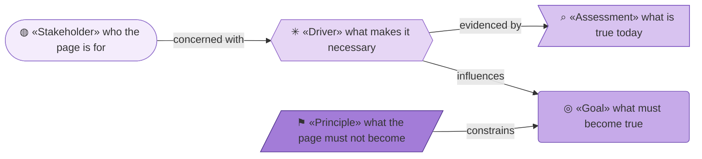
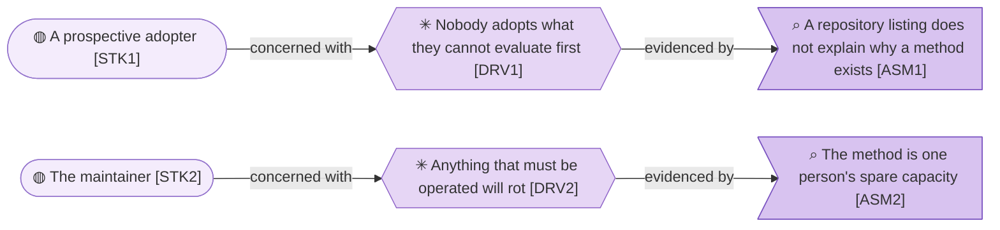

# Motivation

_[← Strategy layer](./README.md) · [EA home](../README.md)_

**ArchiMate viewpoint:** Motivation. Who the site is for, what makes it
necessary, and what it must not become.

**Status:** ● Validated at **Gate 1**, 2026-08-22.

The subject is **one public page** at <https://roanboc.github.io/archreator/>,
whose source is `site/index.html` in the
[`archreator`](https://github.com/roanboc/archreator) repository. It exists to
be read by someone who has installed nothing and owes the project nothing.

This tree refines what [`product-archreator/`](../../../CLAUDE.md) exposes and
never restates it: where the site and the method would say the same thing,
this model points one level up.

## How to read this document

| Glyph | Shape | Element | ID prefix | Reads as |
| ----- | ----- | ------- | --------- | -------- |
| `◍` | Stadium | «Stakeholder» | `STK` | `STK1` = Stakeholder 1 |
| `✳` | Hexagon | «Driver» | `DRV` | `DRV1` = Driver 1 |
| `⌕` | Flag | «Assessment» | `ASM` | `ASM1` = Assessment 1 |
| `◎` | Rounded rectangle | «Goal» | `G` | `G1` = Goal 1 |
| `⚑` | Parallelogram | «Principle» | `P` | `P1` = Principle 1 |

Identifiers are scoped to this tree. `G1` here is the site's goal, not the
method's — the two models never share a numbering space.

## Stakeholders, drivers and assessments

| ID | Stakeholder | What they need from the page |
| -- | ----------- | ---------------------------- |
| `STK1` | **A prospective adopter** | To find out, in one read and without installing anything, what the method claims and whether it is worth their time. They arrive from a link and will leave in seconds if the page argues instead of explaining |
| `STK2` | **The maintainer** | To have published something that does not become a second job. Every hour spent on the site is an hour not spent on the method |

| ID | Driver | Why it presses |
| -- | ------ | -------------- |
| `DRV1` | **Nobody adopts what they cannot evaluate first** | Installing a plugin to find out what it does is a cost most people will not pay. Without a front door, the method reaches only people who already trust it |
| `DRV2` | **Anything that must be operated will rot** | A site with a build, a framework or a dependency graph acquires maintenance the method's own budget cannot absorb |

| ID | Assessment | What it means for the site |
| -- | ---------- | ------------------------- |
| `ASM1` | **A repository listing does not explain why a method exists** | A visitor landing on `README.md` sees what the repository contains, not the problem it solves. The two are different documents for different readers |
| `ASM2` | **The method is one person's spare capacity** | Whatever the site costs to keep working comes directly out of the method. That is the constraint every technology choice here answers to |

### Relationships

<!-- Transcribed from this document's diagrams. The identifier is
     authoritative; the description beside it is checked against the
     catalogue that defines the element. -->

| From | From element | To | To element | Relationship |
| ---- | ------------ | -- | ---------- | ------------ |
| `STK1` | «Stakeholder» A prospective adopter | `DRV1` | «Driver» Nobody adopts what they cannot evaluate first | concerned with |
| `STK2` | «Stakeholder» The maintainer | `DRV2` | «Driver» Anything that must be operated will rot | concerned with |
| `DRV1` | «Driver» Nobody adopts what they cannot evaluate first | `ASM1` | «Assessment» A repository listing does not explain why a method exists | evidenced by |
| `DRV2` | «Driver» Anything that must be operated will rot | `ASM2` | «Assessment» The method is one person's spare capacity | evidenced by |

## Goals and principles

| ID | Goal | Answers | Realized by |
| -- | ---- | ------- | ----------- |
| `G1` | **A prospective adopter can decide in one page** | `DRV1`, `ASM1` | Four sections — why it exists, what you get, how to start, where to look — and two links out |
| `G2` | **The site costs nothing to keep running** | `DRV2`, `ASM2` | One static file, no build, no dependency, free hosting |

- **P1 — The site is derived, never a source.** Every claim on the page is
  true because a document in the method says so. Where the two disagree, the
  method is right and the page is a bug. Nothing is stated here first.
- **P2 — Nothing is fetched at request time.** No CDN, no font host, no
  analytics, no script. A page that depends on a third party being reachable
  has an availability it does not control and a privacy story it cannot make.
- **P3 — It explains, and does not argue.** A visitor who wanted persuading
  would not have clicked. The page states what the method does and what it
  costs, and lets them leave.

**`P1` is what keeps this tree honest and small.** It is why the model refines
rather than restates, and why a change to the method can falsify the page but
never the reverse.

## Notes

**No value stream is modeled.** A stream is how value moves through stages,
and this subject has one stage: someone reads a page and either follows a link
or does not. Naming that a stream would dress a single step as a flow.
