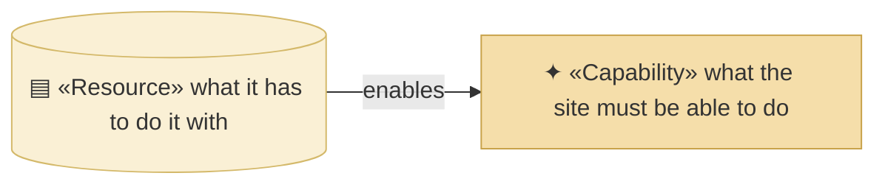
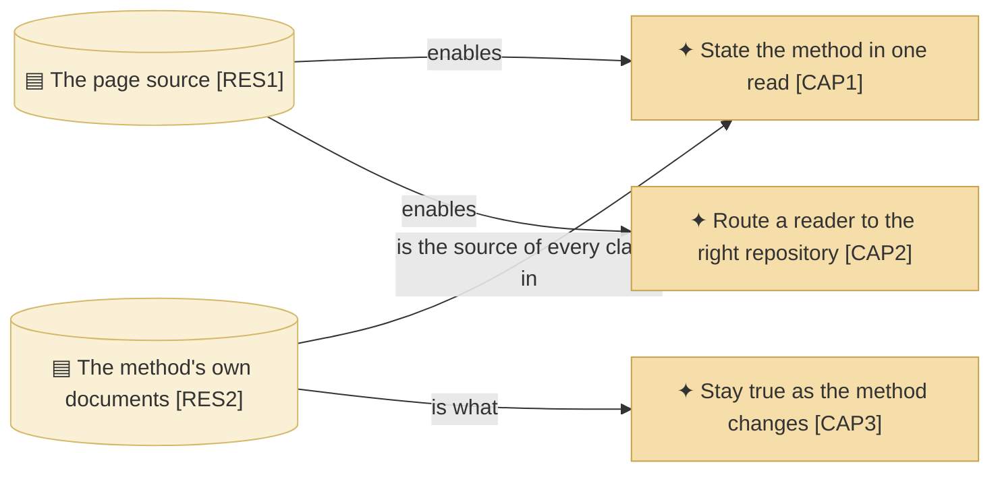

# Capabilities and resources

_[← Strategy layer](./README.md) · [EA home](../README.md)_

**ArchiMate viewpoint:** Strategy. What the site must be able to do, and with
what.

Three capabilities and two resources. A one-page site that deliberately has no
build, no backend and no dependency does not have much it must be able to do,
and inventing more would model an ambition rather than a subject.

## How to read this document

| Glyph | Shape | Element | ID prefix | Reads as |
| ----- | ----- | ------- | --------- | -------- |
| `✦` | Rectangle | «Capability» | `CAP` | `CAP1` = Capability 1 |
| `▤` | Cylinder | «Resource» | `RES` | `RES1` = Resource 1 |

## Capabilities

| ID | Capability | What it includes | Realized by | Maturity |
| -- | ---------- | ---------------- | ----------- | -------- |
| `CAP1` | **State the method in one read** | The problem, the answer, what an adopter receives, and how to start — in four sections a visitor can finish | `site/index.html` § Why it exists, § What you get, § Get started | Established |
| `CAP2` | **Route a reader to the right repository** | Sending someone to the method or to the worked models, and making clear which is which | `site/index.html` § Two repositories, and the two header actions | Established |
| `CAP3` | **Stay true as the method changes** | Noticing that a change to the method has falsified a claim on the page, and repairing it in the same branch | **Carried by review only** — the method's rule that a change repairs every document it falsifies, applied here | **Weak — nothing detects it** |

**`CAP3` is the one that will fail.** The page states the skill count, the
install commands and what the scaffold contains, and every one of those is a
fact owned by another repository. Nothing checks them: a link checker proves
the links resolve, not that the sentence around them is still true. The
capability is recorded as weak rather than left out, because a gap that is
written down is one somebody can close.

## Resources

| ID | Resource | Kind | What it is | State |
| -- | -------- | ---- | ---------- | ----- |
| `RES1` | **The page source** | Asset | One hand-written HTML file with its CSS inline and no script at all — 167 lines, including a data-URI favicon. `site/index.html` | Held |
| `RES2` | **The method's own documents** | Knowledge | What the page is derived from. Not owned here: `README.md`, `docs/method.md` and the skill catalogue in the method's repository | Borrowed, and that is what `P1` means |

**`RES1` being one file is a decision, not an accident.** A second page needs
navigation, navigation needs a template, a template needs a build, and a build
needs maintaining — which is exactly what `G2` refuses. The page grows by
sections until it stops being readable, and the day it does is the day this
model gains a real technology layer.

## Courses of action

**None.** As in the method's own tree, a course of action is an
organization's instrument for closing a gap it has decided to close. This
subject is a deliverable. The organization's courses of action are two trees
up, in
[`org-archreator/`](../../../../org-archreator/architecture/README.md).
