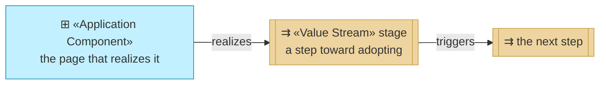
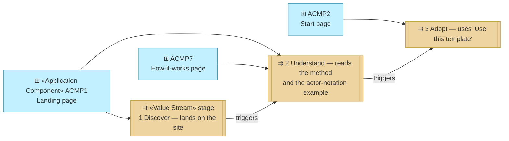

# Value Stream

_[← Strategy layer](./README.md) · [EA home](../README.md)_

**ArchiMate elements:** Value Stream.

## How to read this document

| Glyph | Shape | Element | ID prefix | Reads as |
| ----- | ----- | ------- | --------- | -------- |
| `⇉` | Rectangle, double bars | «Value Stream» stage | `VS` | `VS1` = Value Stream 1; its stages are numbered inside it |
| `⊞` | Rectangle (cyan) | «Application Component» — context, from [layer 4](../4_application/2_application-components.md) | `ACMP` | `ACMP1` = Application Component 1 |

**The glyph rides on every node; the «stereotype» word appears once.**

## The stream

Component edges read **realizes**. **The stream does not close.** Nothing returns from Adopt to Discover — this
site has no feedback path, which is honest rather than an omission: it is
three static pages with no way for a reader to report anything back.

**Stage 1 and stage 2 share a component.** The landing page is written to
carry a reader from never having heard of the project to understanding why it
exists, so `ACMP7` is for the reader who wants more rather than the one who
needs it.

| ID | Value stream | Stages |
| -- | ------------ | ------ |
| `VS1` | **Discover → Understand → Adopt** | Three, below |

| # | Stage | Realized by |
| - | ----- | ----------- |
| 1 | **Discover** | [`public/index.html`](../../public/index.html) — the problem, why the project exists, and what a reader gets from it |
| 2 | **Understand** | The same landing page carries the argument end to end; [`public/how.html`](../../public/how.html) is for the reader who wants the mechanism — layers, gates, the AI actor's limits, and what lands in a repository |
| 3 | **Adopt** | [`public/start.html`](../../public/start.html) — two ways in, what the first session feels like, and honest expectations |

The stages are language-independent: each realizing page above also
ships a Spanish edition under [`public/es/`](../../public/es/index.html)
(`G4`, [1_motivation.md](./1_motivation.md)), so a Spanish-speaking
visitor moves through the same three stages without switching language.

This value stream is realized end to end by `BSVC1`, the
[EA-first method guidance](../2_business/2_business-services.md) business
service.
