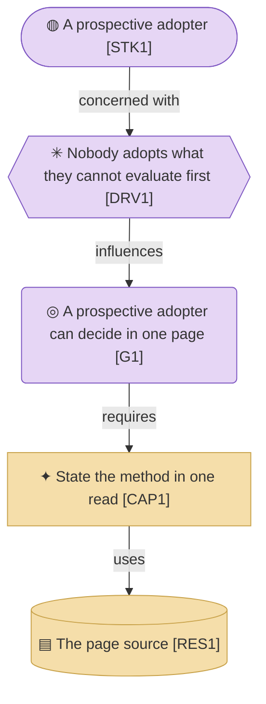

# Strategy & Motivation Layer

_[← EA home](../README.md)_

The top-down business context: who has a stake in the project, why it
exists, which capabilities it needs, and the value stream it delivers. This
layer motivates everything below it — each capability is realized by
business services in the [business layer](../2_business/README.md).

**If [0_business-design/](../0_business-design/README.md) is filled in, this
layer is derived from it, not invented alongside it.** On the company track
the canvases come first and every element here traces back to a canvas
block — the `Source` column below says which. On the application track
layer 0 stays empty, the `Source` column is left blank, and this layer is
where discovery starts.

## Analysis order

Files are numbered in the order they are analyzed: first _who wants what
and why_, then _what we must be able to do_, and only then _how value
flows_.

| #   | Document                                                             | Elements                                                         | Question it answers                                | Source (company track)                             |
| --- | ---------------------------------------------------------------------| ------------------------------------------------------------------ | ---------------------------------------------------- | ---------------------------------------------------- |
| 1   | [1_motivation.md](./1_motivation.md)                                 | Stakeholders, Drivers, Assessments, Goals, Outcomes, Principles | Who cares, what pressures them, what must be true?  | Customer Segments, Jobs, Pains, Gains               |
| 2   | [2_capabilities-and-resources.md](./2_capabilities-and-resources.md) — capabilities split into a folder of one document per level once leveled | Capabilities, Resources, Courses of Action                      | What must we be able to do, and with what?          | Pain Relievers, Gain Creators, Key Resources, Key Activities |
| 3   | `3_value-stream.md`                             | Value Stream and its stage mapping                               | How does value flow end-to-end?                     | Key Activities, Channels                             |

The `Source` column names the canvas blocks each document is derived from;
the block-by-block element mapping lives in
[0_business-design/](../0_business-design/README.md#from-canvas-to-archimate)
and is not restated here. Principles are the exception — they have no canvas
block, and are discovered directly with the Requester in either track.

**Capabilities are not leveled in this tree.** There are three of them under
one aim; areas above them would be scaffolding around nothing. Levelling is
what an organization's capability map needs, and that map is two trees up.

[1_motivation.md](./1_motivation.md) is where **Principles** live — the constraints that a
proposed change is checked against in step 1 of `align-change-through-layers` before
anything else. Keep them few, load-bearing, and testable (e.g. "role
determines access", not "be secure").

## Layer view

One chain: the reader the page is for, what makes it necessary, and the
capability and resource that answer it.

**No value stream box.** This subject has one stage — somebody reads a page —
and dressing a single step as a flow would be the only dishonest node in the
diagram.
