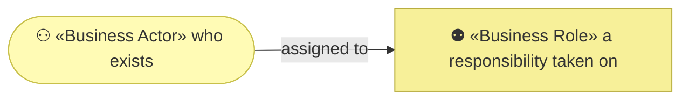
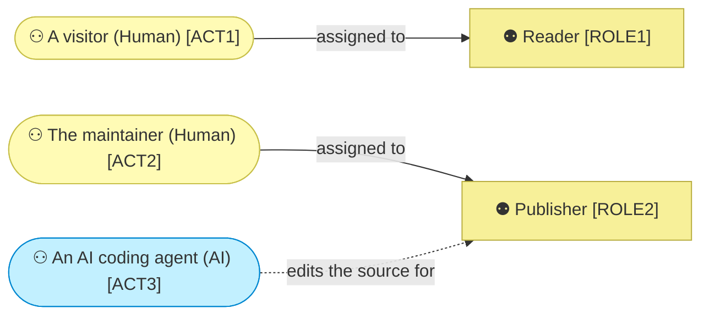

# Business actors and roles

_[← Business layer](./README.md) · [EA home](../README.md)_

**ArchiMate viewpoint:** Business. Who acts on the site, and in which
direction.

**Status:** ● Validated at **Gate 2**, 2026-08-22.

Two roles, and they never meet. A visitor reads and leaves; a maintainer edits
and deploys. There is no interaction between them, no account, and no state
that survives a visit — which is why this layer is a page rather than a
document set.

## How to read this document

| Glyph | Shape | Element | ID prefix | Reads as |
| ----- | ----- | ------- | --------- | -------- |
| `⚇` | Stadium | «Business Actor» | `ACT` | `ACT1` = Actor 1 |
| `⚉` | Rectangle | «Business Role» | `ROLE` | `ROLE1` = Role 1 |

## The actors

| ID | Actor | Kind | Who it is | Fills |
| -- | ----- | ---- | --------- | ----- |
| `ACT1` | **A visitor** | Human | Anyone who opens the page. Anonymous, unauthenticated, and not tracked — nothing on the page knows they were there | `ROLE1` |
| `ACT2` | **The maintainer** | Human | Whoever edits the page and merges the change that deploys it | `ROLE2` |
| `ACT3` | **An AI coding agent** | AI | Writes the page's source when a change to the method falsifies it. Acts on `ROLE2`'s behalf and never merges | — |

### `ACT3` — autonomy, decision rights, escalation

| Column | Value |
| ------ | ----- |
| **Autonomy level** | **Co-pilot** — it edits the source, and `ACT2` reviews and merges before anything is published |
| **Decision rights** | The wording and markup of the page, within the claims the method's documents already support. It may not add a claim the method does not make — that is `P1` |
| **Escalation path** | `ROLE2` for anything that changes what the site *claims*, as opposed to how it says it |

**The distinction the escalation path turns on is claim versus wording.**
Rephrasing a paragraph is editing; adding a benefit the method never promised
is inventing a fact, and the page is not allowed to be where a fact first
appears.

| ID | Role | Responsibility | Ends when |
| -- | ---- | -------------- | --------- |
| `ROLE1` | **Reader** | Reads the page and either follows a link out or leaves. Owes nothing, and is asked for nothing | They navigate away |
| `ROLE2` | **Publisher** | Keeps the page true as the method changes, and merges the change that deploys it | The deployment succeeds |

### Relationships

<!-- Transcribed from this document's diagrams. The identifier is
     authoritative; the description beside it is checked against the
     catalogue that defines the element. -->

| From | From element | To | To element | Relationship |
| ---- | ------------ | -- | ---------- | ------------ |
| `ACT3` | «Actor» An AI coding agent | `ROLE2` | «Role» Publisher | edits the source for |

## No relationship is modeled

**Deliberately.** ArchiMate would offer a «Business Collaboration» or a
«Contract» to bind `ROLE1` and `ROLE2`, and neither exists here: there is no
agreement, no account, no support obligation and no exchange. A visitor takes
something and leaves, and the model says so rather than manufacturing a
relationship to fill the section.
