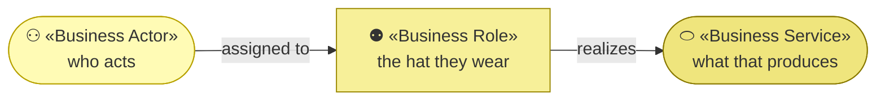
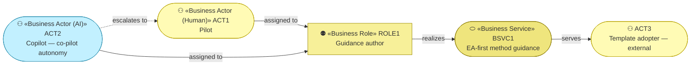

# Business Actors and Roles

_[← Business layer](./README.md) · [EA home](../README.md)_

**ArchiMate elements:** Business Actor, Business Role.

Notation: `architecture-doc-style`'s human/AI/hybrid actor convention — every actor
states its kind, and AI/hybrid actors carry autonomy level, decision
rights, and escalation path.

## How to read this document

| Glyph | Shape | Element | ID prefix | Reads as |
| ----- | ----- | ------- | --------- | -------- |
| `⚇` | Stadium | «Business Actor» | `ACT` | `ACT1` = Business Actor 1 |
| `⚉` | Rectangle | «Business Role» | `ROLE` | `ROLE1` = Business Role 1 |
| `⬭` | Stadium | «Business Service» — from [2_business-services.md](./2_business-services.md) | `BSVC` | `BSVC1` = Business Service 1 |

An `(AI)` actor is drawn in the Application cyan, so a reader never mistakes
it for a person. **The glyph rides on every node; the «stereotype» word
appears once.**

## Actors

**Two actors share one role**, which is the whole point of this example: the
human and the AI do the same job, and what separates them is the autonomy
column below, not a different box on the diagram.

| ID | Actor | Kind | Role | Autonomy level | Decision rights | Escalation path |
| -- | ----- | ---- | ---- | --------------- | ---------------- | ----------------- |
| `ACT1` | **Pilot** | Human | `ROLE1` | — (human) | Approves/merges any change to `site/`, `docs/`, or repo settings; sole authority over GitHub Pages configuration | — |
| `ACT2` | **Copilot** | **AI** | `ROLE1` | **Co-pilot** — drafts complete changes; nothing it writes reaches the published site without a human merging it | May edit `site/*.html`, `architecture/**`, `architecture/scope/**` within this `site/` folder and open a PR. May **not** merge PRs, change GitHub Pages/repo settings, or edit content outside `site/` | Opens a PR to `ACT1`; if a proposed change would contradict a Principle in [`1_strategy/1_motivation.md`](../1_strategy/1_motivation.md), stops and surfaces the conflict instead of proceeding (mirrors `architecture-first-change` step 1) |
| `ACT3` | **Template adopter** | Human, external | Consumer of `BSVC1` | — (human) | None — read-only visitor to the published site | — |

See [`../../decisions/1_docs-agent-autonomy.md`](../decisions/1_docs-agent-autonomy.md)
for why Copilot's autonomy is set at co-pilot rather than fully
autonomous or advisory-only, and
[`../../decisions/3_actor-naming.md`](../decisions/3_actor-naming.md)
for why these two actors are named **Pilot** and **Copilot** — the human
who drives the design and the AI that collaborates.

## Roles

| ID | Role | Filled by | Covers |
| -- | ---- | --------- | ------ |
| `ROLE1` | **Guidance author** | `ACT1` and `ACT2`, jointly | Drafting, reviewing and publishing updates to the guidance site |

One role, two actors. The autonomy and decision-rights columns above are
what distinguishes their authority within it — not a separate role each.

## Mapping to the process roles

The template's change process defines three roles —
**Requester**, **Agent**, and **Reviewer** (see
[CONTRIBUTING.md](../../../../CONTRIBUTING.md)). This project's actors fill
them like this:

| Process role | Filled by | In this project |
| ------------ | --------- | ---------------- |
| Requester | `ACT1` **Pilot** | Decides a guidance change is needed and states it |
| Agent | `ACT2` **Copilot** (or `ACT1`, working without the AI) | Walks the layers, drafts the change, opens the PR |
| Reviewer | `ACT1` **Pilot** | Reviews and merges — the only step that publishes |

The same person (the Pilot) is both Requester and Reviewer here; the Agent
is the one role an AI fills. That is the whole point of the example — an AI
holding a real role in the loop, at a defined autonomy level.
