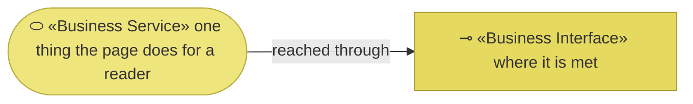
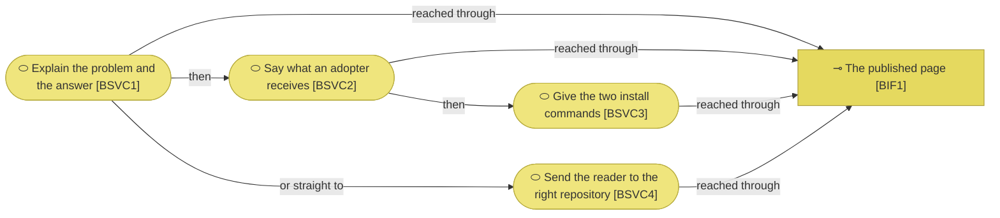

# Business services

_[← Business layer](./README.md) · [EA home](../README.md)_

**ArchiMate viewpoint:** Business. What the page does for whoever opens it.

## How to read this document

| Glyph | Shape | Element | ID prefix | Reads as |
| ----- | ----- | ------- | --------- | -------- |
| `⬭` | Stadium | «Business Service» | `BSVC` | `BSVC1` = Business Service 1 |
| `⊸` | Rectangle | «Business Interface» | `BIF` | `BIF1` = Business Interface 1 |

**No «Product» is modeled.** A product aggregates services into something
offered as a whole, and the whole here is the method itself, whose product
element lives in the tree above. The site is one of the channels that product
is met through, not a product beside it.

It is named in prose rather than cited by identifier on purpose: identifiers
are scoped per tree, and this method has no notation for referencing an
element another model owns. Writing it as an identifier would be a dangling
reference, not a citation.

## The services

**Every service arrives through one interface**, which is what it means to be
a single page: a reader does not navigate between these, they scroll past
them. The order in the diagram is the order on the page, and the branch to
`BSVC4` is the reader who has decided early and wants the repository.

| ID | Business service | What the reader gets | Realizes | Realized by |
| -- | ---------------- | -------------------- | -------- | ----------- |
| `BSVC1` | **Explain the problem and the answer** | Why an AI that can build anything still needs to be told what was meant, and what the method does about it | `CAP1` | `site/index.html` § Why it exists |
| `BSVC2` | **Say what an adopter receives** | Four concrete things — the method, the skills, the scaffold, and AI actors as first-class citizens — rather than a promise | `CAP1` | `site/index.html` § What you get |
| `BSVC3` | **Give the two install commands** | The exact commands, copyable, and the sentence about what to say next | `CAP1` | `site/index.html` § Get started |
| `BSVC4` | **Send the reader to the right repository** | Which of the two repositories holds the method and which holds the worked models, so the reader does not land in the wrong one | `CAP2` | `site/index.html` § Two repositories, and the two header actions |

| ID | Interface | Who meets it | Serves |
| -- | --------- | ------------ | ------ |
| `BIF1` | **The published page** | `ROLE1`, anonymously, over HTTPS | `BSVC1`–`BSVC4` |

**`BSVC3` is the one that dates fastest.** It reproduces two commands and a
skill name that live in another repository, and nothing checks that they still
work. That is `CAP3`'s weakness made concrete: the link checker proves the
page's links resolve, not that a command inside a `<pre>` block is still the
right one.

**`BSVC2` names four things and the method now has seventeen skills.** A count
on a page is a fact with an owner elsewhere, and it is the specific sentence
most likely to be wrong first.
