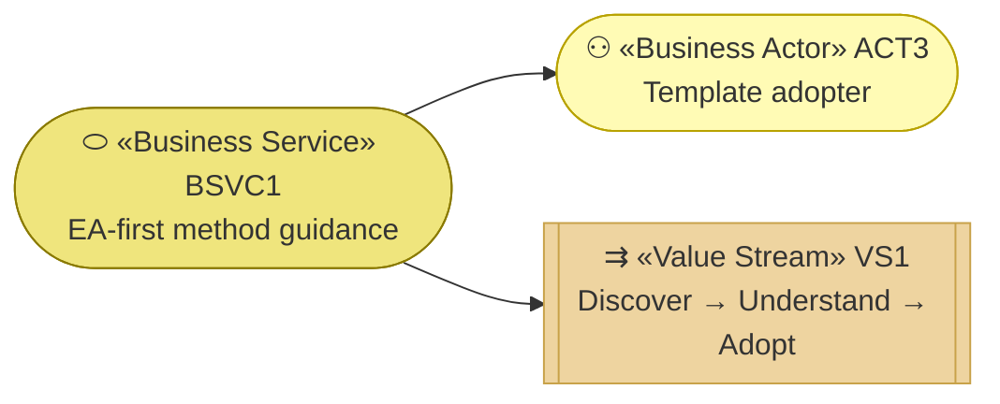
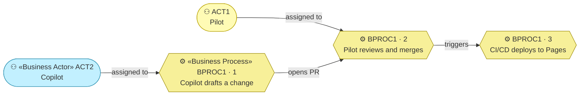

# Business Services

_[← Business layer](./README.md) · [EA home](../README.md)_

**ArchiMate elements:** Business Service, Business Process.

## How to read this document

| Glyph | Shape | Element | ID prefix | Reads as |
| ----- | ----- | ------- | --------- | -------- |
| `⬭` | Stadium | «Business Service» | `BSVC` | `BSVC1` = Business Service 1 |
| `⚙` | Hexagon | «Business Process» | `BPROC` | `BPROC1` = Business Process 1 |
| `⚇` | Stadium | «Business Actor» — context, from [1_business-actors-and-roles.md](./1_business-actors-and-roles.md) | `ACT` | `ACT1` = Business Actor 1 |

**The glyph rides on every node; the «stereotype» word appears once.**

## The service

**One service, and that is the whole business layer.** This project offers
exactly one thing, which is what a Depth 1 model of a three-page site should
look like. What changed in the rebuild is not how many services there are but
what the one service is *for*: persuading before explaining.

| ID | Business service | Serves | Realized by |
| -- | ---------------- | ------ | ----------- |
| `BSVC1` | **The case for the method, and the way in** — why the project exists and what problem it solves, what the method does, and how to start; kept current with the parent template | `ACT3`, and `VS1` end to end | `BPROC1`, and `ASVC1` in [layer 4](../4_application/2_application-components.md) |

The service is offered in **English and Spanish** (`G4`,
[1_strategy/1_motivation.md](../1_strategy/1_motivation.md)): each guidance
page has a Spanish edition under
[`public/es/`](../../public/es/index.html), and updating a page means
updating both editions in the same change — a Spanish edition left behind is
doc drift, the same as a stale source link.

## The process that realizes it

**No actor is assigned to the third step**, and that is the point of `P2`:
deployment is automatic precisely because a human has already stood between
the draft and it.

| ID | Business process | Steps |
| -- | ---------------- | ----- |
| `BPROC1` | **Publish guidance update** | Draft → Review → Deploy, below |

- **Draft** — `ACT2` Copilot (see
  [1_business-actors-and-roles.md](./1_business-actors-and-roles.md))
  walks the EA layers for the requested change, updates the affected
  `architecture/` and `site/` files, and opens a PR — same process as any other
  change to this repository, per `architecture-first-change`.
- **Review** — `ACT1` Pilot approves or requests changes. Nothing merges
  without this step (`P2`,
  [1_strategy/1_motivation.md](../1_strategy/1_motivation.md)).
- **Deploy** — merging to `main` triggers
  [`deploy-site.yml`](../../../../.github/workflows/deploy-site.yml),
  which publishes [`public/`](../../public/index.html) to GitHub Pages (see
  [5_technology/2_deployment.md](../5_technology/2_deployment.md)).
