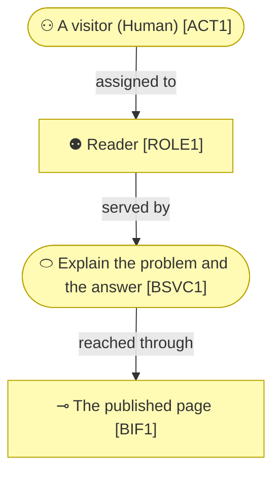

# Business Layer

_[← EA home](../README.md)_

Who interacts with the system, the services it offers them, the processes
those services run through, the business objects they handle, and the
domain vocabulary and rules that constrain all of it.

## Analysis order

Files are numbered in the order they are analyzed: identify _who_ first,
then _what they are offered_, then _how it is delivered_, then _what is
handled_, and finally the domain vocabulary and rules.

| #   | Document                                                          | Elements                                           | Question it answers                              |
| --- | -------------------------------------------------------------------| ---------------------------------------------------- | --------------------------------------------------- |
| 1   | [1_business-actors-and-roles.md](./1_business-actors-and-roles.md) | Business Actors and Roles, organizational units, external partners (Contracts, Collaborations) | Who interacts with the system, and who do we depend on? |
| 2   | [2_business-services.md](./2_business-services.md)                | Products, Business Services, Business Interfaces (channels) | What is offered to them, and through which channels? |
| 3   | `3_business-processes.md` — or a folder of the same name, one document per level, once leveled | Business Processes | How are those services delivered, and at what level of detail? |
| 4   | `4_business-objects.md`                  | Business Objects                                   | What things do the processes handle?              |
| 5   | `5_domain-context-and-rules.md`  | Problem statement, system context, glossary, rules | What vocabulary and constraints bind everything?  |

## No process catalogue

**The site has no business processes, and the omission is honest.** A process
is work with a trigger and an output, run repeatedly. A static page is read;
nothing runs. The only repeatable work in this subject is publishing it, and
that is a deployment pipeline rather than a business process — it lives in
[5_technology/](../5_technology/README.md).

The method's own process catalogue is a different question, answered one tree
up.

`5_domain-context-and-rules.md` carries the project's **glossary** (reuse
its terms in code and commits) and its **business rules table** — every new
rule gets a row there, with its rationale, before it gets a line of code.
It is also the natural home for a role × operation access matrix if the
project has segregated roles.

[2_business-services.md](./2_business-services.md) is where a **«Product»** aggregates the services
that make it up. A single-application project usually has one implicit
product and can leave it out; an organization sells several, and the
portfolio is what makes the rest of the model make sense — two products may
share every capability and still need entirely different channels and
processes. On the company track the products, channels, and customer
relationships are derived from the business model canvases (see
[0_business-design/](../0_business-design/README.md#from-canvas-to-archimate)),
and Key Partners land in [1_business-actors-and-roles.md](./1_business-actors-and-roles.md) as external
actors, each with the «Contract» or «Business Collaboration» that binds
them.

[1_business-actors-and-roles.md](./1_business-actors-and-roles.md) states each actor's **kind** — human, AI,
or hybrid — and, for AI/hybrid actors, its autonomy level, decision
rights, and escalation path (see the `architecture-document-style` skill's actor
notation). This is where an AI system's role **in the business being
modeled** gets stated explicitly — not just its role in how this repo is
developed (see `CONTRIBUTING.md`). If an initiative changes one of those
values, consider a `record-decision` alongside the scope document.

## Layer view

**Nothing flows back.** A reader takes something and leaves; no response, no
account, no state. That one-directional shape is why this layer has no
collaboration and no contract.

The AI actor is drawn in the Application cyan even though it sits in a
business diagram — one of the two colour overrides in
[README.md § Notation conventions](../README.md#notation-conventions), so a
reader never mistakes it for a person.

Every business service is realized by application services — the mapping is
in `4_application/1_application-services.md`.

### Relationships

<!-- Transcribed from this document's diagrams. The identifier is
     authoritative; the description beside it is checked against the
     catalogue that defines the element. -->

| From | From element | To | To element | Relationship |
| ---- | ------------ | -- | ---------- | ------------ |
| `ROLE1` | «Role» Reader | `BSVC1` | «Business Service» Explain the problem and the answer | served by |
