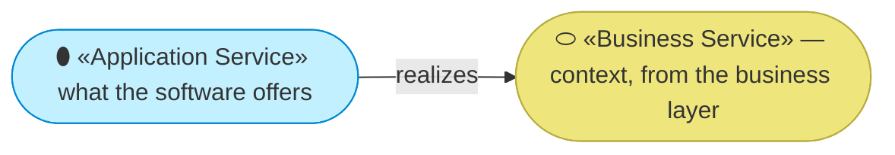
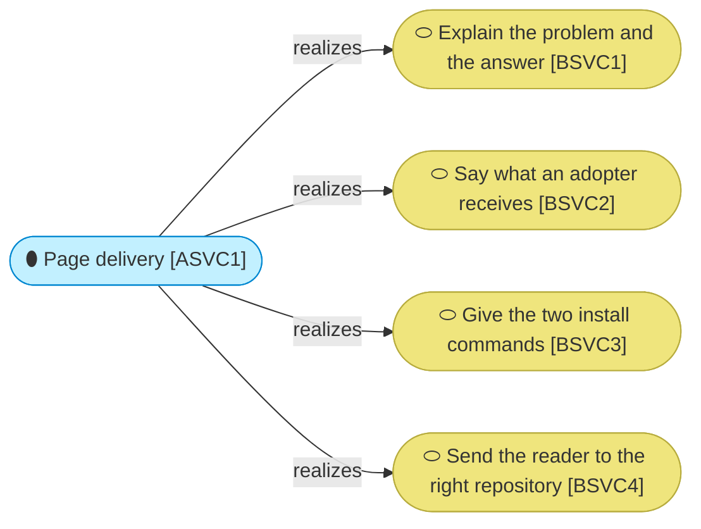

# Application services

_[← Application layer](./README.md) · [EA home](../README.md)_

**ArchiMate viewpoint:** Application. What software does for the business
layer.

**Status:** ● Validated — **Gate 3** declined at Gate 2 ([scope document 1](../scope/1_model-the-site-on-the-current-method.md), 2026-08-22), which routed the application and technology layers to pull-request review.

**One service, and it is the smallest one a layer can have.** The page is
static: nothing computes, nothing queries, nothing decides. What the software
does is hand over bytes that were already correct when they were written.

That is not a gap to be filled later. A site with an application layer worth
several elements would have acquired the build, the framework and the
maintenance that `G2` exists to refuse.

## How to read this document

| Glyph | Shape | Element | ID prefix | Reads as |
| ----- | ----- | ------- | --------- | -------- |
| `⬮` | Stadium | «Application Service» | `ASVC` | `ASVC1` = Application Service 1 |
| `⬭` | Stadium (yellow) | «Business Service» — context, from [2_business/2_business-services.md](../2_business/2_business-services.md) | `BSVC` | `BSVC1` = Business Service 1 |

## The service

| ID | Application service | What it does | Realizes | Provided by |
| -- | ------------------- | ------------ | -------- | ----------- |
| `ASVC1` | **Page delivery** | Returns one HTML document over HTTPS. No request is interpreted, no parameter is read, and no two responses differ | `BSVC1`, `BSVC2`, `BSVC3`, `BSVC4` | `ACMP1` |

**Four business services and one application service is the right shape**, not
a modelling shortcut. The four are distinctions a *reader* makes — sections
they scroll past for different reasons. The software makes none of them: it
cannot tell which section anyone read, and would behave identically if three
of the four were deleted.

## No collaborations, no interfaces, no contracts

There is one component and nothing for it to collaborate with. The application
interface a reader meets is the URL, and that is modeled where it belongs — as
`BIF1`, the published page, in the business layer.
