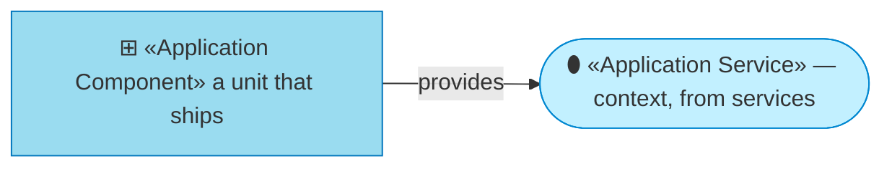
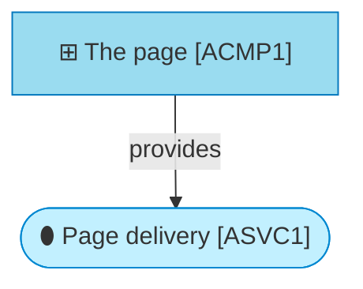

# Application components

_[← Application layer](./README.md) · [EA home](../README.md)_

**ArchiMate viewpoint:** Application. The unit that ships, and what is inside
it.

## How to read this document

| Glyph | Shape | Element | ID prefix | Reads as |
| ----- | ----- | ------- | --------- | -------- |
| `⊞` | Rectangle | «Application Component» | `ACMP` | `ACMP1` = Application Component 1 |
| `⬮` | Stadium | «Application Service» — context, from [1_application-services.md](./1_application-services.md) | `ASVC` | `ASVC1` = Application Service 1 |

## The component

| ID | Component | Provides | Realized by |
| -- | --------- | -------- | ----------- |
| `ACMP1` | **The page** | `ASVC1` | `site/index.html` in the [`archreator`](https://github.com/roanboc/archreator) repository — 167 lines holding the markup, the stylesheet and the favicon |

## What is inside it, and why none of it is a component

The page contains three things that a larger site would separate into
components of their own. Here they are inlined, and each has a reason:

| Inside | Why it is not separate |
| ------ | ---------------------- |
| **The stylesheet** | A `<style>` block rather than a linked file. One request instead of two, nothing to cache-bust, and no way for the markup and its styling to be deployed out of step |
| **The favicon** | A data-URI holding four coloured bars — the ArchiMate layer palette. An external icon file is a second request that fails silently and leaves a broken tab |
| **The colour palette** | CSS custom properties whose values are the layer stroke colours from the method's notation. Shared by convention, not by import |

**All three are the same decision**: one file has no internal dependency that
can break. The cost is that the palette is duplicated from the method's
notation table with nothing holding the copies in step — a small, real
instance of the drift `P1` warns about, accepted because the alternative is a
build step.

## No script, and no third-party anything

`ACMP1` loads nothing at request time — no CDN, no font host, no analytics, no
framework. That is `P2` stated as a component property rather than a
principle: there is no code path that could reach a third party, so the page
cannot be slowed, tracked or broken by one.

It also means the page has no diagrams. The method's documents draw
ArchiMate on Mermaid, which needs a renderer; the site would have to fetch
one, self-host a large bundle, or hand-write the equivalent in HTML. Today it
does none of those and shows no diagrams at all. **If the site ever needs
one, that is a decision worth recording**, because it is the first thing that
would put pressure on `P2`.
