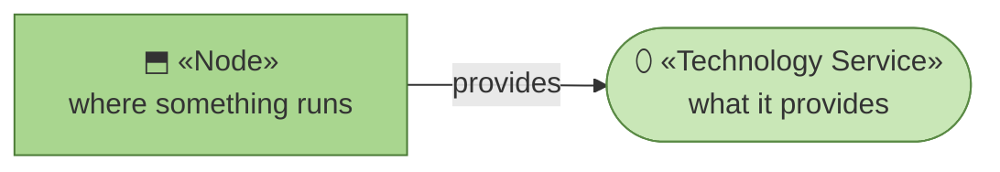
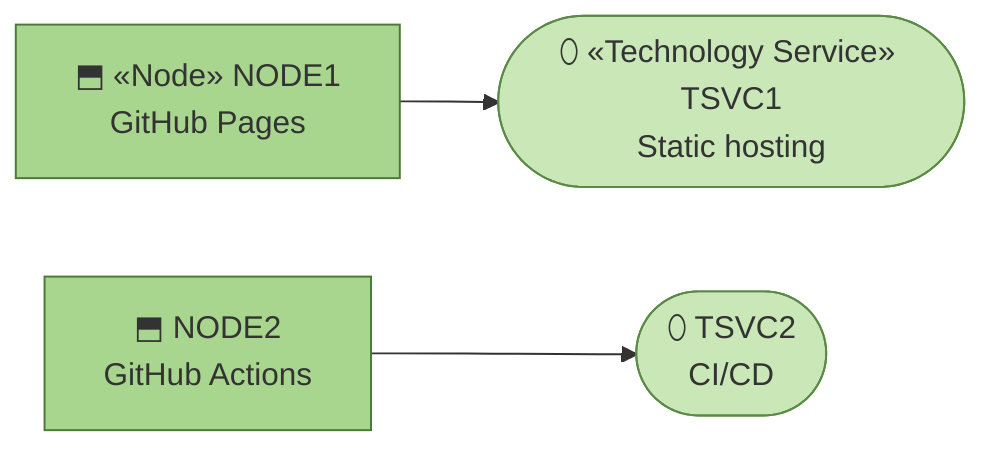

# Technology Services

_[← Technology layer](./README.md) · [EA home](../README.md)_

**ArchiMate elements:** Technology Service, Node.

## How to read this document

| Glyph | Shape | Element | ID prefix | Reads as |
| ----- | ----- | ------- | --------- | -------- |
| `⬒` | Rectangle | «Node» | `NODE` | `NODE1` = Node 1 |
| `⬯` | Stadium | «Technology Service» | `TSVC` | `TSVC1` = Technology Service 1 |

**The glyph rides on every node; the «stereotype» word appears once.**

## The stack

**Two nodes, two services, and no edges between them.** Nothing here calls
anything else at request time, which is what makes the whole layer this
short.

| ID | Technology service | Provided by | Why |
| -- | ------------------ | ----------- | --- |
| `TSVC1` | **Static hosting** | `NODE1` | Zero servers to secure or pay for; the content is fully static and public — exactly the `stack-selection` "no backend" case |
| `TSVC2` | **CI/CD** | `NODE2` | Already the template's assumed CI/CD provider (`stack-selection`); no new tooling to adopt |

| ID | Node | Operated by |
| -- | ---- | ----------- |
| `NODE1` | **GitHub Pages** | GitHub |
| `NODE2` | **GitHub Actions** | GitHub |

No database, no auth provider, no application server — there is nothing
here that mutates shared state, so none of `stack-selection`'s "needs a
backend" guidance applies.
