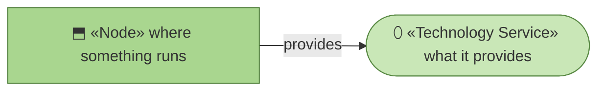
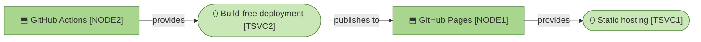

# Technology services

_[← Technology layer](./README.md) · [EA home](../README.md)_

**ArchiMate viewpoint:** Technology. What the page runs on.

**Status:** ● Validated — **Gate 3** declined at Gate 2 ([scope document 1](../scope/1_model-the-site-on-the-current-method.md), 2026-08-22), which routed the application and technology layers to pull-request review.

Two nodes, two services, and nothing operated by anyone here. This is
`stack-selection`'s "no backend" case in its purest form: the state is not
merely small, it does not exist.

## How to read this document

| Glyph | Shape | Element | ID prefix | Reads as |
| ----- | ----- | ------- | --------- | -------- |
| `⬒` | Rectangle | «Node» | `NODE` | `NODE1` = Node 1 |
| `⬯` | Stadium | «Technology Service» | `TSVC` | `TSVC1` = Technology Service 1 |

## The stack

**The one edge in this layer is a deployment, not a call.** `TSVC2` reaches
`NODE1` when something is merged, and never while anyone is reading. At
request time the two nodes are unrelated.

| ID | Technology service | Provided by | Why this one |
| -- | ------------------ | ----------- | ------------ |
| `TSVC1` | **Static hosting** | `NODE1` | Free, versioned with the source, HTTPS and a certificate without asking. Nothing to secure, patch or pay for — which is `G2` as an infrastructure choice |
| `TSVC2` | **Build-free deployment** | `NODE2` | Uploads a directory and publishes it. There is no build because there is nothing to compile; the source file *is* the artifact |

| ID | Node | Operated by | Substitutable? |
| -- | ---- | ----------- | -------------- |
| `NODE1` | **GitHub Pages** | GitHub | **Yes, trivially.** One static file with no server-side behaviour runs anywhere. Cloudflare Pages or Netlify would need a different workflow file and nothing else |
| `NODE2` | **GitHub Actions** | GitHub | Yes. The workflow is four steps and none is provider-specific except the two Pages actions |

**This is the layer that would change if the repository moved**, and it is the
cheapest layer to change. That asymmetry is deliberate: the method keeps its
value in Markdown, so the hosting underneath is a preference rather than a
commitment.

## What this layer deliberately does not have

| Absent | Because |
| ------ | ------- |
| A build step | The source is the artifact. Nothing is compiled, bundled or minified |
| A CDN, font host or analytics | `P2`. The page fetches nothing at request time, from anyone |
| A domain of its own | A project path under `github.io` is free and adequate. A custom domain is a renewal somebody has to remember |
| Any secret | Deployment uses the repository's own token. There is nothing to rotate |

## Relationships

<!-- Transcribed from this document's diagrams. The identifier is
     authoritative; the description beside it is checked against the
     catalogue that defines the element. -->

| From | From element | To | To element | Relationship |
| ---- | ------------ | -- | ---------- | ------------ |
| `TSVC2` | «Technology Service» Build-free deployment | `NODE1` | «Node» GitHub Pages | publishes to |
