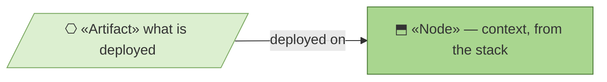

# Deployment

_[← Technology layer](./README.md) · [EA home](../README.md)_

**ArchiMate viewpoint:** Technology. What gets deployed, and what moves it.

## How to read this document

| Glyph | Shape | Element | ID prefix | Reads as |
| ----- | ----- | ------- | --------- | -------- |
| `⎔` | Parallelogram | «Artifact» | `ART` | `ART1` = Artifact 1 |
| `⬒` | Rectangle | «Node» — context, from [1_technology-services.md](./1_technology-services.md) | `NODE` | `NODE1` = Node 1 |

## The pipeline

```mermaid
flowchart LR
  merge(["A change to site/ merges"]):::event
  art1[/"⎔ The site directory [ART1]"/]:::artifact
  node2["⬒ GitHub Actions [NODE2]"]:::node
  node1["⬒ GitHub Pages [NODE1]"]:::node
  live(["Live at roanboc.github.io/archreator"]):::event

  merge -->|triggers| node2
  node2 -->|uploads| art1
  art1 -->|deployed on| node1
  node1 --> live

  classDef artifact fill:#dcefd0,stroke:#7aa860,color:#333
  classDef node fill:#a9d68f,stroke:#4a7a35,color:#333
  classDef event fill:#eeeeee,stroke:#999999,color:#333
```

| ID | Artifact | What it is | Deployed on |
| -- | -------- | ---------- | ----------- |
| `ART1` | **The site directory** | `site/` exactly as it sits in the repository. Not a build output — the same bytes that were reviewed | `NODE1` |

**There is no build, so there is nothing that could differ between what was
reviewed and what is live.** A reviewer reading the diff has read the
deployment. That property disappears the first time a template, a bundler or a
generator is introduced, which is the real cost of adding one.

## The workflow

`.github/workflows/deploy-site.yml` in the
[`archreator`](https://github.com/roanboc/archreator) repository. Four steps
and no configuration worth restating here:

| Trigger | Steps |
| ------- | ----- |
| A push to the default branch touching `site/`, or a manual run | Check out, upload `site/` as a Pages artifact, deploy it, and report the URL |

It runs with permission to write Pages and to mint an identity token, and
nothing else — no repository write access, and no secret of its own.

**Concurrency is a single lane.** Two merges in quick succession do not race:
the second cancels the first, because the second is what should be live.

## Rollback

**Revert the commit.** There is no deployment history to roll back to and no
button to press — the live page is whatever the default branch says, so
reverting and letting the workflow run is both the fastest and the only
mechanism. For a page with no data and no sessions, that is sufficient rather
than a compromise.

## What is not deployed

The model you are reading is not published anywhere. `ART1` is `site/` alone;
these architecture documents live in a different repository and are read on
the code host. A published view of the model would be a **different artifact
on a different node**, and is a course of action the organization has not
taken.
