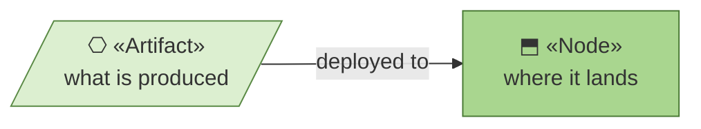
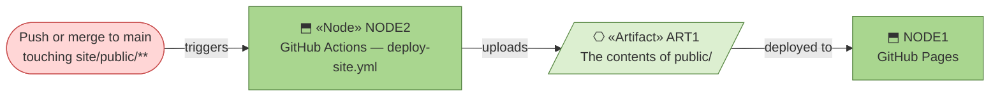

# Deployment

_[← Technology layer](./README.md) · [EA home](../README.md)_

**ArchiMate elements:** Node, Artifact, Deployment/Migration relationship.

## How to read this document

| Glyph | Shape | Element | ID prefix | Reads as |
| ----- | ----- | ------- | --------- | -------- |
| `⎔` | Parallelogram | «Artifact» | `ART` | `ART1` = Artifact 1 |
| `⬒` | Rectangle | «Node» — from [1_technology-services.md](./1_technology-services.md) | `NODE` | `NODE1` = Node 1 |

**The glyph rides on every node; the «stereotype» word appears once.**

## Pipeline

| ID | Artifact | Produced by | Deployed on |
| -- | -------- | ----------- | ----------- |
| `ART1` | **The contents of** [`public/`](../../public/index.html) | Nothing — uploaded verbatim, no build step and no dependencies to install | `NODE1` |

**The pipeline has no build step**, which is why the artifact and the source
are the same thing. That is `stack-selection`'s "no backend" case carried all
the way through to deployment.

- **Pipeline definition:**
  [`.github/workflows/deploy-site.yml`](../../../../.github/workflows/deploy-site.yml),
  at the repository root (workflows aren't scoped per-subfolder).
- **Trigger:** push to `main` touching `site/public/**`, or manual
  dispatch.
- **Manual step, one-time:** GitHub Pages must be enabled for this
  repository (Settings → Pages → Build and deployment → Source: **GitHub
  Actions**) before the workflow's deploy step can succeed. This can't be
  done from a commit — it's a repository-settings change an admin makes
  once. See
  [`architecture/scope/1_publish-guidance-site.md`](../scope/1_publish-guidance-site.md)'s
  open questions.
