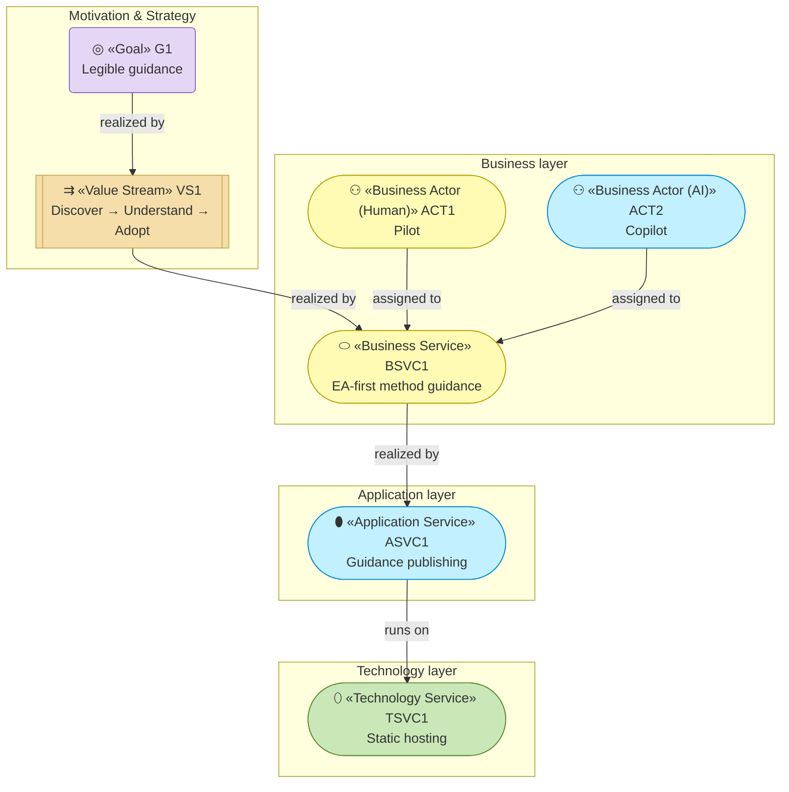

# Enterprise Architecture — archreator-guide

_[← Repository README](../README.md) · [Scope documents](./scope/README.md)_

This folder is the **primary documentation of the system**, organized as an
ArchiMate-layered enterprise architecture. Every element is grounded in the
implemented solution: entries name the page, module, or pipeline file that
realizes them (or are marked explicitly **"Pending — future initiative"**),
so the architecture can be verified against the code at any time.

Folders and files carry a numeric prefix giving the order in which they are
assessed. **Any change in requirements is aligned through these layers in
this order — strategy first, technology last — and captured in a
[scope document](./scope/README.md) before implementation starts** (see
[CLAUDE.md](../CLAUDE.md) and the `ea-first-change` skill in
`../../../.claude/skills/`).

## Layers, in assessment order

| #   | Layer                                       | ArchiMate viewpoint      | Answers                                                                       |
| --- | -------------------------------------------- | ------------------------ | ------------------------------------------------------------------------------ |
| 1   | [1_strategy/](./1_strategy/README.md)       | Motivation + Strategy    | Why does this exist? Who cares? What capabilities and value stream?           |
| 2   | [2_business/](./2_business/README.md)       | Business layer           | Who does what? Which services are offered, through which processes?          |
| 3   | [3_information/](./3_information/README.md) | Passive structure (data) | What information exists, where does it live, how does it flow?               |
| 4   | [4_application/](./4_application/README.md) | Application layer        | Which software services and components realize the business services?       |
| 5   | [5_technology/](./5_technology/README.md)   | Technology layer         | What runs it all — runtimes, tooling, build, hosting, deployment?            |

Files inside each layer folder are numbered the same way; each layer README
explains its own analysis order. Delivered initiatives (ArchiMate
Implementation & Migration viewpoint) are documented per initiative in
[../scope/](./scope/README.md), not here — the EA describes the **current**
state; scope documents describe the **changes** that produce it.

## Notation conventions

Same conventions as the parent template's
[architecture/README.md](../../../.claude/skills/project-bootstrap/templates/architecture/README.md) — stereotype in the node
label, one `classDef` per layer, ArchiMate relationship names on edges, plus
the human/AI/hybrid actor convention from `ea-doc-style`. Not restated here;
see that document for the full palette and rules.

## Layered overview

**This is a cross-layer view, so the flat layer palette applies** — colour
separates motivation from business from technology, not one element type from
another. Inside a single layer the tone ramps instead; each element document
says which. `ACT2` keeps the Application cyan wherever it appears, because an
AI actor should never be mistaken for a person.

## Reading order

Top-down (recommended for newcomers):
[1_strategy/1_motivation.md](./1_strategy/1_motivation.md)
→ [1_strategy/3_value-stream.md](./1_strategy/3_value-stream.md)
→ [2_business/1_business-actors-and-roles.md](./2_business/1_business-actors-and-roles.md)
→ [2_business/2_business-services.md](./2_business/2_business-services.md)
→ [3_information/1_data-objects.md](./3_information/1_data-objects.md)
→ [4_application/2_application-components.md](./4_application/2_application-components.md)
→ [5_technology/2_deployment.md](./5_technology/2_deployment.md).

Bottom-up (for verifying alignment): start from
[4_application/2_application-components.md](./4_application/2_application-components.md),
which links each component to its source file, then trace upward via the
"realizes" relationships.
