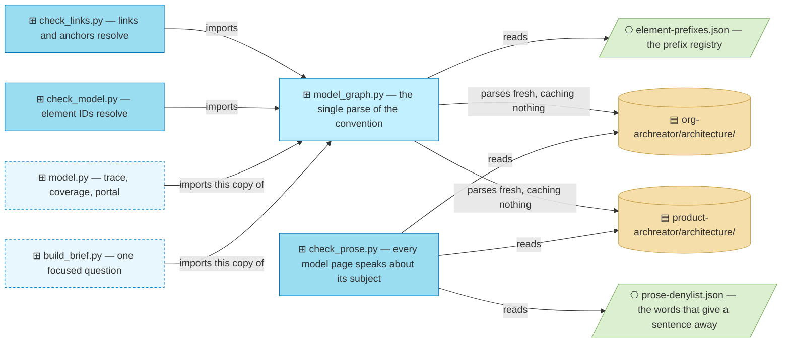

# Scripts

_[← Project home](../README.md)_

**Three validators, and the parse two of them share.** They came with the
scaffold, one copy serving both trees, and CI runs all three on every pull
request.

```bash
python3 scripts/check_links.py    # relative links and HTML anchors resolve
python3 scripts/check_model.py    # element-ID references resolve
python3 scripts/check_prose.py    # every model page speaks about its subject
```

All three exit `0` when everything passes and `1` otherwise, printing what failed.
They need nothing but Python — no network, no plugin installed, no packages —
so a project checks itself on its own.



Four arrows converge on one file, and two of them come from outside this
repository: the plugin's reading tools import this `model_graph.py`, so one
reading of the document convention serves every consumer. The third validator
imports nothing and reads the pages as text.

| File | What it is |
| ---- | ---------- |
| `check_links.py` | Executable. Every relative Markdown link and every HTML `href`, `src` and `#fragment` points at something that exists |
| `check_model.py` | Executable. Every backticked element ID resolves to a definition, none is defined twice, none is both live and retired, a levelled ID has its parent defined, every document that defines an element declares how far it has been validated and carries a diagram per section before that section's tables, no relationship table in its full form restates an element's name differently from the catalogue that defines it (the compact form, `From | To | Relationship | Notes`, restates no name), and every reference that names another model either resolves in this repository or is declared in `architecture/imports.md` |
| `check_prose.py` | Executable. No model page carries a sentence about its approval ("Direction covers this document"), its construction ("were consolidated") or its layout ("the table below"). It skips the narrative folders, the relationship catalogue, the front door, the contract pages, a layer not yet started, the status and viewpoint lines, headings, tables, fenced code, HTML comments and the `## Metamodel` section of a layer README. `--report` lists without failing |
| `prose-denylist.json` | Data, read by `check_prose.py`. Regular expressions grouped by what they betray, and the labels the script skips. Tuned to these two models: their subject is the method, so the method's own words stay off the list |
| `model_graph.py` | Library, imported by `check_links.py` and `check_model.py`. The single parse of the document convention — element IDs, catalogue tables, relationship tables in either form, the resolution of a bare identifier inside a domain, and the neighbourhood walk the reading tools use |
| `element-prefixes.json` | Data, read by `model_graph.py`. The element-ID prefixes and what each stands for |

## Everything else runs from the method

Reading tools are not copied in here. They live in the archreator plugin and
read this project:

```bash
model.py --project . trace BSVC1     # what a change here would touch
model.py --project . coverage        # what is not grounded, and what is not approved
model.py --project . portal          # a stock MkDocs config, for a reader outside the repo
build_brief.py --project . --element BSVC1 --focus impact
```

They import `model_graph.py` from **this** folder, so there is one parse of the
document convention and not two. Run one without a project and it says so.

## What they cannot do

`check_model.py` verifies that a *reference* resolves. `check_links.py`
verifies that a *link* resolves. **Neither reads what a "Realized by" cell
claims about a path**, so a cell naming a directory that no longer exists
passes both silently. `model.py coverage` finds the cell that is *empty*;
whether a path it names still exists is a step in the change process, not
something these scripts can do for you.

`check_prose.py` reads vocabulary, not intent. A sentence about governance in
the subject's own words passes, and a subject whose own words are on the list
fails until the list is tuned. Tune `prose-denylist.json`; never exempt the
page.

`coverage` prints and **always exits 0**. There is no `--strict`.

## Nothing is cached

There is no database and no projection anybody reads. Every tool parses the
Markdown fresh, which takes well under a second on the largest model built on
this method.

`model.py export` still writes `.model/model.json` for a consumer that
genuinely cannot read Markdown — a dashboard, a report — but nothing in the
method reads it back. Delete it and nothing is lost.

## The folders the validators skip

`architecture/reference/` holds source documents as they were provided: an
element identifier inside one is somebody talking, not a definition.

`architecture/scope/`, `architecture/decisions/`, and any `reviews/` or
`engagements/` folder are skipped too — a merged record is immutable and
outlives the elements it names.
