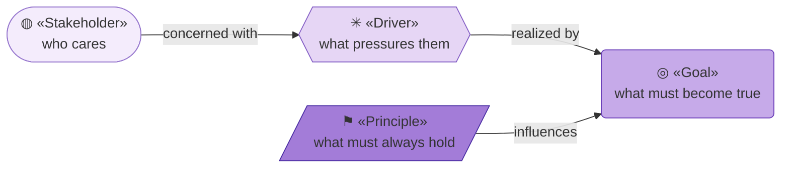
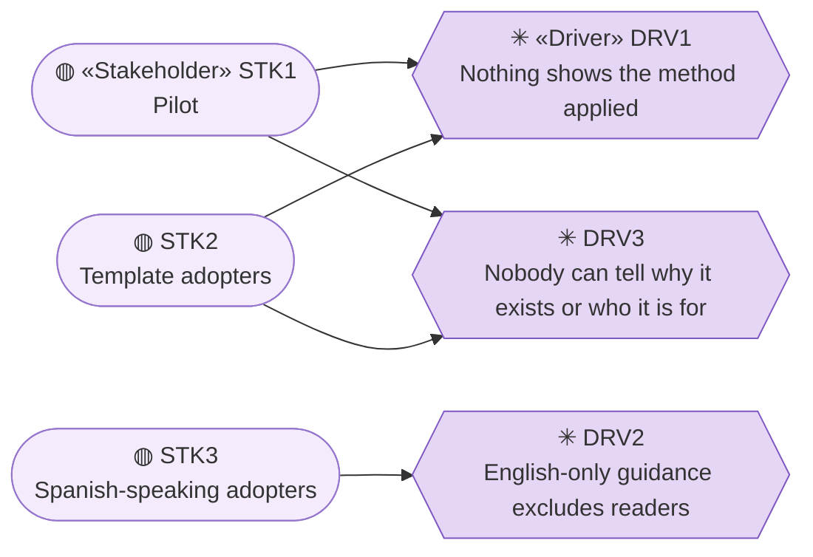
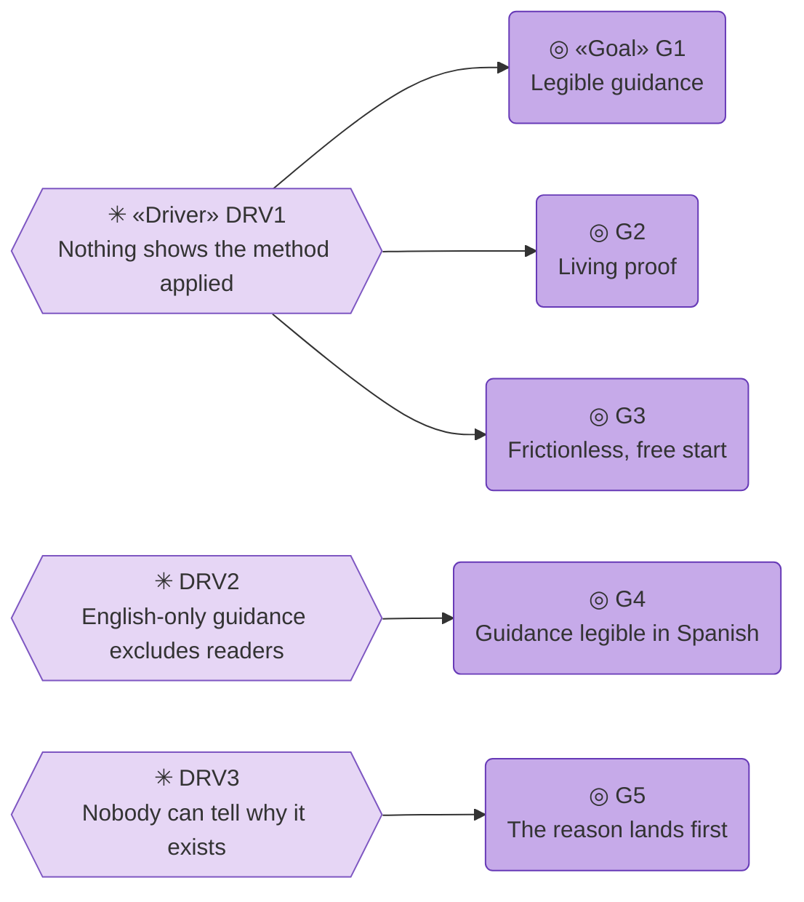
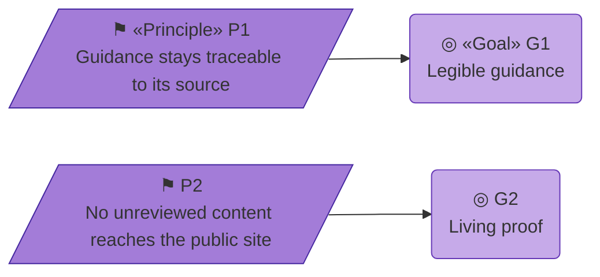

# Motivation

_[← Strategy layer](./README.md) · [EA home](../README.md)_

**ArchiMate elements:** Stakeholder, Driver, Goal, Principle.

## How to read this document

| Glyph | Shape | Element | ID prefix | Reads as |
| ----- | ----- | ------- | --------- | -------- |
| `◍` | Stadium | «Stakeholder» | `STK` | `STK1` = Stakeholder 1 |
| `✳` | Hexagon | «Driver» | `DRV` | `DRV1` = Driver 1 |
| `◎` | Rounded rectangle | «Goal» | `G` | `G1` = Goal 1 |
| `⚑` | Parallelogram | «Principle» | `P` | `P1` = Principle 1 |

**No Assessments or Outcomes.** This is a Depth 1 model of one small site;
the chain runs driver straight to goal. The tones and glyphs come from
[`docs/ea/README.md` § Notation conventions](../../../../docs/ea/README.md#notation-conventions).
**The glyph rides on every node; the «stereotype» word appears once.**

## Stakeholders and drivers

Every edge reads **concerned with**. `DRV1` is one driver seen from two
sides — the Pilot's and the reader's — which is why it is one element with
two edges rather than two elements saying the same thing.

| ID | Stakeholder | Concern | Driver |
| -- | ----------- | ------- | ------ |
| `STK1` | **Pilot** | The archreator template should be usable without reading its skill files directly | `DRV1` |
| `STK2` | **Prospective adopters** (external) — anyone building with AI, most of whom have never heard of the project | Deciding, quickly, whether this is for them and what it would give them — before anyone asks them to learn a method | `DRV1`, `DRV3` |
| `STK3` | **Spanish-speaking adopters** (external) | Learning the method in their own language instead of parsing dense process prose in English | `DRV2` |

| ID | Driver | What pressures it |
| -- | ------ | ----------------- |
| `DRV1` | **Nothing shows the method applied** — no document in the parent template demonstrates the EA-first process, or the human/AI actor notation, on a real project |
| `DRV2` | **English-only guidance excludes readers** — the site shut out anyone who does not work comfortably in English |
| `DRV3` | **Nobody can tell why it exists or who it is for** — the site explained the mechanism to people who had not yet been given a reason to care, so a first-time reader had to work out the value themselves |

## Goals

Every edge reads **realized by**. Three goals answer `DRV1` from different
distances — understanding it, believing it, being able to start — and `G5`
answers the one that comes before all of them: caring at all.

- **G1 — Legible guidance.** A prospective adopter can learn the EA-first
  method and the human/AI/hybrid actor notation from the published site
  alone, without first reading `.claude/skills/*/SKILL.md`.
- **G2 — Living proof.** The site itself is built by following the method
  it describes, so it doubles as evidence the process works on a real,
  small project — including a real AI actor with a defined autonomy level.
- **G3 — Frictionless, free start.** A newcomer with no prior GitHub or
  command-line experience can get from "no account" to a first reviewed
  change without paying for anything or installing a code editor. Realized
  by [`public/start.html`](../../../public/start.html); see
  [3_value-stream.md](./3_value-stream.md)'s **Adopt** stage.
- **G4 — Guidance legible in Spanish.** A Spanish-speaking adopter can
  learn everything `G1` promises without reading English: every guidance
  page has a Spanish edition, reachable from any page in one click.
  Realized by [`public/es/`](../../../public/es/index.html), a one-to-one
  Spanish mirror of the English pages; see the
  [3_information data-object notes](../3_information/1_data-objects.md)
  for how the two editions relate.
- **G5 — The reason lands first.** Someone who has never heard of archreator
  can read one page and come away knowing what problem it solves, why it was
  built, what it would give them, and what it costs — before being asked to
  learn anything. Realized by [`public/index.html`](../../../public/index.html).

## Principles

Every edge reads **influences**. Two principles, one each for the two goals
a change is most likely to erode by accident.

- **P1 — Guidance stays traceable to its source.** Every page on the site
  links back to the skill file or EA document it summarizes rather than
  restating it as a second canonical copy. If the two ever disagree, the
  linked source wins — the site is a derived view, not a second
  authority (see
  [3_information/1_data-objects.md](../3_information/1_data-objects.md)).
- **P2 — No unreviewed content reaches the public site.** The Copilot
  may draft complete changes, but nothing publishes without a human
  merging it (see
  [2_business/1_business-actors-and-roles.md](../2_business/1_business-actors-and-roles.md) and
  [../decisions/1_docs-agent-autonomy.md](../../decisions/1_docs-agent-autonomy.md)).

A proposed change that would publish unreviewed AI-drafted content, or
that would make the site restate rather than link to its source, violates
a Principle here — surface it instead of proceeding (`ea-first-change`,
step 1).
