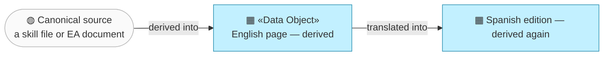
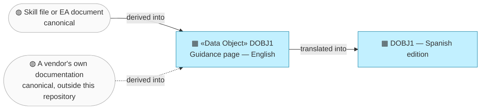

# Data Objects

_[← Information layer](./README.md) · [EA home](../README.md)_

**ArchiMate elements:** Data Object.

## How to read this document

| Glyph | Shape | Element | ID prefix | Reads as |
| ----- | ----- | ------- | --------- | -------- |
| `▦` | Rectangle | «Data Object» | `DOBJ` | `DOBJ1` = Data Object 1 |

**The chain of authority runs left to right, and never back.** `P1` says the
site is a derived view; this diagram is that principle drawn. **The glyph
rides on every node; the «stereotype» word appears once.**

## `DOBJ1` — Guidance page

**One dashed edge, and it is the awkward one.** Most of a page derives from
something inside this repository. `public/start.html` also derives from
third-party vendors' documentation, which nobody here controls — so it states
figures as "at the time of writing" and links the live page rather than
pinning them.

The one data object in this project: a page of guidance content.

| ID | Data object | Representation | Classification |
| -- | ----------- | -------------- | -------------- |
| `DOBJ1` | **Guidance page** | Static HTML, two language editions per page | Public |

| Property | `DOBJ1` — Guidance page |
| -------- | ----- |
| Representation | Static HTML, hand-written, no build step. Two language editions per page: English (canonical between the two) and Spanish |
| Location | English: [`public/index.html`](../../../public/index.html), [`public/guide.html`](../../../public/guide.html), [`public/walkthrough.html`](../../../public/walkthrough.html), [`public/architecture.html`](../../../public/architecture.html), [`public/start.html`](../../../public/start.html). Spanish: the same five filenames under [`public/es/`](../../../public/es/index.html), a one-to-one mirror |
| Source of truth | **Derived**, not canonical — each page summarizes and links to the skill file(s) or EA document(s) it's about. If a page and its linked source disagree, the source is right (`P1`,
[1_strategy/1_motivation.md](../1_strategy/1_motivation.md)). The one page whose subject is partly outside this repo is [`public/start.html`](../../../public/start.html): its archreator-specific steps derive from `README.md`/`CONTRIBUTING.md`, and its third-party tool steps link out to each vendor's official docs — the canonical source there is the vendor's site, so the page states figures as "at the time of writing" and links the live page rather than pinning them |
| Classification | Public |
| Retention | Indefinite, version-controlled via git; no deletion/retention policy needed |

A **Spanish edition** (`site/es/<page>.html`) is one derivation step
further out: it is a translation of its English counterpart, which in turn
derives from the skill/EA sources. The chain of authority is therefore
skill/EA doc → English page → Spanish page — if the two editions disagree,
the English page is right and the Spanish one is stale; if the English
page disagrees with its linked source, the source is right. Spanish pages
keep the same element `id`s and link to the same canonical (English)
sources in the repo, so traceability (`P1`) is unchanged. Both
editions of a page are updated in the same change (see
[2_business/2_business-services.md](../2_business/2_business-services.md)).

This distinction — derived guidance page vs. canonical skill/EA source —
is itself an instance of the `ea-doc-style` rule "each fact lives in
exactly one document; everything else links to it," applied one level up:
the fact lives in `../../../.claude/skills/` or in this project's own
`docs/ea/`, and the site links to it rather than restating it as a second
authority.
