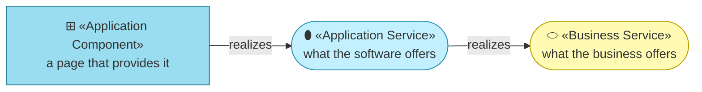
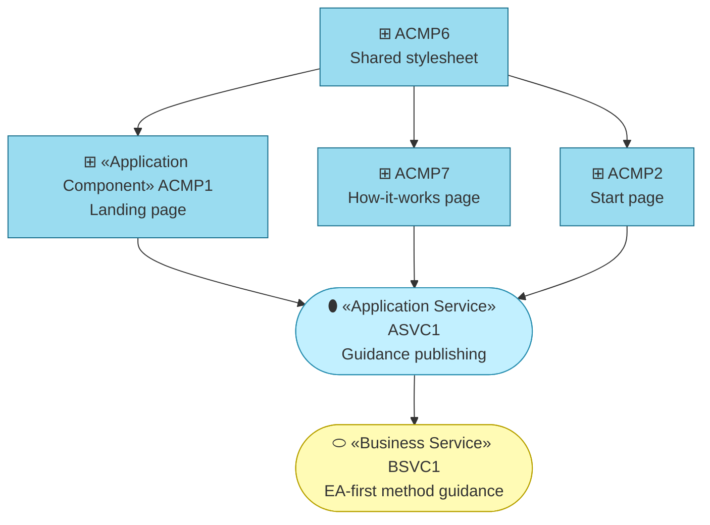

# Application Components

_[← Application layer](./README.md) · [EA home](../README.md)_

**ArchiMate elements:** Application Service, Application Component.

## How to read this document

| Glyph | Shape | Element | ID prefix | Reads as |
| ----- | ----- | ------- | --------- | -------- |
| `⬮` | Stadium | «Application Service» | `ASVC` | `ASVC1` = Application Service 1 |
| `⊞` | Rectangle | «Application Component» | `ACMP` | `ACMP1` = Application Component 1 |
| `⬭` | Stadium (yellow) | «Business Service» — context, from [layer 2](../2_business/2_business-services.md) | `BSVC` | `BSVC1` = Business Service 1 |

**The glyph rides on every node; the «stereotype» word appears once.**

## `ASVC1` — Guidance publishing

Page edges read **realizes**; `ACMP6`'s read **serves**. **`ACMP6` is the
only shared component and it is a stylesheet** — which is the whole coupling
story of this application. Change it and every page changes; change any
page and nothing else moves.

| ID | Application service | Realizes | Provided by |
| -- | ------------------- | -------- | ----------- |
| `ASVC1` | **Guidance publishing** — the pages, served statically, in two language editions | `BSVC1`, the [EA-first method guidance](../2_business/2_business-services.md) business service | `ACMP1`, `ACMP2`, `ACMP6`, `ACMP7` |

Provided by four components, where there were six:

| ID | Component | Realizes | Source file |
| -- | --------- | -------- | ----------- |
| `ACMP1` | **Landing page** | The whole argument on one page: the problem, why the project exists, how it works, the proof, and the call to start | [`public/index.html`](../../../public/index.html) |
| `ACMP7` | **How-it-works page** | The layers, the four gates, how an AI actor is modeled, and what ends up in a repository | [`public/how.html`](../../../public/how.html) |
| `ACMP2` | **Start page** | Two ways in, what the first session feels like, and honest expectations | [`public/start.html`](../../../public/start.html) |
| `ACMP6` | **Shared stylesheet** | The design system: tokens, light and dark, the layout primitives and the layer-coloured components | [`public/styles.css`](../../../public/styles.css) |

## Retired

Withdrawn when the site was rebuilt around **why the project exists** rather
than as reference documentation. Their identifiers are never reused — the parent method's rule on
identifiers — and the pages they named are reachable in the history at the
commit before removal.

| ID | Component | Retired | Why |
| -- | --------- | ------- | --- |
| `ACMP3` | Guide page | 2026-08-09 | Reference material a first-time reader was not ready for. What survives of it is `ACMP7` |
| `ACMP4` | Walkthrough page | 2026-08-09 | A long worked example that answered "how" before anyone had been told "why" |
| `ACMP5` | Architecture page | 2026-08-09 | Rendered this project's own layers in hand-written CSS — a second copy of the model that went stale every time the model moved. The real models on GitHub are now linked instead |

Each component ships in **two language editions**: the English page listed
above and a Spanish edition with the same filename under
[`public/es/`](../../../public/es/index.html) (`G4`,
[1_strategy/1_motivation.md](../1_strategy/1_motivation.md)). The Spanish
edition mirrors its English counterpart's structure, element `id`s, and
source links, and every page's header carries an EN ⇄ ES switcher linking
the two editions of the same page; `<link rel="alternate" hreflang>` tags
declare the pairing to search engines. See
[3_information/1_data-objects.md](../3_information/1_data-objects.md) for
which edition wins when they disagree.

All six pages share `ACMP6`. None of the pages build or fetch anything at request
time — no external scripts, fonts, or stylesheets — so deployment is a
direct copy of `public/` (see
[5_technology/2_deployment.md](../5_technology/README.md)). The site's
diagrams are a *derived* rendering of the canonical Mermaid diagrams in
`docs/ea/`; the choice to render them in CSS rather than load a library is
recorded in
[decision 2 — how the site renders its diagrams](../../decisions/2_site-diagram-rendering.md).
