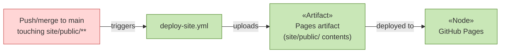

# Deployment

_[← Technology layer](./README.md) · [EA home](../README.md)_

**ArchiMate elements:** Node, Artifact, Deployment/Migration relationship.

## Pipeline

- **Pipeline definition:**
  [`.github/workflows/deploy-site.yml`](../../../../.github/workflows/deploy-site.yml),
  at the repository root (workflows aren't scoped per-subfolder).
- **Artifact:** the contents of [`public/`](../../../public/index.html),
  uploaded verbatim — no build step, no dependencies to install.
- **Trigger:** push to `main` touching `site/public/**`, or manual
  dispatch.
- **Manual step, one-time:** GitHub Pages must be enabled for this
  repository (Settings → Pages → Build and deployment → Source: **GitHub
  Actions**) before the workflow's deploy step can succeed. This can't be
  done from a commit — it's a repository-settings change an admin makes
  once. See
  [`docs/scope/1_publish-guidance-site.md`](../../scope/1_publish-guidance-site.md)'s
  open questions.
