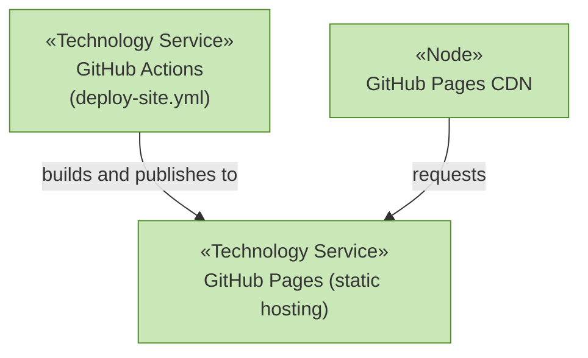

# Technology Layer

_[← EA home](../README.md)_

The runtime and pipeline that the
[application layer](../4_application/README.md) executes on. Chosen using
the `stack-selection` skill's "no backend" decision path — this is a
static site with no shared mutable state, so it takes the cheapest,
simplest option: static files, static hosting.

## Analysis order

| #   | Document                                               | Elements                                                          | Question it answers                       |
| --- | --------------------------------------------------------| --------------------------------------------------------------------| --------------------------------------------- |
| 1   | [1_technology-services.md](./1_technology-services.md) | Technology Services and the nodes/system software providing them | What infrastructure services are used?    |
| 2   | [2_deployment.md](./2_deployment.md)                   | Nodes, Artifacts, and the CI/CD deployment pipeline               | How does the build get to where it runs?  |

## Layer view

